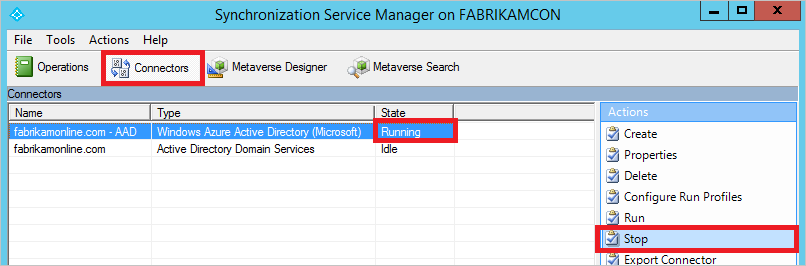

<properties
   pageTitle="Azure AD Connect sync: Scheduler | Microsoft Azure"
   description="This topic describes the built-in scheduler feature in Azure AD Connect sync."
   services="active-directory"
   documentationCenter=""
   authors="AndKjell"
   manager="StevenPo"
   editor=""/>

<tags
   ms.service="active-directory"
   ms.devlang="na"
   ms.topic="article"
   ms.tgt_pltfrm="na"
   ms.workload="identity"
   ms.date="06/27/2016"
   ms.author="andkjell"/>

# Azure AD Connect sync: Scheduler
This topic describes the built-in scheduler in Azure AD Connect sync (a.k.a. sync engine).

This feature was introduced with build 1.1.105.0 (released February 2016).

## Overview
Azure AD Connect sync will synchronize changes happening in your on-premises directory using a scheduler. There are two scheduler processes, one for password sync and another for object/attribute sync, and maintenance tasks. This topic will cover the latter.

In earlier releases the scheduler for objects and attributes was external to the sync engine and the Windows task scheduler or a separate Windows service was used to trigger the synchronization process. The scheduler is with the 1.1 releases built-in to the sync engine and do allow some customization. The new default synchronization frequency is 30 minutes.

The scheduler is responsible for two tasks:

- **Synchronization cycle**. The process to import, sync, and export changes.
- **Maintenance tasks**. Renew keys and certificates for Password reset and Device Registration Service (DRS). Purge old entries in the operations log.

The scheduler itself is always running, but it can be configured to only run one or none of these tasks. For example if you need to have your own synchronization cycle process, you can disable this task in the scheduler but still run the maintenance task.

## Scheduler configuration
To see your current configuration settings, go to PowerShell and run `Get-ADSyncScheduler`. It will show you something like this:


If you see **The sync command or cmdlet is not available** when you run this cmdlet, then the PowerShell module is not loaded. This could happen if you run Azure AD Connect on a domain controller or on a server with higher PowerShell restriction levels than default settings. If you see this error, then run `Import-Module ADSync` to make the cmdlet available.

- **AllowedSyncCycleInterval**. The most frequently Azure AD will allow synchronizations to occur. You cannot synchronize more frequently than this and still be supported.
- **CurrentlyEffectiveSyncCycleInterval**. The schedule currently in effect. It will have the same value as CustomizedSyncInterval (if set) if it is not more frequent than AllowedSyncInterval. If you change CustomizedSyncCycleInterval, this will take effect after next synchronization cycle.
- **CustomizedSyncCycleInterval**. If you want the scheduler to run at any other frequency than the default 30 minutes, you will configure this setting. In the picture above the scheduler has been set to run every hour instead. If you set this to a value lower than AllowedSyncInterval, the latter will be used.
- **NextSyncCyclePolicyType**. Either Delta or Initial. Defines if the next run should only process delta changes, or if the next run should do a full import and sync, which would also reprocess any new or changed rules.
- **NextSyncCycleStartTimeInUTC**. Next time the scheduler will start the next sync cycle.
- **PurgeRunHistoryInterval**. The time operation logs should be kept. These can be reviewed in the synchronization service manager. The default is to keep these for 7 days.
- **SyncCycleEnabled**. Indicates if the scheduler is running the import, sync, and export processes as part of its operation.
- **MaintenanceEnabled**. Shows if the maintenance process is enabled. It will update the certificates/keys and purge the operations log.
- **IsStagingModeEnabled**. Shows if [staging mode](active-directory-aadconnectsync-operations.md#staging-mode) is enabled.

You can change some of these settings with `Set-ADSyncScheduler`. The following parameters can be modified:

- CustomizedSyncCycleInterval
- NextSyncCyclePolicyType
- PurgeRunHistoryInterval
- SyncCycleEnabled
- MaintenanceEnabled

The scheduler configuration is stored in Azure AD. If you have a staging server, any change on the primary server will also effect the staging server (with the exception of IsStagingModeEnabled).

## Start the scheduler
The scheduler will by default run every 30 minutes. In some cases you might want to run a sync cycle in between the scheduled cycles or you need to run a different type.

**Delta sync cycle**  
A delta sync cycle includes the following steps:

- Delta import on all Connectors
- Delta sync on all Connectors
- Export on all Connectors

It could be that you have an urgent change which must be synchronized immediately which is why you need to manually run a cycle. If you need to manually run a cycle, then from PowerShell run `Start-ADSyncSyncCycle -PolicyType Delta`.

**Full sync cycle**  
If you have made one of the following configuration changes, you need to run a full sync cycle (a.k.a. Initial):

- Added more objects or attributes to be imported from a source directory
- Made changes to the Synchronization rules
- Changed [filtering](active-directory-aadconnectsync-configure-filtering.md) so a different number of objects should be included

If you have made one of these changes, then you need to run a full sync cycle so the sync engine has the opportunity to reconsolidate the connector spaces. A full sync cycle includes the following steps:

- Full Import on all Connectors
- Full Sync on all Connectors
- Export on all Connectors

To initiate a full sync cycle, run `Start-ADSyncSyncCycle -PolicyType Initial` from a PowerShell prompt. This will start a full sync cycle.

## Stop the scheduler
If the scheduler is currently running a synchronization cycle you might need to stop it. For example if you start the installation wizard and you get this error:


When a sync cycle is running, you cannot make configuration changes. You could wait until the scheduler has finished the process, but you can also stop it so you can make your changes immediately. Stopping the current cycle is not harmful and any changes still not processed will be processed with next run.

1. Start by telling the scheduler to stop its current cycle with the PowerShell cmdlet `Stop-ADSyncSyncCycle`.
2. Stopping the scheduler will not stop the current Connector from its current task. To force the Connector to stop, take the following actions:

    - Start **Sychronization Service** from the start menu. Go to **Connectors**, highlight the Connector with the state **Running** and select **Stop** from the Actions.

The scheduler is still active and will start again on next opportunity.

## Custom scheduler
The cmdlets documented in this section are only available in build [1.1.130.0](active-directory-aadconnect-version-history.md#111300) and later.

If the built-in scheduler does not satisfy your requirements, then you can schedule the Connectors using PowerShell.

### Invoke-ADSyncRunProfile
You can start a profile for a Connector in this way:

```
Invoke-ADSyncRunProfile -ConnectorName "name of connector" -RunProfileName "name of profile"
```

The names to use for [Connector names](active-directory-aadconnectsync-service-manager-ui-connectors.md) and [Run Profile Names](active-directory-aadconnectsync-service-manager-ui-connectors.md#configure-run-profiles) can be found in the [Synchronization Service Manager UI](active-directory-aadconnectsync-service-manager-ui.md).

  

The `Invoke-ADSyncRunProfile` cmdlet is synchronous, i.e. it will not return control until the Connector has completed the operation, either successfully or with an error.

When you schedule your Connectors, the recommendation is to schedule them in the following order:

1. (Full/Delta) Import from on-premises directories, such as Active Directory
2. (Full/Delta) Import from Azure AD
3. (Full/Delta) Synchronization from on-premises directories, such as Active Directory
4. (Full/Delta) Synchronization from Azure AD
5. Export to Azure AD
6. Export to on-premises directories, such as Active Directory

If you look at the built-in scheduler, this is the order the Connectors will run.

### Get-ADSyncConnectorRunStatus
You can also monitor the sync engine to see if it is busy or idle. This cmdlet will return an empty result if the sync engine is idle and is not running a Connector. If a Connector is running, it will return the name of the Connector.

```
Get-ADSyncConnectorRunStatus
```

  
In the picture above, the first line is from a state where the sync engine is idle. The second line from when the Azure AD Connector is running.

## Scheduler and installation wizard
If you start the installation wizard, then the scheduler will be temporarily suspended. This is because it is assumed you will make configuration changes and these cannot be applied if the sync engine is actively running. For this reason, do not leave the installation wizard open since it will stop the sync engine from performing any synchronization actions.

## Next steps
Learn more about the [Azure AD Connect sync](active-directory-aadconnectsync-whatis.md) configuration.

Learn more about [Integrating your on-premises identities with Azure Active Directory](active-directory-aadconnect.md).
