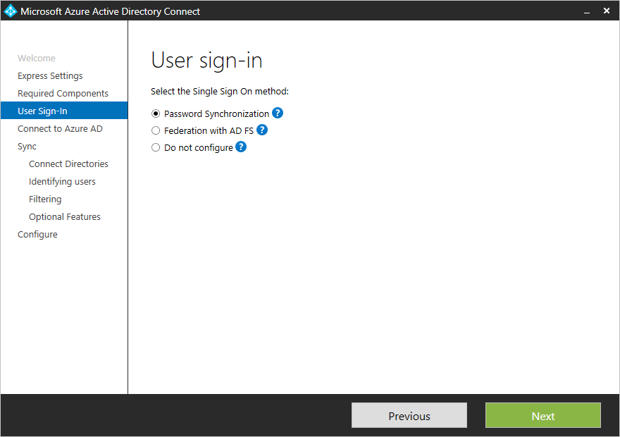
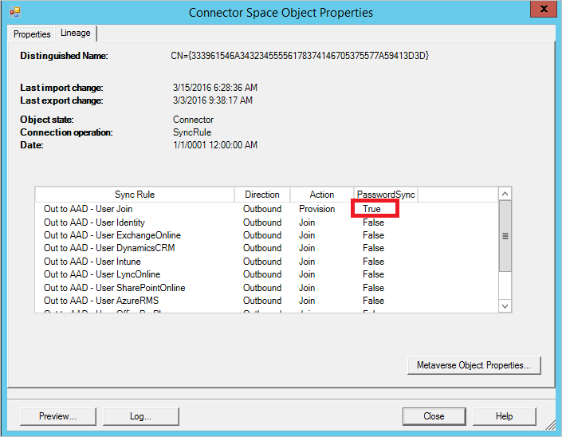

<properties
	pageTitle="Implementing password synchronization with Azure AD Connect sync | Microsoft Azure"
	description="Provides information about how password synchronization works and how to enable it."
	services="active-directory"
	documentationCenter=""
	authors="markusvi"
	manager="stevenpo"
	editor=""/>
<tags
	ms.service="active-directory"
	ms.workload="identity"
	ms.tgt_pltfrm="na"
	ms.devlang="na"
	ms.topic="article"
	ms.date="04/15/2016"
	ms.author="markusvi;andkjell"/>


# Implementing password synchronization with Azure AD Connect sync

With password synchronization, you can use your on-premises Active Directory password to also sign in to your Azure Active Directory.

This topic provides you with the information you need to enable and troubleshoot password synchronization in your environment.


## What is password synchronization

Password synchronization is a feature to synchronize user passwords from an on-premises Active Directory to a cloud-based Azure Active Directory (Azure AD).
This feature enables you to sign-on to Azure Active Directory services (such as Office 365, Microsoft Intune, and CRM Online) using the same password you are using to sign-on to your on-premises network.
To use this feature, you need to install Azure Active Directory Connect synchronization services (Azure AD Connect sync).


> [AZURE.NOTE] For more details about Active Directory Domain Services that are configured for FIPS and password synchronization, see [Password Sync and FIPS](#password-synchronization-and-fips).

## How password synchronization works

Password synchronization is an extension to the directory synchronization feature implemented by Azure AD Connect sync. This feature requires directory synchronization between your on-premises AD and your Azure Active Directory to be configured.

The Active Directory domain service stores passwords in form of a hash value representation of the actual user password.
You cannot use a password hash to:

- Sign in to your on-premises network

- Revert it to the plain text version of a password

To synchronize your password, Azure AD Connect sync extracts your password hash from the on-premises Active Directory. Additional security processing is applied to the password hash before it is synchronized to the Azure Active Directory authentication service. The actual data flow of the password synchronization process is similar to the synchronization of user data such as DisplayName or Email Addresses.

Passwords are synchronized:

- On a per-user basis

- In chronological order

- More frequently than the standard directory synchronization window for other attributes

A synchronized password overwrites the existing cloud password.

The first time you enable the password synchronization feature, it performs an initial synchronization of the passwords of all in-scope users. You cannot explicitly define a subset of user passwords you want to synchronize.

When you change an on-premises password, the updated password is synchronized, most often in a matter of minutes.
The password synchronization feature automatically retries failed user password syncs. If an error occurs during an attempt to synchronize a password, an error is logged in your event viewer.

The synchronization of a password has no impact on the currently logged on user.
If a password change is synchronized while you are logged into a cloud service, your cloud service session is not immediately affected by this. However, as soon as the cloud service requires you to authenticate again, you need to provide your new password.

> [AZURE.NOTE] Password sync is only supported for the object type user in Active Directory. It is not supported for the iNetOrgPerson object type.

### How password synchronization works with Azure AD Domain Services

If you enable this service in Azure AD, the password sync option is required to get a single-sign on experience. With this service enabled, the behavior for password sync is changed and the password hashes are also synchronized as-is from your on-premises Active Directory to Azure AD Domain Services. The functionality is similar to the Active Directory Migration Tool (ADMT) and allows Azure AD Domain Services to be able to authenticate the user with all the methods available in the on-premises AD.

### Security considerations

When synchronizing passwords, the plain text version of your password is not exposed to the password synchronization feature, to Azure AD or any of the associated services.

Additionally, there is no requirement on the on-premises Active Directory to store the password in a reversibly encrypted format. A digest of the Active Directory password hash is used for the transmission between the on-premises AD and Azure Active Directory. The digest of the password hash cannot be used to access resources in your on-premises environment.

### Password policy considerations

There are two types of password policies that are affected by enabling password synchronization:

1. Password Complexity Policy
2. Password Expiration Policy

**Password complexity policy**

When you enable password synchronization, the password complexity policies configured in the on-premises Active Directory override any complexity policies that may be defined in the cloud for synchronized users. This means any password that is valid in the customer's on-premises Active Directory environment can be used for accessing Azure AD services.

> [AZURE.NOTE] Passwords for users that are created directly in the cloud are still subject to password policies as defined in the cloud.

**Password expiration policy**

If a user is in the scope of password synchronization, the cloud account password is set to "*Never Expire.*" This means that you can continue to log into cloud services using a synchronized password that has been expired in your on-premises environment.

Your cloud password is updated the next time you change the password in the on-premises environment.

### Overwriting synchronized passwords

An administrator can manually reset your password using PowerShell.

In this case, the new password overrides your synchronized password and all password policies defined in the cloud are applied to the new password.

If you change your on-premises password again, the new password is synchronized to the cloud, and overrides the manually updated password.


## Enabling password synchronization

To enable password synchronization, you have two options:

- If you use express settings when you install Azure AD Connect, password synchronization is enabled by default.

- If you use custom settings when you install Azure AD Connect, you enable password synchronization on the user sign-in page.

<br>

<br>

If you select to use **Federation with AD FS**, then you can optionally enable password sync as a backup in case your AD FS infrastructure fails. You can also enable it if you plan to use Azure AD Domain Services.

### Password synchronization and FIPS

If your server has been locked down according to FIPS (Federal Information Processing Standard), then MD5 has been disabled. To enable this for password synchronization, add the enforceFIPSPolicy key in miiserver.exe.config in C:\Program Files\Azure AD Sync\Bin.

```
<configuration>
    <runtime>
        <enforceFIPSPolicy enabled="false"/>
    </runtime>
</configuration>
```

The configuration/runtime node can be found at the end of the config file.

For information about security and FIPS see [AAD Password Sync, Encryption and FIPS compliance](http://blogs.technet.com/b/ad/archive/2014/06/28/aad-password-sync-encryption-and-and-fips-compliance.aspx)


## Troubleshooting password synchronization

**To troubleshoot password synchronization, perform the following steps:**

1. Open the **Synchronization Service Manager**

2. Click **Connectors**

3. Select the Active Directory Connector the user is located in

4. Select **Search Connector Space**

5. Locate the user you are looking for.

6. Select the **lineage** tab and make sure at least one Sync Rule shows **Password Sync** as **True**. In the  default configuration, the name of the Sync Rule is **In from AD - User AccountEnabled**.

    

7. You should also [follow the user](active-directory-aadconnectsync-service-manager-ui-connectors.md#follow-an-object-and-its-data-through-the-system) through the metaverse to the Azure AD Connector space. The connector space object should have an outbound rule with **Password Sync** set to **True**. In the default configuration, the name of the sync rule is **Out to AAD - User Join**.

    

8. To see the password sync details of the object, click on the button **Log...**.<br> This creates a page with a historic view of the user's password sync status for the past week.

    

The status column can have the following values:

| Status | Description |
| ---- | ----- |
| Success | Password has been successfully synchronized. |
| FilteredByTarget | Password is set to **User must change password at next logon**. Password has not been synchronized. |
| NoTargetConnection | No object in the metaverse or in the Azure AD connector space. |
| SourceConnectorNotPresent | No object found in the on-premises Active Directory connector space. |
| TargetNotExportedToDirectory | The object in the Azure AD connector space has not yet been exported. |
| MigratedCheckDetailsForMoreInfo | Log entry was created before build 1.0.9125.0 and is shown in its legacy state. |


## Triggering a full sync of all passwords

Typically, there is no need to force a full sync of all passwords.<br>
However, if necessary, you can trigger a full sync of all passwords using the following script:

    $adConnector = "<CASE SENSITIVE AD CONNECTOR NAME>"
    $aadConnector = "<CASE SENSITIVE AAD CONNECTOR NAME>"
    Import-Module adsync
    $c = Get-ADSyncConnector -Name $adConnector
    $p = New-Object Microsoft.IdentityManagement.PowerShell.ObjectModel.ConfigurationParameter “Microsoft.Synchronize.ForceFullPasswordSync”, String, ConnectorGlobal, $null, $null, $null
    $p.Value = 1
    $c.GlobalParameters.Remove($p.Name)
    $c.GlobalParameters.Add($p)
    $c = Add-ADSyncConnector -Connector $c
    Set-ADSyncAADPasswordSyncConfiguration -SourceConnector $adConnector -TargetConnector $aadConnector -Enable $false
    Set-ADSyncAADPasswordSyncConfiguration -SourceConnector $adConnector -TargetConnector $aadConnector -Enable $true


## Next steps

* [Azure AD Connect Sync: Customizing Synchronization options](active-directory-aadconnectsync-whatis.md)
* [Integrating your on-premises identities with Azure Active Directory](active-directory-aadconnect.md)
