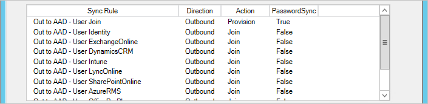
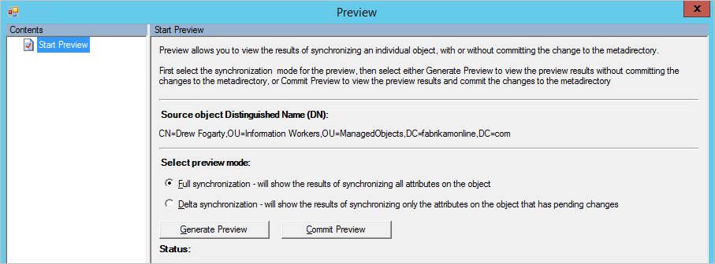
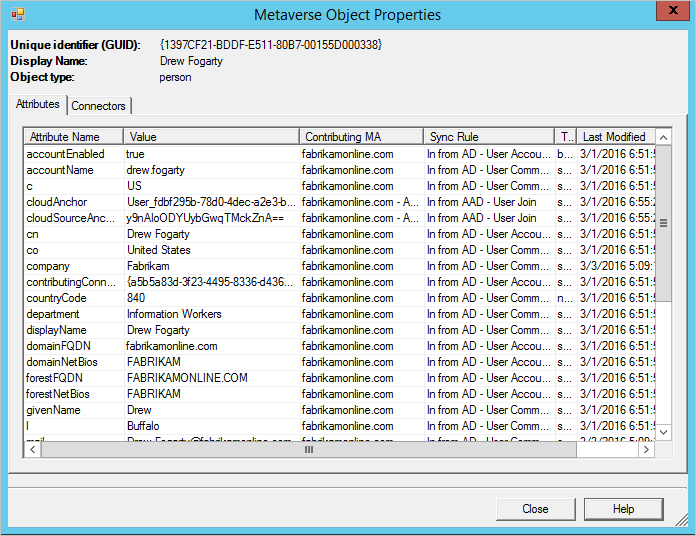

<properties
	pageTitle="Azure AD Connect sync: Synchronization Service Manager UI | Microsoft Azure"
	description="Understand the Connectors tab in the Synchronization Service Manager for Azure AD Connect."
	services="active-directory"
	documentationCenter=""
	authors="andkjell"
	manager="stevenpo"
	editor=""/>

<tags
	ms.service="active-directory"
	ms.workload="identity"
	ms.tgt_pltfrm="na"
	ms.devlang="na"
	ms.topic="article"
	ms.date="06/27/2016"
	ms.author="andkjell"/>

# Azure AD Connect sync: Synchronization Service Manager

[Operations](active-directory-aadconnectsync-service-manager-ui-operations.md) | [Connectors](active-directory-aadconnectsync-service-manager-ui-connectors.md) | [Metaverse Designer](active-directory-aadconnectsync-service-manager-ui-mvdesigner.md) | [Metaverse Search](active-directory-aadconnectsync-service-manager-ui-mvsearch.md)
--- | --- | --- | ---

The Connectors tab is used to manage all systems the sync engine is connected to.

## Connector actions

Action | Comment
--- | ---
Create | Do not use. For connecting to additional AD forests, use the installation wizard.
Properties | Used for domain and OU filtering.
[Delete](#delete) | Used to either delete the data in the connector space or to delete connection to a forest.
[Configure Run Profiles](#configure-run-profiles) | With the exception of domain filtering, nothing to configure here. You can use this to see already configured run profiles.
Run | Used to start a one-off run of a profile.
Stop | Stops a Connector currently running a profile.
Export Connector | Do not use.
Import Connector | Do not use.
Update Connector | Do not use.
Refresh Schema | Refreshes the cached schema. It is preferred to use the option in the installation wizard instead since that will also update sync rules.
[Search Connector Space](#search-connector-space) | Used to find objects and to [Follow an object and its data through the system](#follow-an-object-and-its-data-through-the-system).

### Delete
The delete action is used for two different things.

The option **Delete connector space only** will remove all data, but keep all configuration.

The option **Delete Connector and connector space** will remove the data as well as all configuration. This is used when you do not want to connect to a forest anymore.

Both options will sync all objects and update the metaverse objects. This is a long running operation.

### Configure Run Profiles
This option allows you to see the run profiles configured for a Connector.

### Search Connector Space
The search connector space action is useful to find objects and troubleshoot data issues.

Start by selecting a **scope**. You can search based on data (RDN, DN, Anchor, Sub-Tree), or state of the object (all other options).  
  
If you for example do a Sub-Tree search you get all objects in one OU.

From this you can select an object, select **properties** and [follow it](#follow-an-object-and-its-data-through-the-system) from the source connector space, through the metaverse, and to the target connector space.

## Follow an object and its data through the system
When you are troubleshooting a problem with data, follow an object from the source connector space, to the metaverse, and to the target connector space is a key procedure to understand why data does not have the expected values.

### Connector Space Object Properties
**Import**  
When you open a cs object, there are several tabs at the top. The **Import** tab shows the data which is staged after an import.

The **Old Value** shows what currently is stored in the system and the **New Value** what has been received from the source system and has not been applied yet. In this case since there is a synchronization error, the change cannot be applied.

**Error**  
The error page is only visible if there is a problem with the object. See the details on the operations page for more information on how to [troubleshoot synchronization errors](active-directory-aadconnectsync-service-manager-ui-operations.md#troubleshoot-errors-in-operations-tab).

**Lineage**  
The lineage tab shows how the connector space object is related to the metaverse object. We can see when we last imported a change from the connected system and which rules applied to populate data in the metaverse.

In the **Action** column we can see there is one **Inbound** sync rule with the action **Provision**. That indicates that as long as this connector space object is present, the metaverse object will remain. If the list of sync rules instead shows a sync rule with direction **Outbound** and **Provision** it indicates that this object will be deleted when the metaverse object is deleted.

We can also see in the **PasswordSync** column that the inbound connector space can contribute changes to the password since one sync rule has the value **True**. This password is then sent to Azure AD through the outbound rule.

From the lineage tab you can get to the metaverse by clicking on [Metaverse Object Properties](#metaverse-object-properties).

At the bottom of all tabs are two buttons: **Preview** and **Log**.

**Preview**  
The preview page is used to synchronize one single object. It is useful if you are troubleshooting some customer sync rules and want to see the effect of a change on a single object. You can select between **Full Sync** and **Delta sync**. You can also select between **Generate Preview**, which will only keep the change in memory, and **Commit Preview**, which will stage all changes to target connector spaces.

You can inspect the object and which rule applied for a particular attribute flow.

**Log**  
The Log page is used to see the password sync status and history, see [Troubleshoot password synchronization](active-directory-aadconnectsync-implement-password-synchronization.md#troubleshoot-password-synchronization) for more information.

### Metaverse Object Properties
**Attributes**  
On the attributes tab you can see the values and which Connector contributed it.

**Connectors**  
The Connectors tab shows all connector spaces which have a representation of the object.

This tab also allows you to navigate to the [connector space object](#connector-space-object-properties).

## Next steps
Learn more about the [Azure AD Connect sync](active-directory-aadconnectsync-whatis.md) configuration.

Learn more about [Integrating your on-premises identities with Azure Active Directory](active-directory-aadconnect.md).
