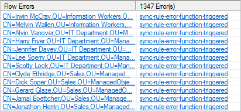

<properties
	pageTitle="Azure AD Connect sync: Synchronization Service Manager UI | Microsoft Azure"
	description="Understand the Operations tab in the Synchronization Service Manager for Azure AD Connect."
	services="active-directory"
	documentationCenter=""
	authors="andkjell"
	manager="femila"
	editor=""/>

<tags
	ms.service="active-directory"
	ms.workload="identity"
	ms.tgt_pltfrm="na"
	ms.devlang="na"
	ms.topic="article"
	ms.date="09/07/2016"
	ms.author="andkjell"/>

# Azure AD Connect sync: Synchronization Service Manager

[Operations](active-directory-aadconnectsync-service-manager-ui-operations.md) | [Connectors](active-directory-aadconnectsync-service-manager-ui-connectors.md) | [Metaverse Designer](active-directory-aadconnectsync-service-manager-ui-mvdesigner.md) | [Metaverse Search](active-directory-aadconnectsync-service-manager-ui-mvsearch.md)
--- | --- | --- | ---

The operations tab shows the results from the most recent operations. This tab is key to understand and troubleshoot issues.

## Understand the information visible in the operations tab
The top half shows all runs in chronic order. By default, the operations log keeps information about the last seven days, but this setting can be changed with the [scheduler](active-directory-aadconnectsync-feature-scheduler.md). You want to look for any run that does not show a success status. You can change the sorting by clicking the headers.

The **Status** column is the most important information and shows the most severe problem for a run. Here is a quick summary of the most common statuses in order of priority to investigate (where * indicate several possible error strings).

Status | Comment
--- | ---
stopped-* | The run could not complete. For example, if the remote system is down and cannot be contacted.
stopped-error-limit | There are more than 5,000 errors. The run was automatically stopped due to the large number of errors.
completed-\*-errors | The run completed, but there are errors (fewer than 5,000) that should be investigated.
completed-\*-warnings | The run completed, but some data is not in the expected state. If you have errors, then this message is usually only a symptom. Until you have addressed errors, you should not investigate warnings.
success | No issues.

When you select a row, the bottom updates to show the details of that run. To the far left of the bottom, you might have a list saying **Step #**. This list only appears if you have multiple domains in your forest where each domain is represented by a step. The domain name can be found under the heading **Partition**. Under **Synchronization Statistics**, you can find more information about the number of changes that were processed. You can click the links to get a list of the changed objects. If you have objects with errors, those errors show up under **Synchronization Errors**.

## Troubleshoot errors in operations tab
  
When you have errors, both the object in error and the error itself are links that provides more information.

Start by clicking the error string (**sync-rule-error-function-triggered** in the picture). You are first presented with an overview of the object. To see the actual error, click the button **Stack Trace**. This trace provides debug level information for the error.

**TIP:** You can right-click in the **call stack information** box, choose **select all**, and **copy**. You can then copy the stack and look at the error in your favorite editor, such as Notepad.

- If the error is from **SyncRulesEngine**, then the call stack information first has a list of all attributes on the object. Scroll down until you see the heading **InnerException =>**.  
  
The line after shows the error. In the picture above, the error is from a custom Sync Rule Fabrikam created.

If the error itself does not give enough information, then it is time to look at the data itself. You can click the link with the object identifier and [Follow an object and its data through the system](active-directory-aadconnectsync-service-manager-ui-connectors.md#follow-an-object-and-its-data-through-the-system).

## Next steps
Learn more about the [Azure AD Connect sync](active-directory-aadconnectsync-whatis.md) configuration.

Learn more about [Integrating your on-premises identities with Azure Active Directory](active-directory-aadconnect.md).
