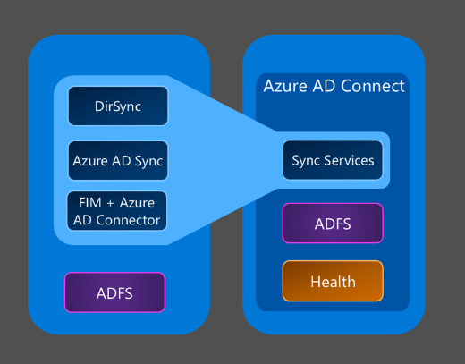

<properties
	pageTitle="Azure AD Connect sync customization options | Microsoft Azure"
	description="Explains how to customize Azure AD Connect sync."
	services="active-directory"
	documentationCenter=""
	authors="markusvi"
	manager="stevenpo"
	editor=""/>

<tags
	ms.service="active-directory"
	ms.workload="identity"
	ms.tgt_pltfrm="na"
	ms.devlang="na"
	ms.topic="article"
	ms.date="10/13/2015"
	ms.author="markusvi;andkjell"/>

# Azure AD Connect sync: Customizing Synchronization options

The Azure Active Directory Connect synchronization services (Azure AD Connect sync) is a main component of Azure AD Connect that takes care of all the operations that are related to synchronizing identity data between your on-premises environment and Azure AD in the cloud. From a synchronization perspective, Azure AD Connect sync is the successor of DirSync, Azure AD Sync and Forefront Identity Manager with the Azure Active Directory Connector configured.

The objective of this topic is to provide you with links to topics that are related to Auzre AD Connect sync.

What do you want to do next?:

- For an overview of the technical concepts, see [Technical Concepts](active-directory-aadconnectsync-technical-concepts.md).
- For an overview of topologies and scenarios supported by Azure AD Connect sync, see [Topologies for Azure AD Connect](active-directory-aadconnect-topologies.md).
- If you want to learn about how implement a filter, see [Configure Filtering](active-directory-aadconnectsync-configure-filtering.md).
- If you want to know more about password synchronization, see [Implement password synchronization](active-directory-aadconnectsync-implement-password-synchronization.md).
- If you want to know more about users and contacts in Azure AD Connect sync, see [Understanding Users and Contacts](active-directory-aadconnectsync-understanding-users-and-contacts.md).
- If you want to change the default configuration, see [Best practices for changing the default configuration](active-directory-aadconnectsync-best-practices-changing-default-configuration.md)
- If you want to know more about how to operate the sync server, see [Operational tasks and considerations](active-directory-aadconnectsync-operations.md)
- If you want to explore the attributes that are synchronized to Azure AD, see [Attributes synchronized to Azure Active Directory](active-directory-aadconnectsync-attributes-synchronized.md)
- If you want to learn more about declarative provisioning, see [Understanding Declarative Provisioning Expressions](active-directory-aadconnectsync-understanding-declarative-provisioning-expressions.md)
- To explore the declarative provisioning functions, see [Functions Reference](active-directory-aadconnectsync-functions-reference.md)

## Additional Resources

* [Sign up for Azure as an organization](sign-up-organization.md)

<!--Image references-->
