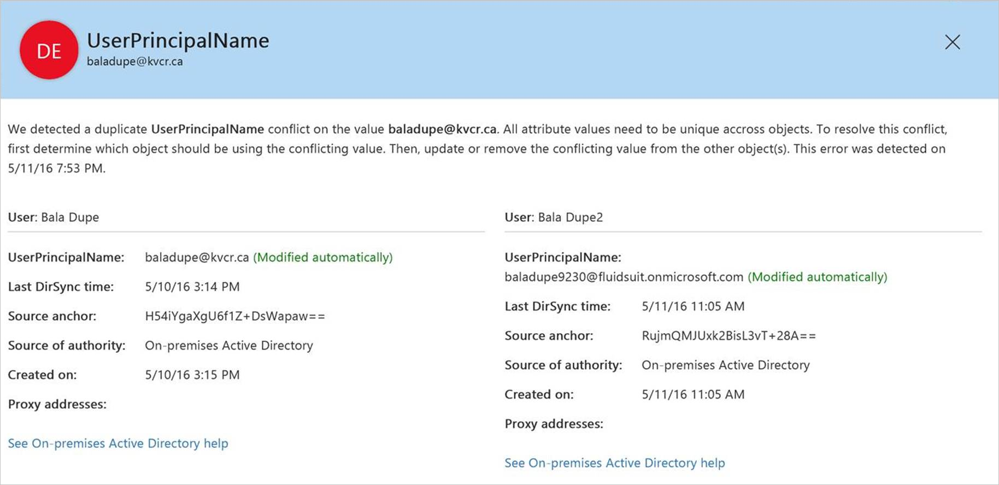
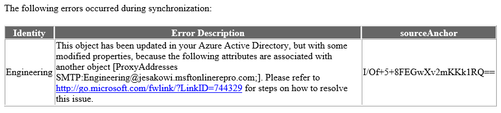

<properties
	pageTitle="Identity synchronization and duplicate attribute resiliency | Microsoft Azure"
	description="New behavior of how to handle objects with UPN or ProxyAddress conflicts during directory sync using Azure AD Connect."
	services="active-directory"
	documentationCenter=""
	authors="markusvi"
	manager="femila"
	editor=""/>

<tags
	ms.service="active-directory"
	ms.workload="identity"
	ms.tgt_pltfrm="na"
	ms.devlang="na"
	ms.topic="article"
	ms.date="05/26/2016"
	ms.author="markusvi"/>

# Identity synchronization and duplicate attribute resiliency
Duplicate Attribute Resiliency is a feature in Azure Active Directory in order to eliminate friction caused by **UserPrincipalName** and **ProxyAddress** conflicts when running one of Microsoft’s synchronization tools.

These two attributes are generally required to be unique across all **User**, **Group**, or **Contact** objects in a given Azure Active Directory directory.

> [AZURE.NOTE] Only Users can have UPNs.

The new behavior that this feature enables is in the cloud portion of the sync pipeline, therefore it is client agnostic and relevant for any Microsoft synchronization product including Azure AD Connect, DirSync and MIM + Connector. The generic term “sync client” is used in this document to represent any one of these products.

## Current behavior
If there is an attempt to provision a new object with a UPN or ProxyAddress value that violates this uniqueness constraint, Azure Active Directory blocks that object from being created. Similarly, if an object is updated with a non-unique UPN or ProxyAddress, the update fails. The provisioning attempt or update is retried by the sync client upon each export cycle, and continues to fail until the conflict is resolved. An error report email is generated upon each attempt and an error is logged by the sync client.

## Behavior with Duplicate Attribute Resiliency
Instead of completely failing to provision or update an object with a duplicate attribute, Azure Active Directory “quarantines” the duplicate attribute which would violate the uniqueness constraint. If this attribute is required for provisioning, like UserPrincipalName, the service assigns a placeholder value. The format of these temporary values is  
“***<OriginalPrefix>+<4DigitNumber>@<InitialTenantDomain>.onmicrosoft.com***”.  
If the attribute is not required, like a  **ProxyAddress**, Azure Active Directory simply quarantines the conflict attribute and proceeds with the object creation or update.

Upon quarantining the attribute, information about the conflict is sent in the same error report email used in the old behavior. However, this info only appears in the error report one time, when the quarantine happens, it does not continue to be logged in future emails. Also, since the export for this object has succeeded, the sync client does not log an error and does not retry the create / update operation upon subsequent sync cycles.

To support this behavior a new attribute has been added to the User, Group, and Contact object classes:  
**DirSyncProvisioningErrors**

This is a multi-valued attribute that is used to store the conflicting attributes that would violate the uniqueness constraint should they be added normally. A background timer task has been enabled in Azure Active Directory that  runs every hour to look for duplicate attribute conflicts that have been resolved, and automatically removes the attributes in question from quarantine.

### Enabling Duplicate Attribute Resiliency
The feature can be enabled by downloading the latest version of the Azure Active Directory PowerShell module and running:

`Set-MsolDirSyncFeature -Feature DuplicateUPNResiliency -Enable $true`

`Set-MsolDirSyncFeature -Feature DuplicateProxyAddressResiliency -Enable $true`

At present, UPN and ProxyAddress resiliency can be turned on and disabled individually. This behavior will change in the future and both will be enabled for all Azure AD directories and will not be able to disabled it.

## Identifying Objects with DirSyncProvisioningErrors
There are currently two methods to identify objects that have these errors due to duplicate property conflicts, Azure Active Directory PowerShell and the Office 365 Admin Portal. There are plans to extend to additional portal based reporting in the future.

### Azure Active Directory PowerShell
For the PowerShell cmdlets in this topic, the following is true:

- All of the following cmdlets are case sensitive.
- The **–ErrorCategory PropertyConflict** must always be included. There are currently no other types of
 **ErrorCategory**, but this may be extended in the future.

First, get started by running **Connect-MsolService** and entering credentials for a tenant administrator.

Then, use the following cmdlets and operators to view errors in different ways:

1. [See All](#see-all)

2. [By Property Type](#by-property-type)

3. [By Conflicting Value](#by-conflicting-value)

4. [Using a String Search](#using-a-string-search)

5. [Sorted](#sorted)

6. [In a Limited Quantity or All](#in-a-limited-quantity-or-all)

#### See all
Once connected, to see a general list of attribute provisioning errors in the tenant run:

`Get-MsolDirSyncProvisioningError -ErrorCategory PropertyConflict`

This produces a result like the following:  
   

#### By property type
To see errors by property type, add the **-PropertyName** flag with the **UserPrincipalName** or **ProxyAddresses** argument:

`Get-MsolDirSyncProvisioningError -ErrorCategory PropertyConflict -PropertyName UserPrincipalName`

Or

`Get-MsolDirSyncProvisioningError -ErrorCategory PropertyConflict -PropertyName ProxyAddresses`

#### By conflicting value
To see errors relating to a specific property add the **-PropertyValue** flag (**-PropertyName** must be used as well when adding this flag):

`Get-MsolDirSyncProvisioningError -ErrorCategory PropertyConflict -PropertyValue User@domain.com -PropertyName UserPrincipalName`

#### Using a string search
To do a broad string search use the **-SearchString** flag. This can be used independently from all of the above flags, with the exception of **-ErrorCategory PropertyConflict**, which is always required:

`Get-MsolDirSyncProvisioningError -ErrorCategory PropertyConflict -SearchString User`

#### Sorted
There are two flags that can be used to sort the results of a given query:

1.	**SortField**: valid arguments include DisplayName and UserPrincipalName

2.	**SortDirection**: valid arguments include Ascending and Descending

`Get-MsolDirSyncProvisioningError -ErrorCategory PropertyConflict -SortField UserPrincipalName -SortDirection Ascending`

#### In a limited quantity or all
1. **MaxResults <Int>** can be used to limit the query to a specific number of values.

2. **All** can be used to ensure all results are retrieved in the case that a large number of errors exists.

`Get-MsolDirSyncProvisioningError -ErrorCategory PropertyConflict -MaxResults 5`

## Office 365 admin portal

You can view directory synchronization errors in the Office 365 admin center. The report in the Office 365 portal only displays **User** objects that have these errors. It does not show info about conflicts between **Groups**, **Contacts** or **PublicFolders**.

For instructions on how to view directory synchronization errors in the Office 365 admin center, see [Identify directory synchronization errors in Office 365](https://support.office.com/en-us/article/Identify-directory-synchronization-errors-in-Office-365-b4fc07a5-97ea-4ca6-9692-108acab74067).

### Identity synchronization error report
When an object with a duplicate attribute conflict is handled with this new behavior a notification is included in the standard Identity Synchronization Error Report email that is sent to the Technical Notification contact for the tenant. However, there is an important change in this behavior. In the past, information about a duplicate attribute conflict would be included in every subsequent error report until the conflict was resolved. With this new behavior, the error notification for a given conflict does only appear once- at the time the conflicting attribute is quarantined.

Here is an example of what the email notification looks like for a ProxyAddress conflict:  
      

## Resolving conflicts
Troubleshooting strategy and resolution tactics for these errors should not differ from the way duplicate attribute errors were handled in the past. The only difference is that the timer task sweeps through the tenant on the service-side to automatically add the attribute in question to the proper object once the conflict is resolved.

The following article outlines various troubleshooting and resolution strategies: [Duplicate or invalid attributes prevent directory synchronization in Office 365](https://support.microsoft.com/kb/2647098).

## Known issues
None of these known issues causes data loss or service degradation. Several of them are aesthetic, others cause standard “*pre-resiliency*” duplicate attribute errors to be thrown instead of quarantining the conflict attribute, and another causes certain errors to require extra manual fix-up.

**Core behavior:**

1. User with specific attribute configuration continues receiving export errors as opposed to attributes being quarantined.  
For example:

    a. New user is created in AD with a UPN of **Joe@contoso.com** and ProxyAddress **smtp:Joe@contoso.com**

    b. The properties of this object conflict with an existing Group, where ProxyAddress is **SMTP:Joe@contoso.com**.

    c. Upon export, a **ProxyAddress conflict** error is thrown instead of having the conflict attributes quarantined. The operation is retried upon each subsequent sync cycle, as it would have been before the resiliency feature was enabled.

2. The timer task that looks for resolved duplicate attribute conflicts only compares UPN conflicts with other UPN conflicts. This causes the problem shown in step 4 of the following scenario:

    a. **UserA@contoso.com** has a non-unique UPN due to another object's ProxyAddress also having that value.

    b. UserA is given a temporary **MOERA UPN**, **UserA1234@contoso.onmicrosoft.com** and the real UPN value is quarantined (as expected).

    c. The other conflicting object has the ProxyAddress removed later.

    d. UserA's UPN is never fixed automatically; it must be updated manually.

3. If two Groups are created on-premises with the same SMTP address, one fails to provision on the first attempt with a standard duplicate **ProxyAddress** error. However, the duplicate value is properly quarantined upon the next sync cycle.

**PowerShell cmdlets**:

1. **ImmutableId** / **LastDirSyncTime** are not displayed for the User object class.

2. **SortField** and **SortDirection** flags do not affect results.

3. Using the **PropertyValue** flag without adding the **PropertyName** flag throws an ambiguous error.

4. **SearchString** flag returns extra results if run without the **PropertyValue** and **PropertyName** flags.

**Office Portal Report**:

1. The detailed error message for two objects in a UPN conflict set is the same. This indicates that they have both had their UPN changed / quarantined, when in fact only a one of them had any data changed.

2. The detailed error message for a UPN conflict shows the wrong displayName for a user who has had their UPN changed/quarantined. For example:

    a. **User A** syncs up first with **UPN = User@contoso.com**.

    b. **User B** is attempted to be synced up next with **UPN = User@contoso.com**.

    c. **User B’s** UPN is changed to **User1234@contoso.onmicrosoft.com** and **User@contoso.com** is added to **DirSyncProvisioningErrors**.

    d. The error message for **User B** should indicate that **User A** already has **User@contoso.com** as a UPN, but it shows **User B’s** own displayName.

3. The report may only display detailed error information for users with **UPN** conflicts, not for those with **ProxyAddress** errors (still investigating whether this is consistent or environmental).

## See also

- [Azure AD Connect sync](active-directory-aadconnectsync-whatis.md)

- [Integrating your on-premises identities with Azure Active Directory](active-directory-aadconnect.md)

- [Identify directory synchronization errors in Office 365](https://support.office.com/en-us/article/Identify-directory-synchronization-errors-in-Office-365-b4fc07a5-97ea-4ca6-9692-108acab74067)
