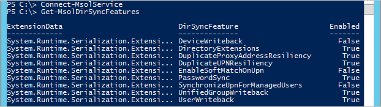

<properties
	pageTitle="Azure AD Connect sync service features and configuration | Microsoft Azure"
	description="Describes service side features for Azure AD Connect sync service."
	services="active-directory"
	documentationCenter=""
	authors="andkjell"
	manager="stevenpo"
	editor=""/>

<tags
	ms.service="active-directory"
	ms.workload="identity"
	ms.tgt_pltfrm="na"
	ms.devlang="na"
	ms.topic="article"
	ms.date="06/27/2016"
	ms.author="andkjell;markvi"/>

# Azure AD Connect sync service features

The synchronization feature of Azure AD Connect has two components:

- The on-premises component named **Azure AD Connect sync**, also called **sync engine**.
- The service residing in Azure AD also known as **Azure AD Connect sync service**

This topic explains how the following features of the **Azure AD Connect sync service** work and how you can configure them using Windows PowerShell.

These settings are configured by the [Azure Active Directory Module for Windows PowerShell](http://aka.ms/aadposh) and you must download and install it separately from Azure AD Connect to be able to configure these settings. The cmdlets documented were introduced in the [2016 March release (build 9031.1)](http://social.technet.microsoft.com/wiki/contents/articles/28552.microsoft-azure-active-directory-powershell-module-version-release-history.aspx#Version_9031_1). If you do not have the cmdlets documented in this topic or they do not produce the same result, then make sure you run the latest version.

To see the configuration in your Azure AD directory, run `Get-MsolDirSyncFeatures`.  


Many of these settings can only be changed by Azure AD Connect.

The following settings can be configured by `Set-MsolDirSyncFeature`:

DirSyncFeature | Comment
--- | ---
 [DuplicateProxyAddressResiliency<br/>DuplicateUPNResiliency](#duplicate-attribute-resiliency) | Allows an attribute to be quarantined if it is a duplicate of another object rather than failing the entire object during export.
[EnableSoftMatchOnUpn](#userprincipalname-soft-match) | Allows objects to join on userPrincipalName in addition to primary SMTP address.
[SynchronizeUpnForManagedUsers](#synchronize-userprincipalname-updates) | Allows the sync engine to update the userPrincipalName attribute for managed/licensed (non-federated) users.

After you have enabled a feature, it cannot be disabled again.

The following settings are configured by Azure AD Connect and cannot be modified by `Set-MsolDirSyncFeature`:

DirSyncFeature | Comment
--- | ---
DeviceWriteback | [Azure AD Connect: Enabling device writeback](active-directory-aadconnect-feature-device-writeback.md)
DirectoryExtensions | [Azure AD Connect sync: Directory extensions](active-directory-aadconnectsync-feature-directory-extensions.md)
PasswordSync | [Implementing password synchronization with Azure AD Connect sync](active-directory-aadconnectsync-implement-password-synchronization.md)
UnifiedGroupWriteback | [Preview: Group writeback](active-directory-aadconnect-feature-preview.md#group-writeback)
UserWriteback | Not currently supported.

## Duplicate attribute resiliency
Instead of failing to provision objects with duplicate UPNs / proxyAddresses, the duplicated attribute is “quarantined” and a temporary value is assigned if necessary. When the conflict is resolved, the temporary UPN will be fixed up to the proper value automatically. This behavior can be enabled for UPN and proxyAddress separately. For more details, see [Identity synchronization and duplicate attribute resiliency](active-directory-aadconnectsyncservice-duplicate-attribute-resiliency.md).

## UserPrincipalName soft match
When this feature is enabled, soft-match will be applied on UPN as well as the [primary SMTP address](https://support.microsoft.com/kb/2641663), which is always enabled. Soft-match is used to match existing cloud users in Azure AD with on-premises users.

Enabling this feature is particularly useful if you need to match on-premises AD accounts with existing accounts created in the cloud and you are not using Exchange Online. In this scenario, you generally don’t have a reason to set the SMTP attribute in the cloud.

This feature is on by default for newly created Azure AD directories. You can see if this is enabled for you by running:  
```
Get-MsolDirSyncFeatures -Feature EnableSoftMatchOnUpn
```

If this feature is not enabled for your Azure AD directory, then you can enable it by running:  
```
Set-MsolDirSyncFeature -Feature EnableSoftMatchOnUpn -Enable $true
```

## Synchronize userPrincipalName updates
Historically, updates to the UserPrincipalName attribute using the sync service from on-premises has been blocked, unless both of these conditions are true:

- The user is managed (non-federated).
- The user has not been assigned a license.

For more details, see [User names in Office 365, Azure, or Intune don't match the on-premises UPN or alternate login ID](https://support.microsoft.com/kb/2523192).

Enabling this feature allows the sync engine to update the userPrincipalName when it is changed on-premises and you use password sync. If you use federation, this feature will not work.

This feature is on by default for newly created Azure AD directories. You can see if this is enabled for you by running:  
```
Get-MsolDirSyncFeatures -Feature SynchronizeUpnForManagedUsers
```

If this feature is not enabled for your Azure AD directory, then you can enable it by running:  
```
Set-MsolDirSyncFeature -Feature SynchronizeUpnForManagedUsers -Enable $true
```

After enabling this feature, existing userPrincipalName values will remain as-is. On next change of the userPrincipalName attribute on-premises, the normal delta sync on users will update the UPN.  

## Future changes
These settings will be enabled for all Azure AD directories in the future.

## See also

- [Azure AD Connect sync](active-directory-aadconnectsync-whatis.md)

- [Integrating your on-premises identities with Azure Active Directory](active-directory-aadconnect.md).
