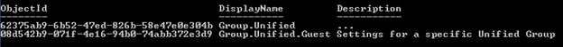
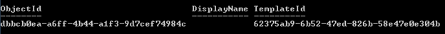

<properties
	pageTitle="Azure Active Directory cmdlets for configuring group settings | Microsoft Azure"
	description="How manage the settings for groups using Azure Active Directory cmdlets."
	services="active-directory"
	documentationCenter=""
	authors="curtand"
	manager="femila"
	editor=""/>

<tags
	ms.service="active-directory"
	ms.workload="identity"
	ms.tgt_pltfrm="na"
	ms.devlang="na"
	ms.topic="article"
	ms.date="06/21/2016"
	ms.author="curtand"/>

# Azure Active Directory cmdlets for configuring group settings

The following settings for unified groups can be configured in your directory:

1.  Classifications: the comma-separated list of classifications that users can set on a group. Examples would be “Classified”, “Secret”, and “Top Secret.”

2.  Usage Guidelines URL: a URL that points users to the terms of use for using Unified Groups, as defined by your organization. This URL will show up in the user interface where users use groups.

3.  Group creation enabled: whether none, some or all users are allowed to create Unified Groups. When set to on, all users can create groups. When set to off, no users can create groups. When off, you can also specify a security group whose users who are still allowed to create groups.

These settings are configured using a Settings and SettingsTemplate objects. Initially, you will not see any Settings objects in your directory. This means your directory is configured with the default settings. To change the default settings, you will create a new settings object using a settings template. Settings templates are defined by Microsoft.

You can download the module containing the cmdlets used for these operations from the [Microsoft Connect site](http://connect.microsoft.com/site1164/Downloads/DownloadDetails.aspx?DownloadID=59185).

## Create settings at the directory level

These steps create settings at directory level, which apply to all Office groups in the directory.

1. If you do not know which SettingTemplate to use, this cmdlet returns the list of settings templates:

	`Get-MsolAllSettingTemplate`

	

2. To add a usage guideline URL, first you need to get the SettingsTemplate object that defines the usage guideline URL value; that is, the Group.Unified template:

	`$template = Get-MsolSettingTemplate –TemplateId 62375ab9-6b52-47ed-826b-58e47e0e304b`

3. Next, create a new settings object based on that template:

	`$setting = $template.CreateSettingsObject()`

4. Then update the usage guideline value:

	`$setting["UsageGuidelinesUrl"] = "<https://guideline.com>"`

5. Finally, apply the settings:

	`New-MsolSettings –SettingsObject $setting`

	

Here are the settings defined in the Group.Unified SettingsTemplate.

 **Setting**                          | **Description**                                                                                             
--------------------------------------|-----------------------------------------------
 <ul><li>ClassificationList<li>Type: String<li>Default: “”                  | A comma-delimited list of valid classification values that can be applied to Unified Groups.                
 <ul><li>EnableGroupCreation<li>Type: Boolean<li>Default: True              | The flag indicating whether Unified Group creation is allowed in the directory.                               
 <ul><li>GroupCreationAllowedGroupId<li>Type: String<li>Default: “”         | GUID of the security group that is allowed to create Unified Groups even when EnableGroupCreation == false.
 <ul><li>UsageGuidelinesUrl<li>Type: String<li>Default: “”                  | A link to the Group Usage Guidelines.                                                                       

## Read settings at the directory level

These steps read settings at directory level, which apply to all Office groups in the directory.

1. Read all existing directory settings:

	`Get-MsolAllSettings`

2. Read all settings for a specific group:

	`Get-MsolAllSettings -TargetType Groups -TargetObjectId <groupObjectId>`

3. Read specific directory settings, using SettingId GUID:

	`Get-MsolSettings –SettingId dbbcb0ea-a6ff-4b44-a1f3-9d7cef74984c`

	

## Update settings at the directory level

These steps update settings at directory level, which apply to all Office groups in the directory.

1. Get the existing Settings object:

	`$setting = Get-MsolSettings –SettingId dbbcb0ea-a6ff-4b44-a1f3-9d7cef74984c`

2. Get the value you want to update:

	`$value = $Setting.GetSettingsValue()`

3. Update the value:

	`$value["AllowToAddGuests"] = "false"`

4. Update the setting:

	`Set-MsolSettings –SettingId dbbcb0ea-a6ff-4b44-a1f3-9d7cef74984c –SettingsValue $value`

## Remove settings at the directory level

This step removes settings at directory level, which apply to all Office groups in the directory.

	`Remove-MsolSettings –SettingId dbbcb0ea-a6ff-4b44-a1f3-9d7cef74984c`

## Cmdlet syntax reference

You can find more Azure Active Directory PowerShell documentation at [Azure Active Directory Cmdlets](http://go.microsoft.com/fwlink/p/?LinkId=808260).

## SettingsTemplate object reference (Group.Unified SettingsTemplate object)

- "name": "EnableGroupCreation", "type": "System.Boolean", "defaultValue": "true", "description": "A boolean flag indicating if the Unified Group creation feature is on."

- "name": "GroupCreationAllowedGroupId", "type": "System.Guid", "defaultValue": "", "description": "GUID of the security group that is whitelisted to create Unified Groups."

- "name": "ClassificationList", "type": "System.String", "defaultValue": "", "description": "A comma-delimited list of valid classification values that can be applied to Unified Groups."

- "name": "UsageGuidelinesUrl", "type": "System.String", "defaultValue": "", "description": "A link to the Group Usage Guidelines."

name | type | defaultValue | description
----------  | ----------  | ---------  | ----------
"EnableGroupCreation"  | "System.Boolean"  | "true"  | "A boolean flag indicating if the Unified Group creation feature is on."
"GroupCreationAllowedGroupId"  | "System.Guid"  | ""  | "GUID of the security group that is whitelisted to create Unified Groups."
"ClassificationList"  | "System.String"  | ""  | "A comma-delimited list of valid classification values that can be applied to Unified Groups."
"UsageGuidelinesUrl"  | "System.String"  | ""  | "A link to the Group Usage Guidelines."

## Next steps

You can find more Azure Active Directory PowerShell documentation at [Azure Active Directory Cmdlets](http://go.microsoft.com/fwlink/p/?LinkId=808260).

Additional instruction from Microsoft program manager Rob de Jong is available at [Rob's Groups Blog](http://robsgroupsblog.com/blog/configuring-settings-for-office-365-groups-in-azure-ad).

* [Managing access to resources with Azure Active Directory groups](active-directory-manage-groups.md)

* [Integrating your on-premises identities with Azure Active Directory](active-directory-aadconnect.md)
