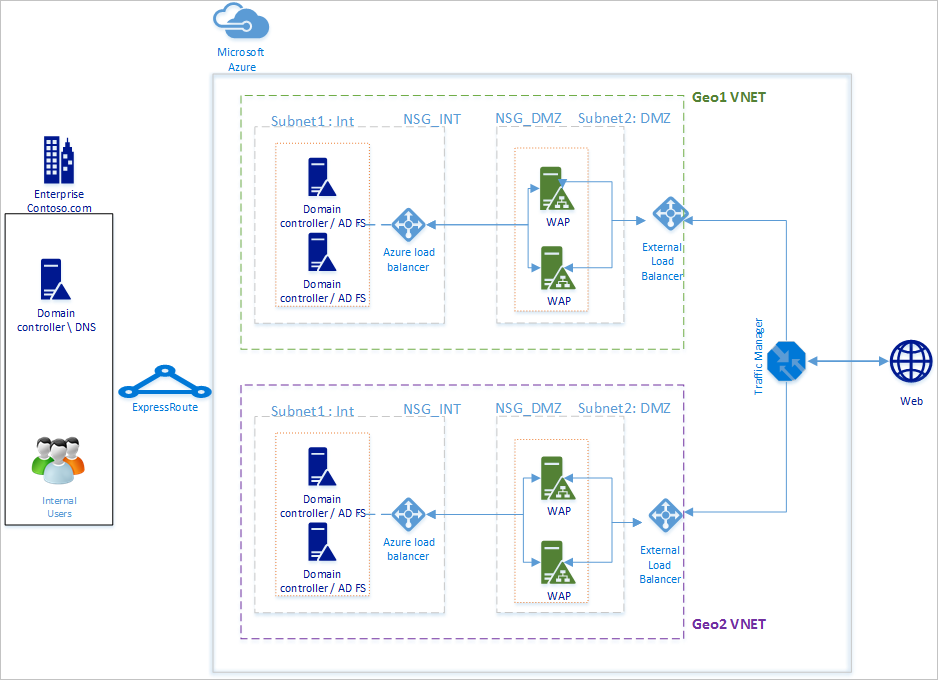
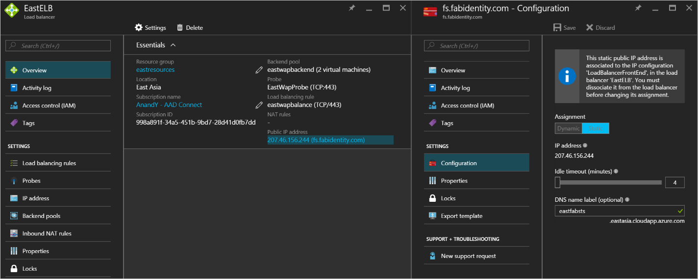
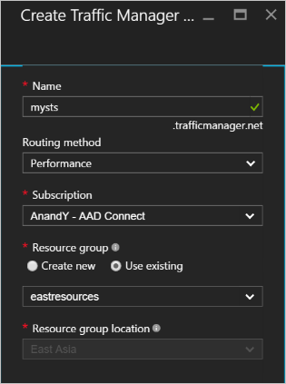
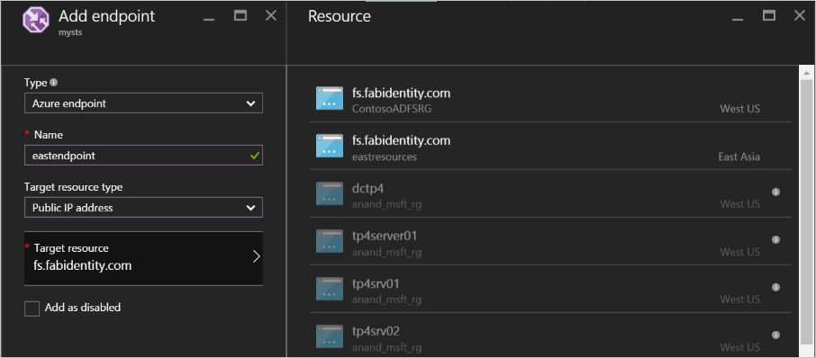
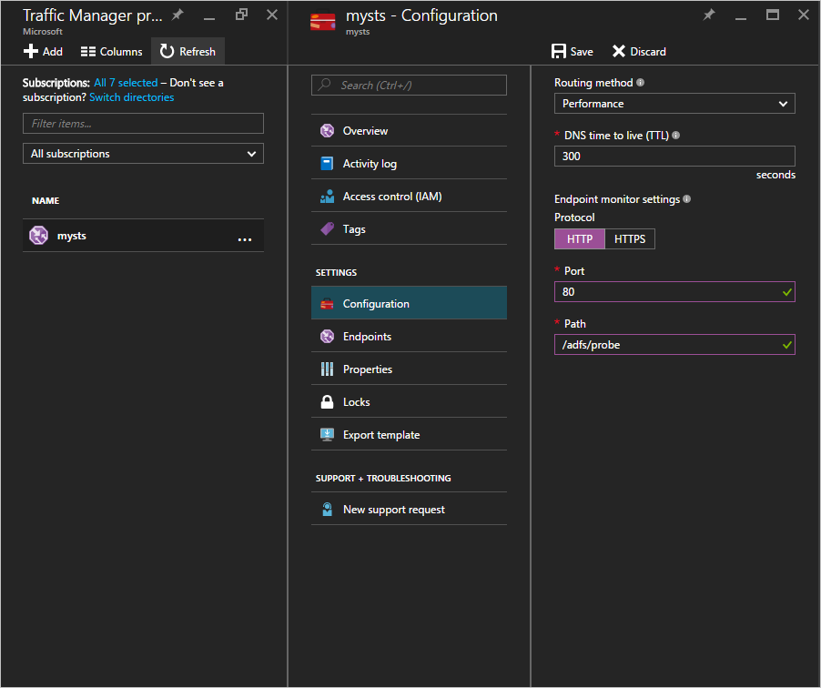
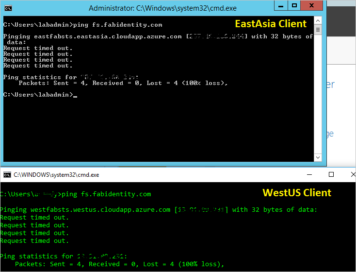
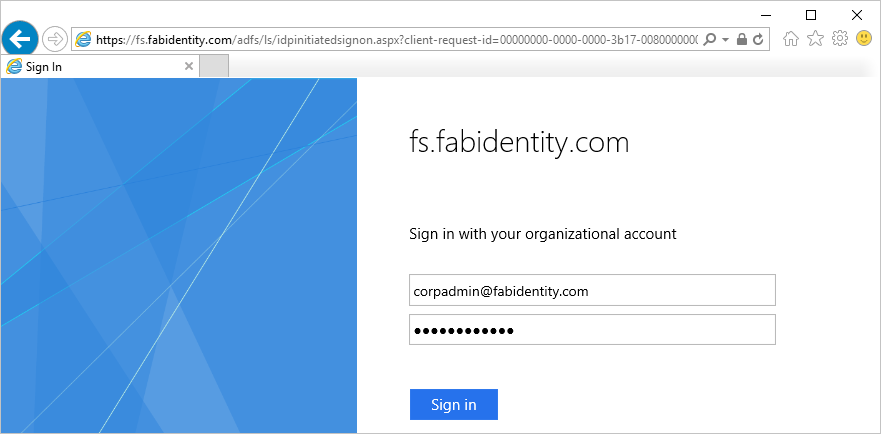
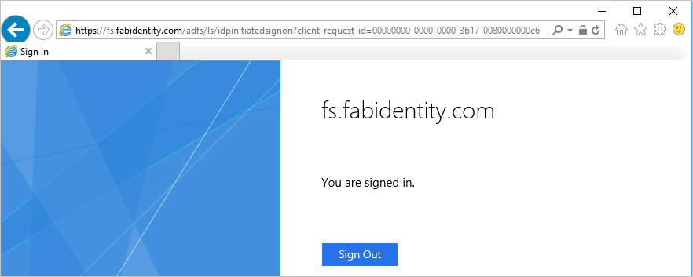

# High availability cross-geographic AD FS deployment in Azure with Azure Traffic Manager
[AD FS deployment in Azure](hybrid/how-to-connect-fed-azure-adfs.md) provides step-by-step guideline as to how you can deploy a simple AD FS infrastructure for your organization in Azure. This article provides the next steps to create a cross-geographic deployment of AD FS in Azure using [Azure Traffic Manager](../traffic-manager/traffic-manager-overview.md). Azure Traffic Manager helps create a geographically spread high availability and high-performance AD FS infrastructure for your organization by making use of range of routing methods available to suit different needs from the infrastructure.

A highly available cross-geographic AD FS infrastructure enables:

* **Elimination of single point of failure:** With failover capabilities of Azure Traffic Manager, you can achieve a highly available AD FS infrastructure even when one of the data centers in a part of the globe goes down
* **Improved performance:** You can use the suggested deployment in this article to provide a high-performance AD FS infrastructure that can help users authenticate faster. 

## Design principles

The basic design principles will be same as listed in Design principles in the article AD FS deployment in Azure. The diagram above shows a simple extension of the basic deployment to another geographical region. Below are some points to consider when extending your deployment to new geographical region

* **Virtual network:** You should create a new virtual network in the geographical region you want to deploy additional AD FS infrastructure. In the diagram above you see Geo1 VNET and Geo2 VNET as the two virtual networks in each geographical region.
* **Domain controllers and AD FS servers in new geographical VNET:** It is recommended to deploy domain controllers in the new geographical region so that the AD FS servers in the new region do not have to contact a domain controller in another far away network to complete an authentication and thereby improving the performance.
* **Storage accounts:** Storage accounts are associated with a region. Since you will be deploying machines in a new geographic region, you will have to create new storage accounts to be used in the region.  
* **Network Security Groups:** As storage accounts, Network Security Groups created in a region cannot be used in another geographical region. Therefore, you will need to create new network security groups similar to those in the first geographical region for INT and DMZ subnet in the new geographical region.
* **DNS Labels for public IP addresses:** Azure Traffic Manager can refer to endpoints ONLY via DNS labels. Therefore, you are required to create DNS labels for the External Load Balancers’ public IP addresses.
* **Azure Traffic Manager:** Microsoft Azure Traffic Manager allows you to control the distribution of user traffic to your service endpoints running in different datacenters around the world. Azure Traffic Manager works at the DNS level. It uses DNS responses to direct end-user traffic to globally-distributed endpoints. Clients then connect to those endpoints directly. With different routing options of Performance, Weighted and Priority, you can easily choose the routing option best suited for your organization’s needs. 
* **V-net to V-net connectivity between two regions:** You do not need to have connectivity between the virtual networks itself. Since each virtual network has access to domain controllers and has AD FS and WAP server in itself, they can work without any connectivity between the virtual networks in different regions. 

## Steps to integrate Azure Traffic Manager
### Deploy AD FS in the new geographical region
Follow the steps and guidelines in [AD FS deployment in Azure](hybrid/how-to-connect-fed-azure-adfs.md) to deploy the same topology in the new geographical region.

### DNS labels for public IP addresses of the Internet Facing (public) Load Balancers
As mentioned above, the Azure Traffic Manager can only refer to DNS labels as endpoints and therefore it is important to create DNS labels for the External Load Balancers’ public IP addresses. Below screenshot shows how you can configure your DNS label for the public IP address. 

### Deploying Azure Traffic Manager
Follow the steps below to create a traffic manager profile. For more information, you can also refer to [Manage an Azure Traffic Manager profile](../traffic-manager/traffic-manager-manage-profiles.md).

1. **Create a Traffic Manager profile:** Give your traffic manager profile a unique name. This name of the profile is part of the DNS name and acts as a prefix for the Traffic Manager domain name label. The name / prefix is added to .trafficmanager.net to create a DNS label for your traffic manager. The screenshot below shows the traffic manager DNS prefix being set as mysts and resulting DNS label will be mysts.trafficmanager.net. 
   
    
2. **Traffic routing method:** There are three routing options available in traffic manager:
   
   * Priority 
   * Performance
   * Weighted
     
     **Performance** is the recommended option to achieve highly responsive AD FS infrastructure. However, you can choose any routing method best suited for your deployment needs. The AD FS functionality is not impacted by the routing option selected. See [Traffic Manager traffic routing methods](../traffic-manager/traffic-manager-routing-methods.md) for more information. In the sample screenshot above you can see the **Performance** method selected.
3. **Configure endpoints:** In the traffic manager page, click on endpoints and select Add. This will open an Add endpoint page similar to the screenshot below
   
   
   
   For the different inputs, follow the guideline below:
   
   **Type:** Select Azure endpoint as we will be pointing to an Azure public IP address.
   
   **Name:** Create a name that you want to associate with the endpoint. This is not the DNS name and has no bearing on DNS records.
   
   **Target resource type:** Select Public IP address as the value to this property. 
   
   **Target resource:** This will give you an option to choose from the different DNS labels you have available under your subscription. Choose the DNS label corresponding to the endpoint you are configuring.
   
   Add endpoint for each geographical region you want the Azure Traffic Manager to route traffic to.
   For more information and detailed steps on how to add / configure endpoints in traffic manager, refer to [Add, disable, enable or delete endpoints](../traffic-manager/traffic-manager-endpoints.md)
4. **Configure probe:** In the traffic manager page, click on Configuration. In the configuration page, you need to change the monitor settings to probe at HTTP port 80 and relative path /adfs/probe
   
     
   
   > [!NOTE]
   > **Ensure that the status of the endpoints is ONLINE once the configuration is complete**. If all endpoints are in ‘degraded’ state, Azure Traffic Manager will do a best attempt to route the traffic assuming that the diagnostics is incorrect and all endpoints are reachable.
   > 
   > 
5. **Modifying DNS records for Azure Traffic Manager:** Your federation service should be a CNAME to the Azure Traffic Manager DNS name. Create a CNAME in the public DNS records so that whoever is trying to reach the federation service actually reaches the Azure Traffic Manager.
   
    For example, to point the federation service fs.fabidentity.com to the Traffic Manager, you would need to update your DNS resource record to be the following:
   
    <code>fs.fabidentity.com IN CNAME mysts.trafficmanager.net</code>

## Test the routing and AD FS sign-in
### Routing test
A very basic test for the routing would be to try ping the federation service DNS name from a machine in each geographic region. Depending on the routing method chosen, the endpoint it actually pings will be reflected in the ping display. For example, if you selected the performance routing, then the endpoint nearest to the region of the client will be reached. Below is the snapshot of two pings from two different region client machines, one in EastAsia region and one in West US. 

### AD FS sign-in test
The easiest way to test AD FS is by using the IdpInitiatedSignon.aspx page. In order to be able to do that, it is required to enable the IdpInitiatedSignOn on the AD FS properties. Follow the steps below to verify your AD FS setup

1. Run the below cmdlet on the AD FS server, using PowerShell, to set it to enabled. 
   Set-AdfsProperties -EnableIdPInitiatedSignonPage $true
2. From any external machine access https://<yourfederationservicedns>/adfs/ls/IdpInitiatedSignon.aspx
3. You should see the AD FS page like below:
   
    
   
    and on successful sign-in, it will provide you with a success message as shown below:
   
    

## Related links
* [Basic AD FS deployment in Azure](hybrid/how-to-connect-fed-azure-adfs.md)
* [Microsoft Azure Traffic Manager](../traffic-manager/traffic-manager-overview.md)
* [Traffic Manager traffic routing methods](../traffic-manager/traffic-manager-routing-methods.md)

## Next steps
* [Manage an Azure Traffic Manager profile](../traffic-manager/traffic-manager-manage-profiles.md)
* [Add, disable, enable or delete endpoints](../traffic-manager/traffic-manager-endpoints.md) 

