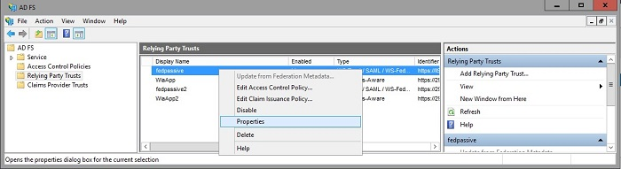
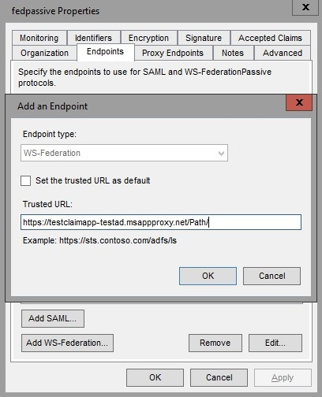

<properties
	pageTitle="Working with Claims Aware Apps in Application Proxy"
	description="Covers how to get up and running with Azure AD Application Proxy."
	services="active-directory"
	documentationCenter=""
	authors="kgremban"
	manager="femila"
	editor=""/>

<tags
	ms.service="active-directory"
	ms.workload="identity"
	ms.tgt_pltfrm="na"
	ms.devlang="na"
	ms.topic="article"
	ms.date="06/22/2016"
	ms.author="kgremban"/>

# Working with claims aware apps in Application Proxy

Claims aware apps perform a redirection to the Security Token Service (STS), which in turn requests credentials from the user in exchange for a token before redirecting the user to the application. To enable Application Proxy to work with these redirects, the following steps need to be taken.

## Prerequisites
Before performing this procedure, make sure that the STS the claims aware app redirects to is available outside of your on-premises network.

## Azure classic portal configuration

1. Publish your application according to the instructions described in [Publish applications with Application Proxy](active-directory-application-proxy-publish.md).
2. In the list of applications, select the claims aware app and click **Configure**.
3. If you chose **Passthrough** as your **Preauthentication Method**, make sure to select **HTTPS** as your **External URL** scheme.
4. If you chose **Azure Active Directory** as your **Preauthentication Method**, select **None** as your **Internal Authentication Method**.

## ADFS configuration

1. Open ADFS Management.
2. Go to **Relying Party Trusts**, right click on the app you are publishing with Application Proxy, and choose **Properties**.  
    
3. On the **Endpoints** tab, under **Endpoint type**, select **WS-Federation**.
4. Under **Trusted URL** enter the URL you entered in the Application Proxy under **External URL** and click **OK**.  
    

## See also

- [Publish applications with Application Proxy](active-directory-application-proxy-publish.md)
- [Enable single-sign on](active-directory-application-proxy-sso-using-kcd.md)
- [Troubleshoot issues you're having with Application Proxy](active-directory-application-proxy-troubleshoot.md)
- [Enable native client apps to interact with proxy applications](active-directory-application-proxy-native-client.md)

For the latest news and updates, check out the [Application Proxy blog](http://blogs.technet.com/b/applicationproxyblog/)
