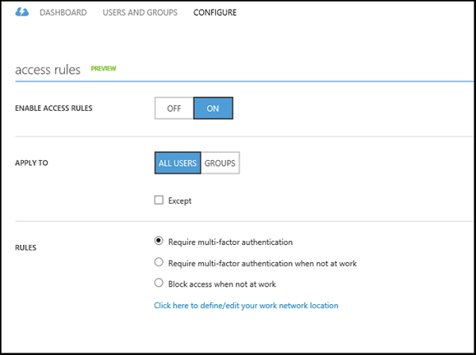

<properties
	pageTitle="Conditional Access for Applications Published with Azure AD Application Proxy"
	description="Covers how to set up conditional access for applications you publish to be accessed remotely using Azure AD Application Proxy."
	services="active-directory"
	documentationCenter=""
	authors="kgremban"
	manager="femila"
	editor=""/>

<tags
	ms.service="active-directory"
	ms.workload="identity"
	ms.tgt_pltfrm="na"
	ms.devlang="na"
	ms.topic="article"
	ms.date="06/22/2016"
	ms.author="kgremban"/>

# Working with conditional access

You can configure access rules to grant conditional access to applications published using Application Proxy. This enables you to:

- Require multi-factor authentication per application
- Require multi-factor authentication only when users are not at work
- Block users from accessing the application when they are not at work

These rules can be applied to all users and groups or only to specific users and groups. By default the rule will apply to all users who have access to the application. However the rule can also be restricted to users that are members of specified security groups.  

Access rules are evaluated when a user accesses a federated application that uses OAuth 2.0, OpenID Connect, SAML or WS-Federation. In addition, access rules are evaluated with OAuth 2.0 and OpenID Connect when a refresh token is used to acquire an access token.

## Conditional access prerequisites

- Subscription to Azure Active Directory Premium
- A federated or managed Azure Active Directory tenant
- Federated tenants require that multi-factor authentication (MFA) be enabled  
	

## Configure per-application multi-factor authentication
1. Sign in as an administrator in the Azure classic portal.
2. Go to Active Directory and select the directory in which you want to enable Application Proxy.
3. Click **Applications** and scroll down to the **Access Rules** section. The access rules section only appears for applications published using Application Proxy that use federated authentication.
4. Enable the rule by selecting **Enable Access Rules** to **On**.
5. Specify the users and groups to whom the rules will apply. Use the **Add Group** button  to select one or more groups to which the access rule will apply. This dialog can also be used to remove selected groups.  When the rules are selected to apply to groups, the access rules will only be enforced for users that belong to one of the specified security groups.  

  - To explicitly exclude security groups from the rule, check **Except**  and specify one or more groups. Users who are members of a group in the Except list will not be required to perform multi-factor authentication.  

  - If a user was configured using the per-user multi-factor authentication feature, this setting will take precedence over the application multi-factor authentication rules. This means that a user who has been configured for per-user multi-factor authentication will be required to perform multi-factor authentication even if they have been exempted from the application's multi-factor authentication rules. Learn more about [multi-factor authentication and per-user settings](../multi-factor-authentication/multi-factor-authentication.md).

6. Select the access rule you want to set:
	- **Require Multi-factor authentication**: Users to whom access rules apply will be required to complete multi-factor authentication before accessing the application to which the rule applies.
	- **Require Multi-factor authentication when not at work**: Users trying to access the application from a trusted IP address will not be required to perform multi-factor authentication. The trusted IP address ranges can be configured on the multi-factor authentication settings page.
	- **Block access when not at work**: Users trying to access the application from outside your corporate network will not be able to access the application.

## Configuring MFA for federation services
For federated tenants, multi-factor authentication (MFA) may be performed by Azure Active Directory or by the on-premises AD FS server. By default, MFA will occur on any page hosted by Azure Active Directory. In order to configure MFA on-premises, run Windows PowerShell and use the –SupportsMFA property to set the Azure AD module.

The following example shows how to enable on-premises MFA by using the [Set-MsolDomainFederationSettings cmdlet](https://msdn.microsoft.com/library/azure/dn194088.aspx) on the contoso.com tenant: `Set-MsolDomainFederationSettings -DomainName contoso.com -SupportsMFA $true `

In addition to setting this flag, the federated tenant AD FS instance must be configured to perform multi-factor authentication. Follow the instructions for [deploying Microsoft Azure multi-factor authentication on-premises](../multi-factor-authentication/multi-factor-authentication-get-started-server.md).

## See also

- [Working with claims aware applications](active-directory-application-proxy-claims-aware-apps.md)
- [Publish applications with Application Proxy](active-directory-application-proxy-publish.md)
- [Enable single-sign on](active-directory-application-proxy-sso-using-kcd.md)
- [Publish applications using your own domain name](active-directory-application-proxy-custom-domains.md)

For the latest news and updates, check out the [Application Proxy blog](http://blogs.technet.com/b/applicationproxyblog/)
