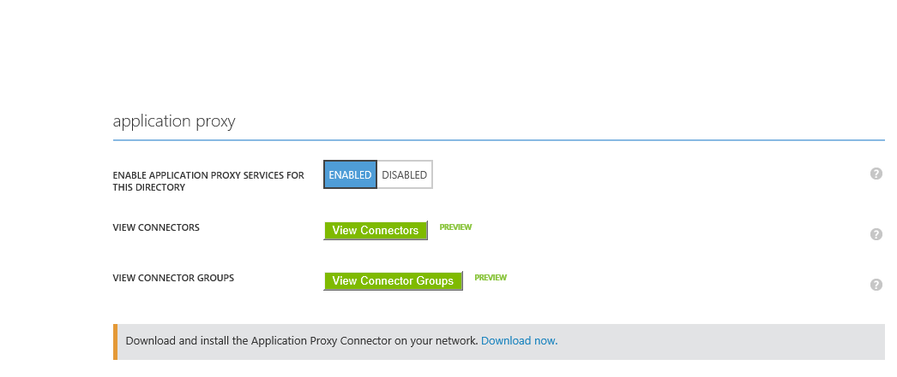
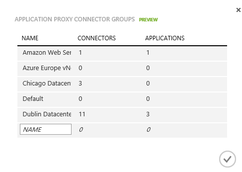
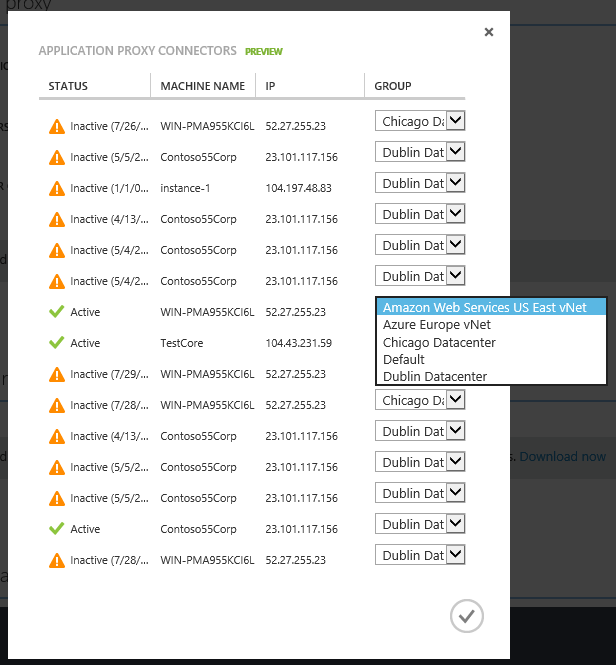
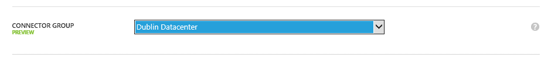

<properties
	pageTitle="Working with Azure AD Application Proxy Connectors | Microsoft Azure"
	description="Covers how to create and manage groups of Connectors in Azure AD Application Proxy."
	services="active-directory"
	documentationCenter=""
	authors="kgremban"
	manager="StevenPo"
	editor=""/>

<tags
	ms.service="active-directory"
	ms.workload="identity"
	ms.tgt_pltfrm="na"
	ms.devlang="na"
	ms.topic="article"
	ms.date="02/09/2016"
	ms.author="kgremban"/>

# Publish applications on separate networks and locations using Connector groups

> [AZURE.NOTE] Application Proxy is a feature that is available only if you upgraded to the Premium or Basic edition of Azure Active Directory. For more information, see [Azure Active Directory editions](active-directory-editions.md).

Connector groups are useful for a number of various scenarios, including:

- Sites with multiple interconnected datacenters in which you want to keep as much traffic within the datacenter as possible, because cross-datacenter links are usually expensive and have high latency. You can deploy Connectors in each datacenter to serve only the applications that reside within the datacenter, in order to save valuable cross-datacenter links and provide an entirely transparent experience to your users.
- Managing applications installed on isolated networks that are not part of the main corporate network. You can use Connector groups to install dedicated Connectors for isolated networks to also enable isolation of applications to the network.
- For applications installed on IaaS for cloud access, Connector groups provide a common service to secure the access to all of them without creating additional dependency on your corporate network or fragmenting the experience. Connectors can be installed on every cloud datacenter and serve only applications that reside in this network. You can install several Connectors to achieve high availability.
- Support for multi-forest environments in which specific Connectors can be deployed per forest and set to serve specific applications.
- Connector groups can be used in Disaster Recovery sites to either detect failover or as backup for the main site.
- Connector groups can also be used to serve multiple companies from a single tenant.

## Working with Connector groups
In order to group your Connectors, you have to make sure you [installed multiple Connectors](active-directory-application-proxy-enable.md), and that you name them and then group them. Finally you have to assign them to specific apps.

## Step 1: Create Connector groups
You can create as many Connector groups as you want. Connector group creation is accomplished in the Azure classic portal. Select your directory and click **Configure**.

  

Then, under Application Proxy, click **Manage Connector Groups** and create a new Connector group by giving the group a name.

  

## Step 2: Assign Connectors to your groups
Once the Connector groups are created, move the Connectors to the appropriate group. Under **Application Proxy**, click **Manage Connectors**. Under **Group**, select the group you want for each Connector. Note that it might take the Connectors up to 10 minutes to become active in the new group.

  

## Step 3: Assign applications to your Connector groups
The last step is to set each application to the Connector group that will serve it. In the Azure classic portal, in your directory, select the Application you want to assign to the group, click **Configure**. Under **Connector group**, select the group you want the application to use. This change is immediately applied.

  

For more information on publishing applications, see [Publish applications using your own domain name](active-directory-application-proxy-custom-domains.md)

## See also
There's a lot more you can do with Application Proxy:

- [Enable Application Proxy](active-directory-application-proxy-enable.md)
- [Enable single-sign on](active-directory-application-proxy-sso-using-kcd.md)
- [Enable conditional access](active-directory-application-proxy-conditional-access.md)
- [Working with claims aware applications](active-directory-application-proxy-claims-aware-apps.md)
- [Troubleshoot issues you're having with Application Proxy](active-directory-application-proxy-troubleshoot.md)

## Learn more about Application Proxy
- [Take a look at our online help](active-directory-application-proxy-enable.md)
- [Check out the Application Proxy blog](http://blogs.technet.com/b/applicationproxyblog/)
- [Watch our videos on Channel 9!](http://channel9.msdn.com/events/Ignite/2015/BRK3864)

## Additional resources
- [Article Index for Application Management in Azure Active Directory](active-directory-apps-index.md)
- [About Kerberos constrained delegation](http://technet.microsoft.com/library/cc995228.aspx)
