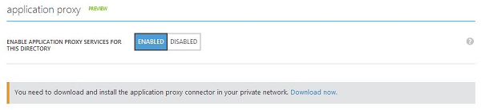
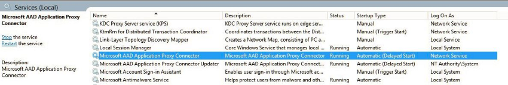

<properties
	pageTitle="Enabling Azure AD Application Proxy | Microsoft Azure"
	description="Covers how to get up and running with Azure AD Application Proxy."
	services="active-directory"
	documentationCenter=""
	authors="kgremban"
	manager="StevenPo"
	editor=""/>

<tags
	ms.service="active-directory"
	ms.workload="identity"
	ms.tgt_pltfrm="na"
	ms.devlang="na"
	ms.topic="article"
	ms.date="02/09/2016"
	ms.author="kgremban"/>

# Enabling Azure AD Application Proxy
> [AZURE.NOTE] Application Proxy is a feature that is available only if you upgraded to the Premium or Basic edition of Azure Active Directory. For more information, see [Azure Active Directory editions](active-directory-editions.md).

Microsoft Azure Active Directory Application Proxy lets you publish applications, such as SharePoint sites, Outlook Web Access, and IIS-based apps inside your private network and provides secure access to users outside your network. Employees can log into your apps from home on their own devices and authenticate through this cloud-based proxy.

Application Proxy works by installing a slim Windows service called a Connector inside your network. The Connector maintains an outbound connection from within your network to the proxy service. When users access a published application, the proxy uses this connection to provide access to the application.

This article walks you through enabling Microsoft Azure AD Application Proxy for your cloud directory in Azure AD, installing the Application Proxy Connector on your private network, and registering the Connector with your Microsoft Azure AD tenant subscription.

## Application Proxy prerequisites
Before you can enable and use Application Proxy services, you need to have:

- A Microsoft Azure AD [basic or premium subscription](active-directory-editions.md) and an Azure AD directory for which you are a global administrator.
- A server running Windows Server 2012 R2 or Windows 8.1 or higher on which you can install the Application Proxy Connector. The server must be able to send HTTPS requests to the Application Proxy services in the cloud, and it must have an HTTPS connection to the applications that you intend to publish.
- If a firewall is placed in the path, make sure the firewall is open to allow HTTPS (TCP) requests that originate from the Connector to the Application Proxy. The Connector uses these ports together with subdomains that are part of the high level domains: msappproxy.net and servicebus.windows.net. Make sure to open **all** the following ports to **outbound** traffic:

Port Number | Description
--- | ---
80 | To enable outbound HTTP traffic for security validation.
443 | To enable user authentication against Azure AD (required only for the Connector registration process)
10100 - 10120 | To enable LOB HTTP responses sent back to the proxy
9352, 5671 | To enable communication between the Connector toward the Azure service for incoming requests.
9350 | Optional, to enable better performance for incoming requests
8080 | To enable the Connector bootstrap sequence and Connector automatic update
9090 | To enable Connector registration (required only for the Connector registration process)
9091 | To enable Connector trust certificate automatic renewal

If your firewall enforces traffic according to originating users, open these ports for traffic coming from Windows services running as a Network Service. Also, make sure to enable port 8080 for NT Authority\System.

## Step 1: Enable Application Proxy in Azure AD
1. Sign in as an administrator in the Azure classic portal.
2. Go to Active Directory and select the directory in which you want to enable Application Proxy.
3. Click **Configure**, scroll down to Application Proxy and toggle Enable Application Proxy Services for this Directory to **Enabled**.

	

4. Click **Download now** at the bottom of the screen. This will take you to the download page. Read and accept the license terms and click **Download** to save the Windows Installer file (.exe) for the Application Proxy Connector.

## Step 2: Install and register the Connector
1. Run `AADApplicationProxyConnectorInstaller.exe` on the server you prepared (see Application Proxy prerequisites above).
2. Follow the instructions in the wizard to install.
3. During installation you will be prompted to register the Connector with the Application Proxy of your Azure AD tenant.

  - Provide your Azure AD global administrator credentials. Your global administrator tenant may be different from your Microsoft Azure credentials.
  - Make sure the admin who registers the Connector is in the same directory where you enabled the Application Proxy service, for example if the tenant domain is contoso.com, the admin should be admin@contoso.com or any other alias on that domain.
  - If IE Enhanced Security Configuration is set to **On** on the server where you are installing the Azure AD Connector, the registration screen might be blocked. If this happens, follow the instructions in the error message to allow access. Make sure that Internet Explorer Enhanced Security is off.
  - If Connector registration does not succeed, see [Troubleshoot Application Proxy](active-directory-application-proxy-troubleshoot.md).  

4. When the installation completes, two new services are added to your server, as shown below. These are the Connector service, which enables connectivity, and an automated update service, which periodically checks for new versions of the Connector and updates the Connector as needed. Click **Finish** in the installation window to complete installation

	

5. You are now ready to [Publish applications with Application Proxy](active-directory-application-proxy-publish.md).

For high availability purposes, you must deploy at least one additional Connector. To deploy an additional Connector, repeat steps 2 and 3, above. Each Connector must be registered separately.

If you want to uninstall the Connector, uninstall both the Connector service and the Updater service and then make sure to restart your computer to fully remove the service.

## See also
There's a lot more you can do with Application Proxy:

- [Publish applications with Application Proxy](active-directory-application-proxy-publish.md)
- [Publish applications using your own domain name](active-directory-application-proxy-custom-domains.md)
- [Enable single-sign on](active-directory-application-proxy-sso-using-kcd.md)
- [Enable conditional access](active-directory-application-proxy-conditional-access.md)
- [Working with claims aware applications](active-directory-application-proxy-claims-aware-apps.md)
- [Troubleshoot issues you're having with Application Proxy](active-directory-application-proxy-troubleshoot.md)

## Learn more about Application Proxy
- [Check out the Application Proxy blog](http://blogs.technet.com/b/applicationproxyblog/)
- [Watch our videos on Channel 9!](http://channel9.msdn.com/events/Ignite/2015/BRK3864)

## Additional resources
- [Article Index for Application Management in Azure Active Directory](active-directory-apps-index.md)
- [Sign up for Azure as an organization](sign-up-organization.md)
- [Azure Identity](fundamentals-identity.md)
- [Publish Applications with Application Proxy](active-directory-application-proxy-publish.md)
