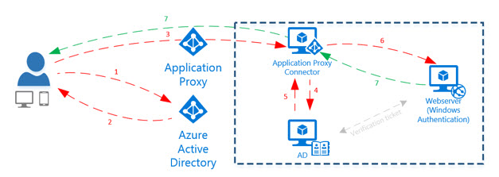

<properties
	pageTitle="How to provide secure remote access to on-premises apps"
	description="Covers how to use Azure AD Application Proxy to provide secure remote access to your on-premises apps."
	services="active-directory"
	documentationCenter=""
	authors="kgremban"
	manager="stevenpo"
	editor=""/>

<tags
	ms.service="active-directory"
	ms.workload="identity"
	ms.tgt_pltfrm="na"
	ms.devlang="na"
	ms.topic="article"
	ms.date="04/12/2016"
	ms.author="kgremban"/>

# How to provide secure remote access to on-premises applications

> [AZURE.NOTE] Application Proxy is a feature that is available only if you upgraded to the Premium or Basic edition of Azure Active Directory. For more information, see [Azure Active Directory editions](active-directory-editions.md).

You want to provide access for remote users who have all kinds of devices – managed, and unmanaged; tablets, smartphones, and laptops. But providing secure access to a myriad of resources can be complex. In recent years, reverse proxies were a popular way to provide secure remote access, but they needed to be behind firewalls which were hard to secure and hard to make highly available.

## Secure remote access in the cloud
In a modern cloud environment, we take remote access to the next level using Application Proxy in Microsoft Azure Active Directory (AD). Application Proxy is a feature of Azure AD that is supplied as a service, meaning that it’s easy to deploy and use. It integrates with Azure AD, the same identity platform that is used by Office 365.

## What is Azure Active Directory Application Proxy?
Application Proxy provides single sign-on (SSO) and secure remote access for web applications hosted on-premises, such as SharePoint sites and Outlook Web Access. Your on-premises web applications can now be accessed the same way as your SaaS apps in Azure Active Directory, without the need for a VPN or changing the network infrastructure. Application Proxy lets you publish applications, and then employees can log into your apps from home or on their own devices, and authenticate through this cloud-based proxy.

## How does it work?

App Proxy works with three basic steps. First, Connectors are deployed on the on-premises network. Then, the connector connects to the cloud service.
Finally, the connector and cloud service route user traffic to applications.

 

1. The user accesses the application through the application proxy and will be directed to the Azure AD logon page to authenticate.
2. After a successful logon, a token is generated and sent to the user.
3. The user sends the token to the application proxy which retrieves the user principal name (UPN) and security principal name (SPN) from the token then directs the request to the connector.
4. On behalf of the user, the connector requests a Kerberos ticket that can be used for internal (Windows) authentication. This is known as Kerberos Constrained Delegation.
5. A Kerberos ticket is retrieved from Active Directory.
6. The ticket is sent to the application server and verified.
7. The response is sent through the application proxy to the user.

### Enabling Access
Application Proxy works by installing a slim Windows Server service called the connector inside your network. The connector doesn’t necessitate opening any inbound ports and you don’t have to put anything in the DMZ. If you have a lot of traffic to your apps you can add more connectors, and the service will take care of the load balancing. The connectors are stateless and pull everything from the cloud as necessary.
When a user accesses applications remotely, from any device, he’s authenticated by Azure Active Directory and gets access to the application.

### Single sign-on
Azure AD Application Proxy provides single sign-on to applications that use Integrated Windows Authentication (IWA), or claims-aware applications. If your application uses IWA, Application Proxy impersonates the user using Kerberos Constrained Delegation to provide SSO. If you have a claims-aware application that trusts Azure Active Directory, SSO is achieved because the user was already authenticated by Azure AD.

## How to get started
Make sure you have an Azure AD basic or premium subscription and an Azure AD directory for which you are a global administrator. You also need Azure AD basic or premium licenses for the directory administrator and users accessing the apps. Take a look at  [Azure Active Directory editions](active-directory-editions.md) for more information.

### Getting started enabling remote access to on-premises applications
Setting up Application Proxy is accomplished in two steps:

1. [Enable Application Proxy and configure the Connector](active-directory-application-proxy-enable.md)  
2. [Publish applications](active-directory-application-proxy-publish.md) - use the quick and easy wizard to get your on-premises apps published and accessible remotely.

## What's next?
There's a lot more you can do with Application Proxy:

- [Publish applications using your own domain name](active-directory-application-proxy-custom-domains.md)
- [Enable single-sign on](active-directory-application-proxy-sso-using-kcd.md)
- [Working with claims aware applications](active-directory-application-proxy-claims-aware-apps.md)
- [Enable conditional access](active-directory-application-proxy-conditional-access.md)

### Learn more about Application Proxy
- [Take a look at our online help](active-directory-application-proxy-enable.md)
- [Check out the Application Proxy blog](http://blogs.technet.com/b/applicationproxyblog/)
- [Watch our videos on Channel 9!](http://channel9.msdn.com/events/Ignite/2015/BRK3864)

## Additional resources
- [Article Index for Application Management in Azure Active Directory](active-directory-apps-index.md)
- [Sign up for Azure as an organization](sign-up-organization.md)
- [Azure Identity](fundamentals-identity.md)
