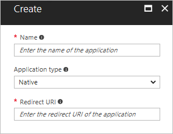

# How to enable native client apps to interact with proxy applications

In addition to web applications, Azure Active Directory Application Proxy can also be used to publish native client apps that are configured with the Azure AD Authentication Library (ADAL). Native client apps differ from web apps because they are installed on a device, while web apps are accessed through a browser. 

Application Proxy supports native client apps by accepting Azure AD issued tokens sent in the header. The Application Proxy service performs authentication on behalf of the users. This solution does not use application tokens for authentication. 


Use the Azure AD Authentication Library, which takes care of authentication and supports many client environments, to publish native applications. Application Proxy fits into the [Native Application to Web API scenario](develop/active-directory-authentication-scenarios.md#native-application-to-web-api). 

This article walks you through the four steps to publish a native application with Application Proxy and the Azure AD Authentication Library. 

## Step 1: Publish your application
Publish your proxy application as you would any other application and assign users to access your application. For more information, see [Publish applications with Application Proxy](active-directory-application-proxy-publish.md).

## Step 2: Configure your application
Configure your native application as follows:

1. Sign in to the [Azure portal](https://portal.azure.com).
2. Navigate to **Azure Active Directory** > **App registrations**.
3. Select **New application registration**.
4. Specify a name for your application, select **Native** as the application type, and provide the Redirect URI for your application. 

   
5. Select **Create**.

For more detailed information about creating a new app registration, see [Integrating applications with Azure Active Directory](.//develop/active-directory-integrating-applications.md).


## Step 3: Grant access to other applications
Enable the native application to be exposed to other applications in your directory:

1. Still in **App registrations**, select the new native application that you just created.
2. Select **Required permissions**.
3. Select **Add**.
4. Open the first step, **Select an API**.
5. Use the search bar to find the Application Proxy app that you published in the first section. Choose that app, then click **Select**. 

   
6. Open the second step, **Select permissions**.
7. Use the checkbox to grant your native application access to your proxy application, then click **Select**.

   
8. Select **Done**.


## Step 4: Edit the Active Directory Authentication Library
Edit the native application code in the authentication context of the Active Directory Authentication Library (ADAL) to include the following text:

```
// Acquire Access Token from AAD for Proxy Application
AuthenticationContext authContext = new AuthenticationContext("https://login.microsoftonline.com/<Tenant ID>");
AuthenticationResult result = authContext.AcquireToken("< External Url of Proxy App >",
        "<App ID of the Native app>",
        new Uri("<Redirect Uri of the Native App>"),
        PromptBehavior.Never);

//Use the Access Token to access the Proxy Application
HttpClient httpClient = new HttpClient();
httpClient.DefaultRequestHeaders.Authorization = new AuthenticationHeaderValue("Bearer", result.AccessToken);
HttpResponseMessage response = await httpClient.GetAsync("< Proxy App API Url >");
```

The variables in the sample code should be replaced as follows:

* **Tenant ID** can be found in the Azure portal. Navigate to **Azure Active Directory** > **Properties** and copy the Directory ID. 
* **External URL** is the front-end URL you entered in the Proxy Application. To find this value, navigate to the **Application proxy** section of the proxy app.
* **App ID** of the native app can be found on the **Properties** page of the native application.
* **Redirect URI of the native app** can be found on the **Redirect URIs** page of the native application.

Once the ADAL is edited with these parameters, your users should be able to authenticate to native client apps even when they're outside of the corporate network. 

## Next steps

For more information about the native application flow, see [Native application to web API](develop/active-directory-authentication-scenarios.md#native-application-to-web-api)

Learn about setting up [Single sign-on for Application Proxy](application-proxy-sso-overview.md)
