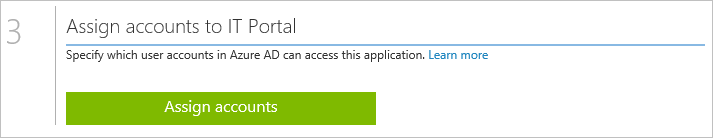

<properties
	pageTitle="Publishing Apps with Azure AD Application Proxy"
	description="Covers how to publish on-premises applications using Azure AD Application Proxy."
	services="active-directory"
	documentationCenter=""
	authors="rkarlin"
	manager="StevenPo"
	editor=""/>

<tags
	ms.service="active-directory"
	ms.workload="identity"
	ms.tgt_pltfrm="na"
	ms.devlang="na"
	ms.topic="article"
	ms.date="10/12/2015"
	ms.author="rkarlin"/>

# Publish applications using Azure AD Application Proxy

> [AZURE.NOTE] Application Proxy is a feature that is available only if you upgraded to the Premium or Basic edition of Azure Active Directory. For more information, see [Azure Active Directory editions](active-directory-edition.md).

After you enable Microsoft Azure AD Application Proxy, you can publish applications to make them accessible for your users outside your private network.

This section walks you through the steps necessary to publish applications that are running on your local network for which you want to enable secure remote access from outside your network.

> [AZURE.NOTE] To verify that the Connector is running properly, the first application you publish should be any website accessible from within your private network to assure users can access it from the Internet, before publishing an actual application.

## Publish an app using the wizard

1. Open a browser of your choice and go to the Azure Management Portal.
2. In the left pane of the Azure Management Portal, click the Active Directory tab.
3. Click the directory in which you enabled Application Proxy and for which you want to publish an application (for example, Wingtip Toys).
4. Click the **Applications** tab, and then click the **Add** button at the bottom of the screen
	
5. In the What do you want to do? dialog box, click **Publish an application that will be accessible outside your network**. 
	

6. Follow the instructions on the screen to provide the following information about your application:
	

**Setting** | **Details**
---|---
External URL | This is the URL of the cloud service that is used to access the application from outside your private network. The URL is automatically generated based on the name you provided, with the suffix msappproxy.net.
Preauthentication Method | 
Set the type of preauthentication method you want the application to use:

a. Microsoft Azure Active Directory (Microsoft Azure AD) – sets the preauthentication method to Microsoft Azure Active Directory (Microsoft Azure AD). When a user tries to access an application, Application Proxy will redirect the user to log in with Azure AD which will authenticate the user, ensuring that the user has the necessary permissions for the directory and the application.
 
b. Pass through –preauthentication is not performed.

External URL Protocol | 
By default, applications are published by using the HTTPS protocol.
 
To enable HTTP for an internal application, you have to set Preauthentication to Passthrough and then you are able to change the External URL protocol from HTTPS to HTTP.
 
Note that publishing applications by using HTTP may create security issues for your application and your users.
 
You can insert a custom domain rather than using the default of msappproxy.net. For more information, see below.

Internal URL | This is the internal URL that the Application Proxy connector uses to access the application internally. This should be the URL of the published application that is used to access the application from inside your private network. This is a valid URL with no spaces or symbols. You can specify a specific path on the backend server to publish, while the rest of the server is not published. This allows you to publish, for example, different sites located on the same SharePoint server with different names and access rules.
The path is specified in the internal URL field and will be visible in the external URL. The internal and external paths must be identical.

To finish the wizard, click the check mark at the bottom of the screen. The application is now defined in Azure AD.

## Assign users and groups to the application

1. For apps that are preauthenticated, you must assign users and groups that will have access to the app. 
For apps that are passthrough, access is available for all users. However, in order for a user to see the app in their application list, you must assign the app to that user.
2. After finishing the Add App wizard, the App Proxy Quick Start page is displayed. To assign users, click **Assign users**.
	
3. Select each user or group you want to assign to this app and click **Assign**. 

> [AZURE.NOTE] For Integrated Windows Authentication apps, you can assign only users and groups that are synced from your on-prem Active Directory. Users logging in using a Microsoft account and guests cannot be assigned for apps published with Azure Active Directory Application Proxy. Make sure the users you assign log in with their credentials that are part of the same domain as the app you are publishing.

## Advanced configuration

1. You can modify published apps or configure advanced options, such as SSO to on-prem applications, from the **Configure** page.
	

2. Select the app and click **Configure**. The following options are available:

**Setting** | **Details**
---|---
Name | Provide a descriptive name for your application
External URL | This is the URL of the cloud service that is used to access the application from outside your private network. The URL is automatically generated based on the name you provided, with the suffix **msappproxy.net.**
Preauthentication Method | Set the type of preauthentication method you want the application to use:
Active directory – sets the preauthentication method to Active Directory. When a user tries to access an application, Application Proxy will redirect the user to log in with Application Proxy which will authenticate the user, ensuring that the user has the necessary permissions for the directory and the application.

 Pass through –preauthentication is not performed.

External URL | By default, applications are published by using the HTTPS protocol. To enable HTTP for an internal application, you have to set Preauthentication to Passthrough and then you are able to change the External URL protocol from HTTPS to HTTP. Note that publishing applications by using HTTP may create security issues for your application and your users. You can set a custom domain rather than using the default domain provided (msappproxy.net). For more information, see Working with Custom Domains.
Internal URL | This is the internal URL that the Application Proxy connector uses to access the application internally. This should be the URL of the published application that is used to access the application from inside your private network. This is a valid URL with no spaces or symbols. You can specify a specific path on the backend server to publish, while the rest of the server is not published. This allows you to publish, for example, different sites located on the same SharePoint server with different names and access rules.
The path is specified in the internal URL field and will be visible in the external URL. The internal and external paths must be identical.
Translate URL in Headers | For applications (such as some SharePoint configurations) that necessitate that the HTTP host headers are not translated, set this to No. This will disable header translation for both request and response headers.
Internal Authentication Method | If you use Application Proxy for preauthentication, you can set an internal authentication method to enable your users to benefit from single-sign on (SSO) to this application. 
 Select **Integrated Windows Authentication (IWA)** if your application uses IWA and you can configure Kerberos Constrained Delegation (KCD) to enable SSO for this application. 
 Select **None** if your application does not use IWA. 
 Applications that use IWA must be configured using KCD, otherwise Application Proxy will not be able to publish these applications. 
 For more information, see SSO for On Prem IWA Apps Using KCD with App Proxy
Internal Application SPN | This is the Service-Principal-Name (SPN) of the internal application as configured in the on-prem Application Proxy. The SPN is used by the Application Proxy Connector to fetch Kerberos tokens for the application using Kerberos Constrained Delegation (KCD). 
 For more information, see [Enable single-sign on](active-directory-application-proxy-sso-using-kcd.md)

After you publish applications using Azure Active Directory Application Proxy, they appear in the Applications list in Azure AD, and you can manage them there.
If you disable Application Proxy services after you have published applications, the applications are not deleted, but will no longer be accessible from outside your private network.
To view an application and make sure it is accessible, double-click the name of the application. If the Application Proxy service is disabled and the application is not available, a warning message appears at the top of the screen.
To delete an application, select an application in the list, and then click **Delete**.

## See also
There's a lot more you can do with Application Proxy:

- [Enable Application Proxy](active-directory-application-proxy-enable.md)
- [Publish applications using your own domain name](active-directory-application-proxy-custom-domains.md)
- [Enable single-sign on](active-directory-application-proxy-sso-using-kcd.md)
- [Enable conditional access](active-directory-application-proxy-conditional-access.md)
- [Working with claims aware applications](active-directory-application-proxy-claims-aware-apps.md)
- [Troubleshoot issues you're having with Application Proxy](active-directory-application-proxy-troubleshoot.md)

## Learn more about Application Proxy
- [Take a look here at our online help](active-directory-application-proxy-enable.md)
- [Check out the Application Proxy blog](http://blogs.technet.com/b/applicationproxyblog/)
- [Watch our videos on Channel 9!](http://channel9.msdn.com/events/Ignite/2015/BRK3864)

## Additional resources

* [About Kerberos constrained delegation](http://technet.microsoft.com/library/cc995228.aspx)
