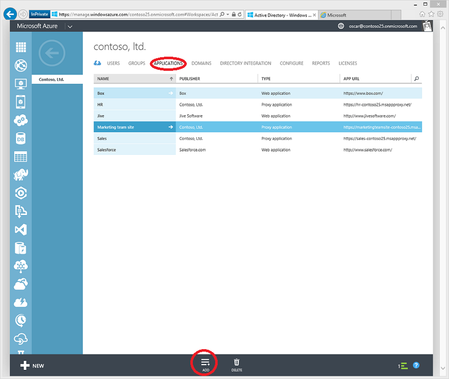
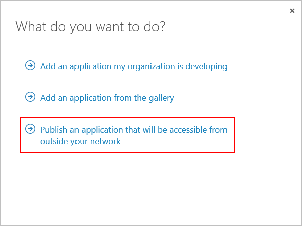
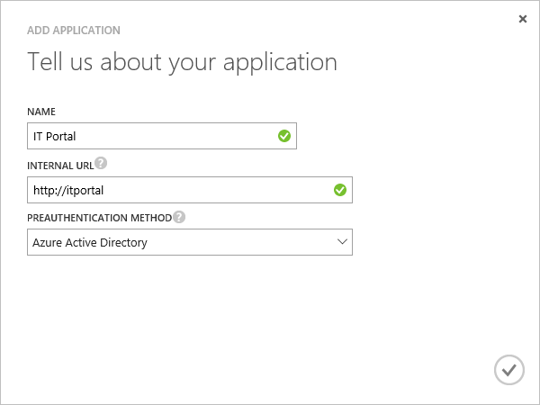
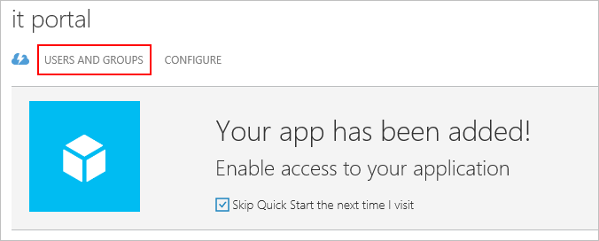
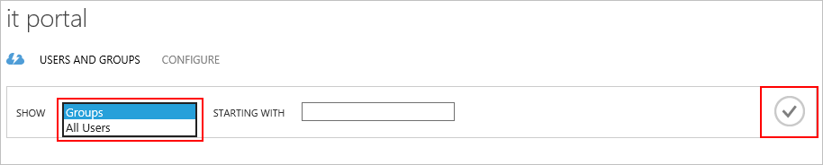
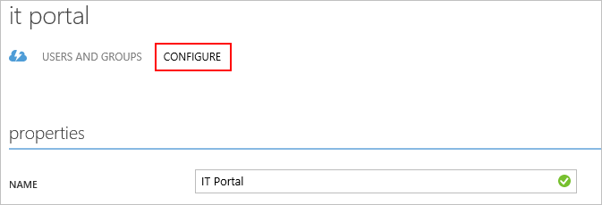

<properties
	pageTitle="Publish apps with Azure AD Application Proxy | Microsoft Azure"
	description="Publish on-premises applications to the cloud with Azure AD Application Proxy."
	services="active-directory"
	documentationCenter=""
	authors="kgremban"
	manager="femila"
	editor=""/>

<tags
	ms.service="active-directory"
	ms.workload="identity"
	ms.tgt_pltfrm="na"
	ms.devlang="na"
	ms.topic="get-started-article"
	ms.date="07/19/2016"
	ms.author="kgremban"/>

# Publish applications using Azure AD Application Proxy

Azure AD Application Proxy helps you support remote workers by publishing on-premises applications to be accessed over the internet. By this point, you should already have [enabled Application Proxy in the Azure classic portal](active-directory-application-proxy-enable.md). This article walks you through the steps to publish applications that are running on your local network and provide secure remote access from outside your network. After you complete this article, you'll be ready to configure the application with personalized information or security requirements.

> [AZURE.NOTE] Application Proxy is a feature that is available only if you upgraded to the Premium or Basic edition of Azure Active Directory. For more information, see [Azure Active Directory editions](active-directory-editions.md).

## Publish an app using the wizard

1. Sign in as an administrator in the [Azure classic portal](https://manage.windowsazure.com/).
2. Go to Active Directory and select the directory where you enabled Application Proxy.

	

3. Click the **Applications** tab, and then click the **Add** button at the bottom of the screen

	

4. Select **Publish an application that will be accessible from outside your network**.

	

5. Provide the following information about your application:

	- **Name**: The user-friendly name for your application. It must be unique within your directory.
	- **Internal URL**: The address that the Application Proxy Connector uses to access the application from inside your private network. You can provide a specific path on the backend server to publish, while the rest of the server is unpublished. In this way, you can publish different sites on the same server, and give each one its own name and access rules.

		> [AZURE.TIP] If you publish a path, make sure that it includes all the necessary images, scripts, and style sheets for your application. For example, if your app is at https://yourapp/app and uses images located at https://yourapp/media, then you should publish https://yourapp/ as the path.

	- **Preauthentication Method**: How Application Proxy verifies users before giving them access to your application. Choose one of the options from the drop-down menu.

		- Azure Active Directory: Application Proxy redirects users to sign in with Azure AD, which authenticates their permissions for the directory and application.
		- Passthrough: Users don't have to authenticate to access the application.

	  

6. To finish the wizard, click the check mark at the bottom of the screen. The application is now defined in Azure AD.

## Assign users and groups to the application

In order for your users to access your published application, you need to assign them either individually or in groups. (Remember to assign yourself access, too.) This requires that each user have a license for Azure Basic or higher. You can assign licenses individually or to groups. See [Assigning users to an application](https://azure.microsoft.com/en-us/documentation/articles/active-directory-applications-guiding-developers-assigning-users/) for more details. 

For apps that require preauthentication, this grants permissions to use the app. For apps that don't require preauthentication, users can still be assigned to the app so that it appears in their application list, such as MyApps.

1. After finishing the Add App wizard, you see the Quick Start page for your application. To manage who has access to the app, select **Users and groups**.

	

2. Search for specific groups in your directory, or show all your users. To display the search results, click the check mark.

  	

2. Select each user or group you want to assign to this app and click **Assign**. You are asked to confirm this action.

> [AZURE.NOTE] For Integrated Windows Authentication apps, you can assign only users and groups that are synced from your on-premises Active Directory. Users who sign in with a Microsoft account and guests cannot be assigned for apps published with Azure Active Directory Application Proxy. Make sure your users sign in with credentials that are part of the same domain as the app you are publishing.

## Test your published application

Once you have published your application, you can test it out by navigating to the URL that you published. Make sure that you can access it, that it renders correctly, and that everythign works as expected. If you have trouble or get an error message, try the [troubleshooting guide](active-directory-application-proxy-troubleshoot.md).

## Configure your application

You can modify published apps or set up advanced options on the Configure page. On this page, you can customize your app by changing the name or uploading a logo. You can also manage access rules like the preauthentication method or multi-factor authentication.

After you publish applications using Azure Active Directory Application Proxy, they appear in the Applications list in Azure AD, and you can manage them there.

If you disable Application Proxy services after you have published applications, they are no longer accessible from outside your private network. This does not delete the applications.

To view an application and make sure that it is accessible, double-click the name of the application. If the Application Proxy service is disabled and the application is not available, a warning message appears at the top of the screen.

To delete an application, select an application in the list and then click **Delete**.

## Next steps

- [Publish applications using your own domain name](active-directory-application-proxy-custom-domains.md)
- [Enable single-sign on](active-directory-application-proxy-sso-using-kcd.md)
- [Enable conditional access](active-directory-application-proxy-conditional-access.md)
- [Working with claims aware applications](active-directory-application-proxy-claims-aware-apps.md)

For the latest news and updates, check out the [Application Proxy blog](http://blogs.technet.com/b/applicationproxyblog/)
