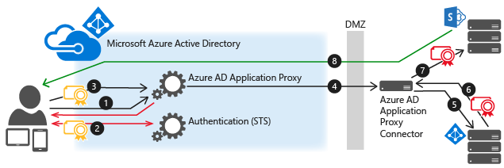
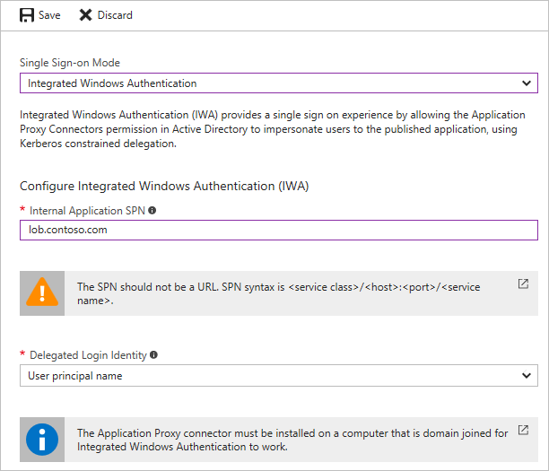
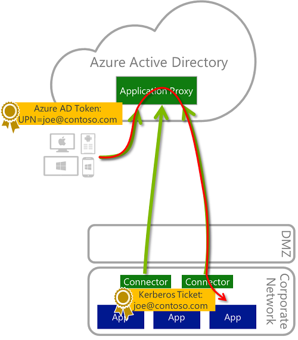
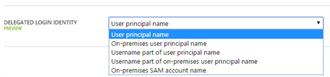

<properties
	pageTitle="Single-sign-on with Application Proxy | Microsoft Azure"
	description="Covers how to provide single-sign using Azure AD Application Proxy."
	services="active-directory"
	documentationCenter=""
	authors="rkarlin"
	manager="StevenPo"
	editor=""/>

<tags
	ms.service="active-directory"
	ms.workload="identity"
	ms.tgt_pltfrm="na"
	ms.devlang="na"
	ms.topic="article"
	ms.date="10/19/2015"
	ms.author="rkarlin"/>

# Single-sign-on with Application Proxy
Single-sign-on is a key element of Azure AD Application Proxy. It provides the best user experience: a user signs in to the cloud, all security validations happen in the cloud (preauthentication) and then, when the request is sent to the on-prem application, the Application Proxy Connector impersonates the user so the backend application thinks that this is a regular user coming from a domain-joined device.

Azure AD Application Proxy enables you to provide a single-sign-on (SSO) experience for your users. Use the following instructions to publish your apps using single-sign-on:

- SSO for on-prem IWA apps using KCD with Application Proxy
- SSO for non-Windows apps
- Working with SSO when on-premises and cloud identities are not identical

## SSO for on-prem IWA apps using KCD with Application Proxy
You can enable Single Sign On (SSO) to your applications using Integrated Windows Authentication (IWA) by giving Application Proxy Connectors permission in Active Directory to impersonate users and send and receive tokens on their behalf.

> [AZURE.IMPORTANT] Application Proxy is a feature that is available only if you upgraded to the Premium or Basic edition of Azure Active Directory. For more information, see [Azure Active Directory editions](active-directory-editions.md).

### Network diagram

This diagram explains the flow when a user attempts to access an on-prem application that uses IWA. The general flow is:

1. The user enters the URL to access the on-prem application through Application Proxy.
2. Application Proxy redirects the request to Azure AD authentication services to preauthenticate. At this point, Azure AD applies any applicable authentication and authorization policies, such as multifactor authentication. If the user is validated, Azure AD creates a token and sends it to the user.
3. The user passes the token to Application Proxy.
4. Application Proxy validates the token and retrieves the User Principal Name (UPN) from it, and then sends the request, the UPN, and the Service Principal Name (SPN) to the Connector through a dually authenticated secure channel.
5. The Connector performs Kerberos Constrained Delegation (KCD) negotiation with the on-prem AD, impersonating the user to get a Kerberos token to the application.
6. Active Directory sends the Kerberos token for the application to the Connector.
7. The Connector sends the original request to the application server, using the Kerberos token it received from AD.
8. The application sends the response to the Connector which is then returned to the Application Proxy service and finally to the user.

### Prerequisites

1. Make sure that your apps, such as your SharePoint Web apps, are set to use Integrated Windows Authentication. For more information see [Enable Support for Kerberos Authentication](https://technet.microsoft.com/library/dd759186.aspx), or for SharePoint see [Plan for Kerberos authentication in SharePoint 2013](https://technet.microsoft.com/library/ee806870.aspx).
2. Create Service Principal Names for your applications.
3. Make sure that the server running the Connector and the server running the app you are publishing are domain joined and part of the same domain. For more information on domain join, see [Join a Computer to a Domain](https://technet.microsoft.com/library/dd807102.aspx).

### Active Directory configuration

The Active Directory configuration varies, depending on whether your Application Proxy Connector and the published server are in the same domain or not.

#### Connector and published server in the same domain

1. In Active Directory, go to **Tools** > **Users and Computers**. 
2. Select the server running the Connector. 
3. Right click and select **Properties** > **Delegation**. 
4. Select **Trust this computer for delegation to specified services only** and under **Services to which this account can present delegated credentials**, add the value for the Service Principal Name (SPN) identity of the application server. 
5. This enables the Application Proxy Connector to impersonate users in AD against the applications defined in the list.

#### Connector and published server in different domains

1. For a list of prerequisites for working with KCD across domains, see [Kerberos Constrained Delegation across domains](https://technet.microsoft.com/library/hh831477.aspx).
2. In Windows 2012 R2, use the `principalsallowedtodelegateto` property on the Connector server to enable the Application Proxy to delegate for the Connector server, where the published server is `sharepointserviceaccount` and the delegating server is `connectormachineaccount`.

		$connector= Get-ADComputer -Identity connectormachineaccount -server dc.connectordomain.com

		Set-ADComputer -Identity sharepointserviceaccount -PrincipalsAllowedToDelegateToAccount $connector

		Get-ADComputer sharepointserviceaccount -Properties PrincipalsAllowedToDelegateToAccount

>[AZURE.NOTE] `sharepointserviceaccount` can be the SPS machine account or a service account under which the SPS app pool is running.

### Azure portal configuration

1. Publish your application according to the instructions described in [Publish applications with Application Proxy](active-directory-application-proxy-publish.md). Make sure to select **Azure Active Directory** as the **Preauthentication Method**.
2. After your application appears in the list of applications, select it and click **Configure**.
3. Under **Properties**, set **Internal Authentication Method** to **Integrated Windows Authentication**. 

4. Enter the **Internal Application SPN** of the application server. In this example, the SPN for our published application is http/lob.contoso.com.

>[AZURE.IMPORTANT] The UPNs in Azure Active Directory must be identical to the UPNs in your on-premises Active Directory in order for preauthentication to work. Make sure your Azure Active Directory is synchronized with your on-premises Active Directory.

| | |
| --- | --- |
| Internal Authentication Method | If you use Azure AD for preauthentication, you can set an internal authentication method to enable your users to benefit from single-sign on (SSO) to this application.    Select **Integrated Windows Authentication** (IWA) if your application uses IWA and you can configure Kerberos Constrained Delegation (KCD) to enable SSO for this application. Applications that use IWA must be configured using KCD, otherwise Application Proxy will not be able to publish these applications.    Select **None** if your application does not use IWA. |
| Internal Application SPN | This is the Service-Principal-Name (SPN) of the internal application as configured in the on-prem Azure AD. The SPN is used by the Application Proxy Connector to fetch Kerberos tokens for the application using KCD. |

<!--Image references-->
[1]: ./media/active-directory-application-proxy-sso-using-kcd/AuthDiagram.png
[2]: ./media/active-directory-application-proxy-sso-using-kcd/Properties.jpg

## SSO for non-Windows apps
The Kerberos delegation flow in Azure AD Application Proxy starts when Azure AD authenticates the user in the cloud. Once the request arrives on-premises, the Azure AD Application Proxy Connector issues a Kerberos ticket on behalf of the user by interacting with the local Active Directory. This process is referred to as Kerberos Constrained Delegation (KCD). In the next phase, a request is sent to the backend application with this Kerberos ticket. There are number of protocols that define how to send such requests. Most non-Windows servers expect Negotiate/SPNego that is now supported on Azure AD Application Proxy. 

### Partial Delegated Identity
Non-Windows applications typically get user identity in the form of a username or SAM account name, not an email address (username@domain) . This is different than most Windows based systems that prefer a UPN, which is more conclusive and ensures no duplication cross domains.
For this reason, Application Proxy enables you to select which identity appears in the Kerberos ticket, per application. Some of these options are suitable for systems that do not accept email address format. 
If partial identity is used, and this identity might not be unique for all the domains or forests in your organization, you might want to publish these applications twice using two different Connector groups, since each application has a different user audience, you can join its Connectors to a different domain.

 
## Working with SSO when on-premises and cloud identities are not identical
Unless otherwise configured, Application Proxy assumes that users have exactly the same identity in the cloud and on-premises. You can configure, for each application, which identity should be used when performing single-sign-on.
This capability allows many organizations that have different on-prem and cloud identities to have single sign on from the cloud to on-prem apps without requiring the users to enter different usernames and passwords. This includes organizations that:

- Have multiple domains internally (joe@us.contoso.com, joe@eu.contoso.com) and a single domain in the cloud (joe@contoso.com).

- Have non routable domain name internally (joe@contoso.usa) and a legal one in the cloud.

- Do not use domain names internally (joe)

- Use Different aliases on-prem and in the cloud. E.g. joe-johns@contoso.com vs. joej@contoso.com
It will also help with applications that do not accept addresses in the form of email address, which is a very common scenario for non-Windows backend servers.
### Setting SSO for different cloud and on-prem identities
1. Configure Azure AD Connect settings so the main identity will be the email address (mail). This is done as part of the customize process, by changing the User Principle Name field in the sync settings. 
NOTE: These settings also determine how users log in to Office365, Windows10 devices and other applications that use Azure AD as their identity store.
2. In the Application Configuration settings for the application you would like to modify, select the **Delegated Login Identity** to be used: 

- User Principle Name: joe@contoso.com

- Alternate User Principle Name: joed@contoso.local

- Username part of User Principle Name: joe

- Username part of Alternate User Principle Name: joed

- On-premises SAM account name: depending on-prem domain controller configuration

### Troubleshooting SSO for different identities
If there is an error in the SSO process it will appear in the Connector machine event log as explained in [Troubleshooting](active-directory-application-proxy-troubleshoot.md).
But, in some cases, the request will be successfully sent to the backend application while this application will reply in various other HTTP responses. Troubleshooting these cases should start by examining event number 24029 on the Connector machine in the Application Proxy session event log. The user identity that was used for delegation will appear in the “user” field within the event details (“joe@contoso55.com” in the example below). To turn on session log, select **Show analytic and debug logs **in the event viewer view menu.

## See also
There's a lot more you can do with Application Proxy:

- [Publish applications with Application Proxy](active-directory-application-proxy-publish.md)
- [Publish applications using your own domain name](active-directory-application-proxy-custom-domains.md)
- [Enable conditional access](active-directory-application-proxy-conditional-access.md)
- [Working with claims aware applications](active-directory-application-proxy-claims-aware-apps.md)
- [Troubleshoot issues you're having with Application Proxy](active-directory-application-proxy-troubleshoot.md)

## Learn more about Application Proxy
- [Take a look here at our online help](active-directory-application-proxy-enable.md)
- [Check out the Application Proxy blog](http://blogs.technet.com/b/applicationproxyblog/)
- [Watch our videos on Channel 9!](http://channel9.msdn.com/events/Ignite/2015/BRK3864)
