# Apps, permissions, and consent in Azure Active Directory
Within Azure Active Directory, you can add applications to your directory.  The applications can vary depending on the type of application.  To view applications in the classic portal, select a directory and choose applications.

## Types of apps

1. **Single-tenant apps**  
	- **Single-tenant apps** - Often referred to as line-of-business (LOB) apps. This is the case where someone within your organization develops their own app, and would like users in the organization to be able to sign in to the app.
	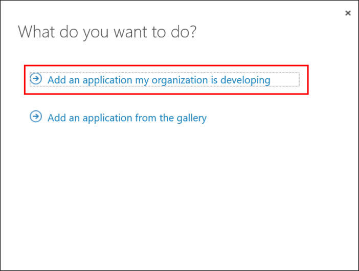
	- **App Proxy apps** - When you expose an on-prem application with Azure AD App Proxy, a single-tenant app is registered in your tenant (in addition to the App Proxy service). This app is what represents your on-prem application for all cloud interactions (for example, authentication). (App Proxy requires Azure AD Basic or higher.)

2. **Multi-tenant apps**
	- **Multi-tenant apps which others can consent to** - similar to “single-tenant apps that your organization develops”. The main difference (besides the logic in the app itself) is that users from other tenants can also consent to and sign in to the app. 
	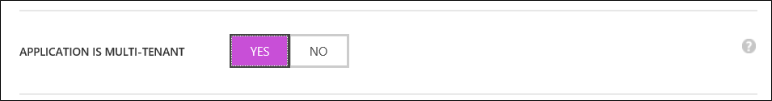
	- **Multi-tenant apps others develop, which Contoso can consent to**. (Or “consented apps”, for short.) This is the flip side of “multi-tenant apps your organization develops”. When another organization develops a multi-tenant app, users of your organization can consent to the app and sign in to it.
	- **Microsoft first-party apps** - Apps that represent Microsoft services. Consent is driven by the fact that you sign up for the service. There is sometimes special UX and logic for certain first-party apps that is often used when establishing policies around access to the app. 
	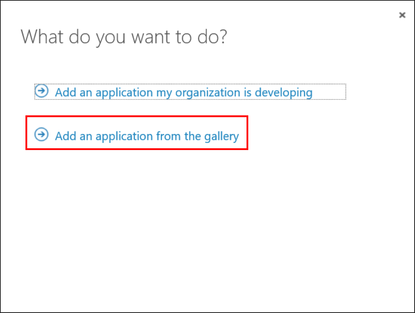
	- **Pre-integrated apps** - Apps available in the Azure AD App Gallery, which you can add to your directory to provide single sign-on (and in some cases, provisioning) to popular SaaS apps.
	- **Azure AD single sign-on**: “Real” SSO, for apps that can be integrated with Azure AD, through a supported sign-in protocol such as SAML 2.0 or OpenID Connect. The wizard walks you through setting it up.
	- **Password single sign-on**: Azure AD securely stores the user’s credentials for the app, and the credentials are “injected” into the sign-in form by the Azure AD App Access browser extension. Also known as “password vaulting”.

## Permissions

When an app is registered, the user performing the app registration (that is, the developer) defines which permissions the app needs access to, and which resources. (The resources are, themselves, defined as other apps.) For example, someone building a mail reader app, would state that their app requires the “Access mailboxes as the signed-in user” permission in the “Office 365 Exchange Online” resource:
	
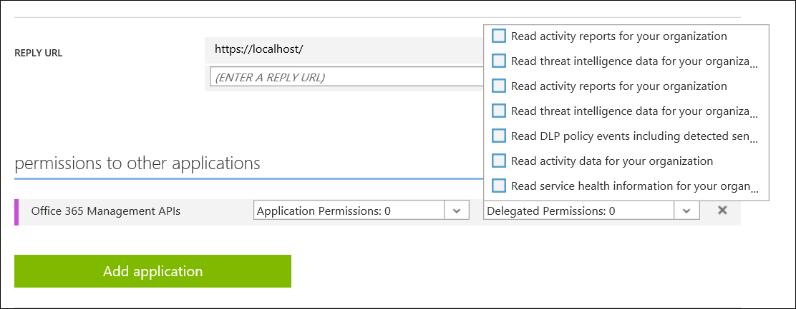

In order for one app (the client) to request a certain permission from another app (the resource), the developer of the resource app defines the permissions that exist. In our example, Microsoft, the owner of the “Office 365 Exchange Online” resource app, have defined a permission named “Access mailboxes as the signed-in user”.

When defining permissions, the app developer must define if the permission can be consented to, or if it requires admin consent. This allows developers to allow users to consent on their own to apps requesting only low-sensitivity permissions, but require admins to consent to more sensitive permissions. For example, the “Azure Active Directory” resource app, has been defined, so users can consent to apps, requesting limited read-only permissions.  However, admin consent is required for full read permissions, and all write permissions.

Because native clients are not authenticated, an app defined as a native client app can only request delegated permissions. This means that there must always be an actual user involved when obtaining a token. Web apps and web APIs (confidential clients), must always authenticate with Azure AD when getting an access token. Meaning they also have the possibility of requesting app-only permissions. For example, if one back-end service needs to authenticate to another back-end service. Applications requesting app-only permissions always require administrator consent.

Summarizing:

- An app (client) states the permissions it needs for other apps (resources).
- An app (resource) states what permissions are exposed to other apps (clients).
- A permission can be an app-only permission, or a delegated permission.
- A delegated permission can be marked as “allows user consent”, or “requires admin consent”.
- An app can behave as a client (by declaring that it needs permissions to a resource), as a resource (by declaring which permissions it exposes), or as both.

## Controls

The following is a list of the different admin controls available for all this behavior. The admin controls can be accessed in the classic portal from configure under the directory.

In the Azure portal, under **manage**, **user settings**.

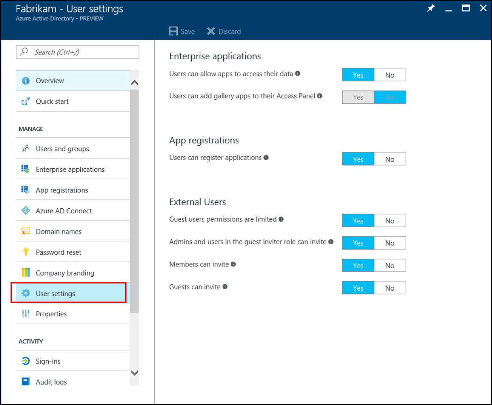

- You can control whether users can consent to apps:

In the classic portal, select **Users may give applications permissions to access their data.**
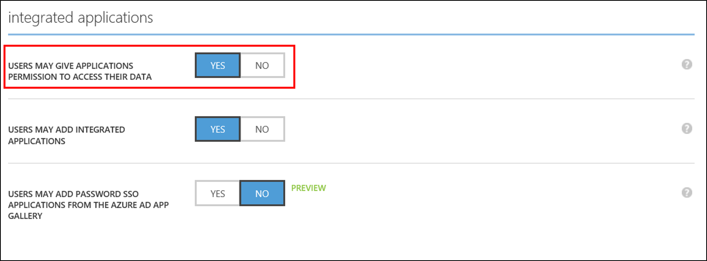

In the Azure portal, select **users can allow apps to access their data**.
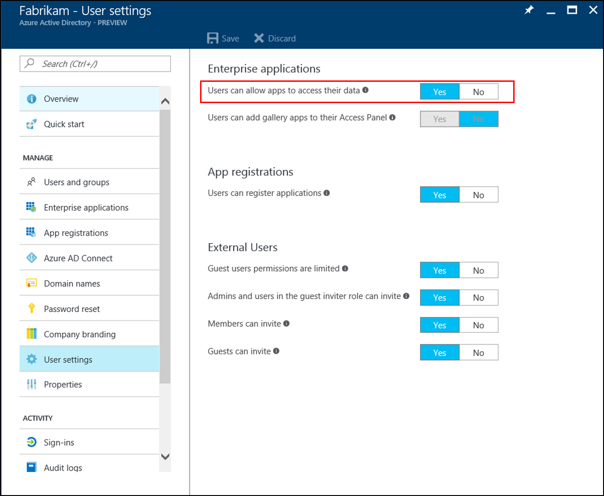

- You can control whether users can register their own single-tenant LOB apps:
In the classic portal select **Users may add integrated applications.**
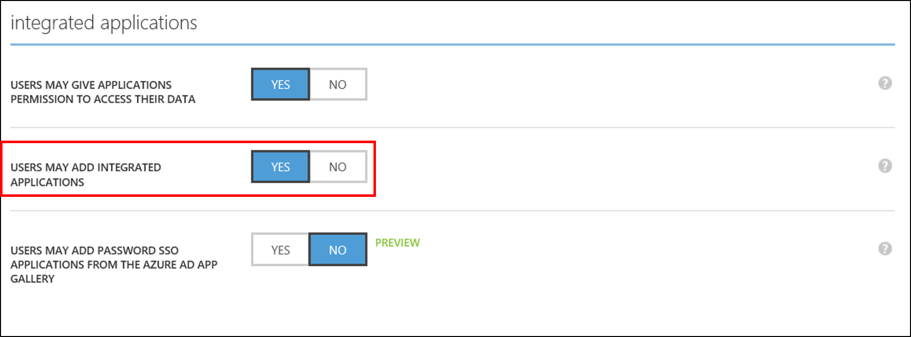

In the Azure portal, select **users can allow apps to access their data**.
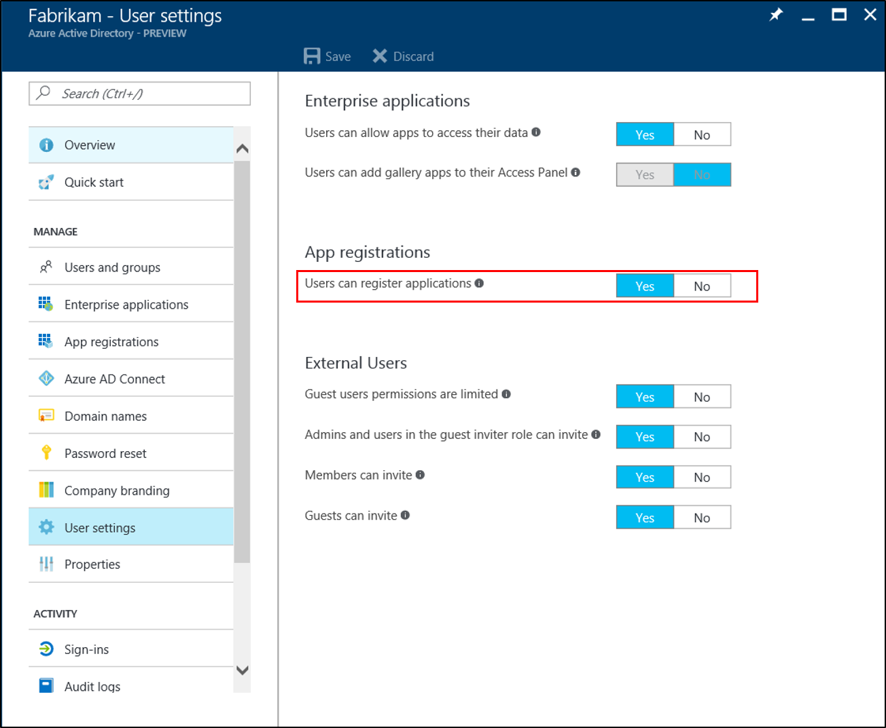

>[!NOTE]
>Even if you do allow users to register single-tenant LOB apps, there are limits to what can be registered.  
>For example, developers who are not directory admins.
>
>- Users cannot make a single-tenant app a multi-tenant app.
>- When registering single-tenant LOB apps, users cannot request app-only permissions to other apps.
>- When registering single-tenant LOB apps, users cannot request delegated permissions to other apps if those permissions require admin consent.
>- Users cannot make changes to apps that they are not owners of.

- You can control whether users can themselves add pre-integrated apps that use password SSO (aka “password vaulting”)
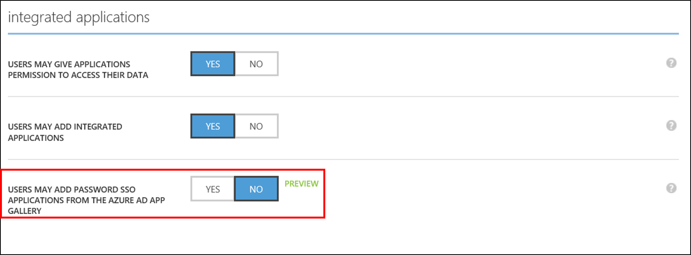

- You can control under which conditions applications can be accessed (that is, conditional access). Be aware this applies both to the client app and to the resource app. So, say you set a conditional access policy that says that the “Office 365 Exchange Online” app can only be accessed from machines, which are compliant.  This policy will also kick in when a user attempts to use a client app which requests permissions to Exchange Online.

- You have visibility into which apps have been consented to and which ones are being used.

1. 	When a user consents to an app, a ServicePrincipal object is created in the tenant. ServicePrincipal creation is included in the audit report.
2. 	User sign-in activity reports tell you which app the user is signing in to. 

## Example

As an example, let’s take the “FabrikamMail for Office 365” app, which you’ve noticed users in your tenant are signing in to. “FabrikamMail” is a mail reader app for Android, published by “Fabrikam, Inc.”. This falls into the “multi-tenant apps other develop, which Contoso can consent to”.

If users are allowed to consent, they get a consent prompt the first time they sign in:
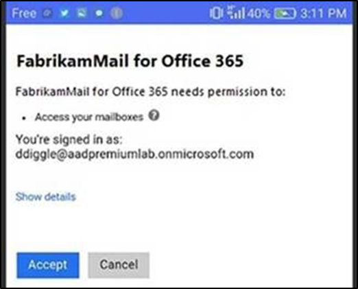

“Access your mailboxes” is the user-facing consent string for the “Access mailboxes as the signed-in user” permission exposed by “Office 365 Exchange Online” (that is, Exchange).

You can see the permissions by looking up the ServicePrincipal object for Exchange (the resource), which was added when you signed up for Office 365. You can think of the ServicePrincipal object of an “instance” of the app in your tenant, which is used for recording different options and configurations.  You can see this by using the `Get-AzureADServicePrincipal` in PowerShell.

	PS C:\> Get-AzureADServicePrincipal -ObjectId 383f7b97-6754-4d3d-9474-3908ebcba1c6 | fl *
	
	DeletionTimeStamp         : 
	ObjectId                  : 383f7b97-6754-4d3d-9474-3908ebcba1c6
	ObjectType                : ServicePrincipal
	AccountEnabled            : True
	AppDisplayName            : Office 365 Exchange Online
	AppId                     : 00000002-0000-0ff1-ce00-000000000000
	AppOwnerTenantId          : 
	AppRoleAssignmentRequired : False
	AppRoles                  : {...}
	DisplayName               : Microsoft.Exchange
	ErrorUrl                  : 
	Homepage                  : 
	KeyCredentials            : {}
	LogoutUrl                 : 
	Oauth2Permissions         : {...
	                            , class OAuth2Permission {
	                              AdminConsentDescription : Allows the app to have the same access to mailboxes as the signed-in user via Exchange Web Services.
	                              AdminConsentDisplayName : Access mailboxes as the signed-in user via Exchange Web Services
	                              Id                      : 3b5f3d61-589b-4a3c-a359-5dd4b5ee5bd5
	                              IsEnabled               : True
	                              Type                    : User
	                              UserConsentDescription  : Allows the app full access to your mailboxes on your behalf.
	                              UserConsentDisplayName  : Access your mailboxes
	                              Value                   : full_access_as_user
	                            },
	                            ...}
	PasswordCredentials       : {}
	PublisherName             : 
	ReplyUrl                  : 
	SamlMetadataUrl           : 
	ServicePrincipalNames     : {00000002-0000-0ff1-ce00-000000000000/outlook.office365.com, 00000002-0000-0ff1-ce00-000000000000/mail.office365.com, 00000002-0000-0ff1-ce00-000000000000/outlook.com, 
	                            00000002-0000-0ff1-ce00-000000000000/*.outlook.com...}
	Tags                      : {}

Consent is initiated when the user clicks “Accept”. First, a ServicePrincipal object for “FabrikamMail for Office 365” is created in the tenant. The ServicePrincipal looks something like this:

	PS C:\> Get-AzureADServicePrincipal -SearchString "FabrikamMail for Office 365" | fl *
	
	DeletionTimeStamp         : 
	ObjectId                  : a8b16333-851d-42e8-acd2-eac155849b37
	ObjectType                : ServicePrincipal
	AccountEnabled            : True
	AppDisplayName            : FabrikamMail for Office 365
	AppId                     : aba7c072-2267-4031-8960-e7a2db6e0590
	AppOwnerTenantId          : 4a4076e0-a70f-41c6-b819-6f9c4a86df89
	AppRoleAssignmentRequired : False
	AppRoles                  : {}
	DisplayName               : FabrikamMail for Office 365
	ErrorUrl                  : 
	Homepage                  : 
	KeyCredentials            : {}
	LogoutUrl                 : 
	Oauth2Permissions         : {}
	PasswordCredentials       : {}
	PublisherName             : Fabrikam, Inc.
	ReplyUrl                  : 
	SamlMetadataUrl           : 
	ServicePrincipalNames     : {aba7c072-2267-4031-8960-e7a2db6e0590}
	Tags                      : {WindowsAzureActiveDirectoryIntegratedApp}

Consenting to an app creates an Oauth2PermissionGrant link between the following:
  
- the user object
- the client apps ServicePrincipalName (SPN)
- the resource apps ServicePrincipalName (SPN)
- permissions in the resource app.  

In the case of FabrikamMail, it looks something like this:

	PS C:\> Get-AzureADUserOAuth2PermissionGrant -ObjectId ddiggle@aadpremiumlab.onmicrosoft.com | fl *
	
	ClientId    : a8b16333-851d-42e8-acd2-eac155849b37
	ConsentType : Principal
	ExpiryTime  : 05/15/2017 07:02:39 AM
	ObjectId    : M2OxqB2F6EKs0urBVYSbN5d7PzhUZz1NlH25COvLocbJjoxkUFfRQauryBKwBWet
	PrincipalId : 648c8ec9-5750-41d1-abab-c812b00567ad
	ResourceId  : 383f7b97-6754-4d3d-9474-3908ebcba1c6
	Scope       : full_access_as_user
	StartTime   : 01/01/0001 12:00:00 AM

(**ClientId** is FabrikamMail’s service principal object ID (the one that just got created), **PrincipalId** is the user object ID (of the user who consented), **ResourceId** is Exchange’s service principal object ID, Scope is the permission in Exchange that was consented to).

If users are not allowed to consent, they will see a screen that says that permission is required.

