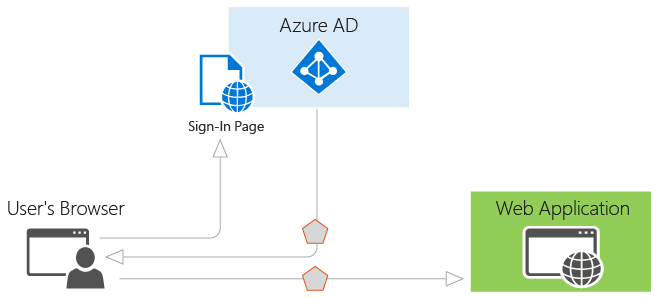

<properties
   pageTitle="Authentication Scenarios for Azure AD | Microsoft Azure"
   description="An overview of the five most common authentication scenarios for Azure Active Directory (AAD)"
   services="active-directory"
   documentationCenter="dev-center-name"
   authors="msmbaldwin"
   manager="mbaldwin"
   editor=""/>

<tags
   ms.service="active-directory"
   ms.devlang="na"
   ms.topic="article"
   ms.tgt_pltfrm="na"
   ms.workload="identity"
   ms.date="06/06/2016"
   ms.author="mbaldwin"/>

# Authentication Scenarios for Azure AD

Azure Active Directory (Azure AD) simplifies authentication for developers by providing identity as a service, with support for industry-standard protocols such as OAuth 2.0 and OpenID Connect, as well as open source libraries for different platforms to help you start coding quickly. This document will help you understand the various scenarios Azure AD supports and will show you how to get started. It’s divided into the following sections:

- [Basics of Authentication in Azure AD](#basics-of-authentication-in-azure-ad)

- [Claims in Azure AD Security Tokens](#claims-in-azure-ad-security-tokens)

- [Basics of Registering an Application in Azure AD](#basics-of-registering-an-application-in-azure-ad)

- [Application Types and Scenarios](#application-types-and-scenarios)

  - [Web Browser to Web Application](#web-browser-to-web-application)

  - [Single Page Application (SPA)](#single-page-application-spa)

  - [Native Application to Web API](#native-application-to-web-api)

  - [Web Application to Web API](#web-application-to-web-api)

  - [Daemon or Server Application to Web API](#daemon-or-server-application-to-web-api)

## Basics of Authentication in Azure AD

If you are unfamiliar with basic concepts of authentication in Azure AD, read this section. Otherwise, you may want to skip down to [Application Types and Scenarios](#application-types-and-scenarios).

Let’s consider the most basic scenario where identity is required: a user in a web browser needs to authenticate to a web application. This scenario is described in greater detail in the [Web Browser to Web Application](#web-browser-to-web-application) section, but it’s a useful starting point to illustrate the capabilities of Azure AD and conceptualize how the scenario works. Consider the following diagram for this scenario:

With the diagram above in mind, here’s what you need to know about its various components:

- Azure AD is the identity provider, responsible for verifying the identity of users and applications that exist in an organization’s directory, and ultimately issuing security tokens upon successful authentication of those users and applications.

- An application that wants to outsource authentication to Azure AD must be registered in Azure AD, which registers and uniquely identifies the app in the directory.

- Developers can use the open source Azure AD authentication libraries to make authentication easy by handling the protocol details for you. See [Azure Active Directory Authentication Libraries](active-directory-authentication-libraries.md) for more information.

• Once a user has been authenticated, the application must validate the user’s security token to ensure that authentication was successful for the intended parties. Developers can use the provided authentication libraries to handle validation of any token from Azure AD, including JSON Web Tokens (JWT) or SAML 2.0. If you want to perform validation manually, see the [JWT Token Handler](https://msdn.microsoft.com/library/dn205065.aspx) documentation.

> [AZURE.IMPORTANT] Azure AD uses public key cryptography to sign tokens and verify that they are valid. See [Important Information About Signing Key Rollover in Azure AD](active-directory-signing-key-rollover.md) for more information on the necessary logic you must have in your application to ensure it’s always updated with the latest keys.

• The flow of requests and responses for the authentication process is determined by the authentication protocol that was used, such as OAuth 2.0, OpenID Connect, WS-Federation, or SAML 2.0. These protocols are discussed in more detail in the [Azure Active Directory Authentication Protocols](active-directory-authentication-protocols.md) topic and in the sections below.

> [AZURE.NOTE] Azure AD supports the OAuth 2.0 and OpenID Connect standards that make extensive use of bearer tokens, including bearer tokens represented as JWTs. A bearer token is a lightweight security token that grants the “bearer” access to a protected resource. In this sense, the “bearer” is any party that can present the token. Though a party must first authenticate with Azure AD to receive the bearer token, if the required steps are not taken to secure the token in transmission and storage, it can be intercepted and used by an unintended party. While some security tokens have a built-in mechanism for preventing unauthorized parties from using them, bearer tokens do not have this mechanism and must be transported in a secure channel such as transport layer security (HTTPS). If a bearer token is transmitted in the clear, a man-in the middle attack can be used by a malicious party to acquire the token and use it for an unauthorized access to a protected resource. The same security principles apply when storing or caching bearer tokens for later use. Always ensure that your application transmits and stores bearer tokens in a secure manner. For more security considerations on bearer tokens, see [RFC 6750 Section 5](http://tools.ietf.org/html/rfc6750).

Now that you have an overview of the basics, read the sections below to understand how provisioning works in Azure AD and the common scenarios Azure AD supports.

## Claims in Azure AD Security Tokens

Security tokens issued by Azure AD contain claims, or assertions of information about the subject that has been authenticated. These claims can be used by the application for various tasks. For example, they can be used to validate the token, identify the subject's directory tenant, display user information, determine the subject's authorization, and so on. The claims present in any given security token are dependent upon the type of token, the type of credential used to authenticate the user, and the application configuration. A brief description of each type of claim emitted by Azure AD is provided in the table below. For more information, refer to [Supported Token and Claim Types](active-directory-token-and-claims.md).

| Claim | Description |
|-------|-------------|
| Application ID | Identifies the application that is using the token.
| Audience | Identifies the recipient resource the token is intended for. |
| Application Authentication Context Class Reference | Indicates how the client was authenticated (public client vs. confidential client). |
| Authentication Instant | Records the date and time when the authentication occurred. |
| Authentication Method | Indicates how the subject of the token was authenticated (password, certificate, etc.). |
| First Name | Provides the given name of the user as set in Azure AD. |
| Groups | Contains object Ids of Azure AD groups the user is a member of. |
| Identity Provider | Records the identity provider that authenticated the subject of the token. |
| Issued At | Records the time at which the token was issued, often used for token freshness. |
| Issuer | Identifies the STS that emitted the token as well as the Azure AD tenant. |
| Last Name | Provides the surname of the user as set in Azure AD. |
| Name | Provides a human readable value that identifies the subject of the token. |
| Object Id | Contains an immutable, unique identifier of the subject in Azure AD. |
| Roles | Contains friendly names of Azure AD Application Roles that the user has been granted. |
| Scope | Indicates the permissions granted to the client application. |
| Subject | Indicates the principal about which the token asserts information. |
| Tenant Id | Contains an immutable, unique identifier of the directory tenant that issued the token. |
| Token Lifetime | Defines the time interval within which a token is valid. |
| User Principal Name | Contains the user principal name of the subject. |
| Version | Contains the version number of the token. |

## Basics of Registering an Application in Azure AD

Any application that outsources authentication to Azure AD must be registered in a directory. This step involves telling Azure AD about your application, including the URL where it’s located, the URL to send replies after authentication, the URI to identify your application, and more. This information is required for a few key reasons:

- Azure AD needs coordinates to communicate with the application when handling sign-on or exchanging tokens. These include the following:

  - Application ID URI: The identifier for an application. This value is sent to Azure AD during authentication to indicate which application the caller wants a token for. Additionally, this value is included in the token so that the application knows it was the intended target.

  - Reply URL and Redirect URI: In the case of a web API or web application, the Reply URL is the location to which Azure AD will send the authentication response, including a token if authentication was successful. In the case of a native application, the Redirect URI is a unique identifier to which Azure AD will redirect the user-agent in an OAuth 2.0 request.

  - Client ID: The ID for an application, which is generated by Azure AD when the application is registered. When requesting an authorization code or token, the client ID and key are sent to Azure AD during authentication.

  - Key: The key that is sent along with a client ID when authenticating to Azure AD to call a web API.

- Azure AD needs to ensure the application has the required permissions to access your directory data, other applications in your organization, and so on

Provisioning becomes clearer when you understand that there are two categories of applications that can be developed and integrated with Azure AD:

- Single tenant application: A single tenant application is intended for use in one organization. These are typically line-of-business (LoB) applications written by an enterprise developer. A single tenant application only needs to be accessed by users in one directory, and as a result, it only needs to be provisioned in one directory. These applications are typically registered by a developer in the organization.

- Multi-tenant application: A multi-tenant application is intended for use in many organizations, not just one organization. These are typically software-as-a-service (SaaS) applications written by an independent software vendor (ISV). Multi-tenant applications need to be provisioned in each directory where they will be used, which requires user or administrator consent to register them. This consent process starts when an application has been registered in the directory and is given access to the Graph API or perhaps another web API. When a user or administrator from a different organization signs up to use the application, they are presented with a dialog that displays the permissions the application requires. The user or administrator can then consent to the application, which gives the application access to the stated data, and finally registers the application in their directory. For more information, see [Overview of the Consent Framework](active-directory-integrating-applications.md#overview-of-the-consent-framework).

Some additional considerations arise when developing a multi-tenant application instead of a single tenant application. For example, if you are making your application available to users in multiple directories, you need a mechanism to determine which tenant they’re in. A single tenant application only needs to look in its own directory for a user, while a multi-tenant application needs to identify a specific user from all the directories in Azure AD. To accomplish this task, Azure AD provides a common authentication endpoint where any multi-tenant application can direct sign-in requests, instead of a tenant-specific endpoint. This endpoint is https://login.microsoftonline.com/common for all directories in Azure AD, whereas a tenant-specific endpoint might be https://login.microsoftonline.com/contoso.onmicrosoft.com. The common endpoint is especially important to consider when developing your application because you’ll need the necessary logic to handle multiple tenants during sign-in, sign-out, and token validation.

If you are currently developing a single tenant application but want to make it available to many organizations, you can easily make changes to the application and its configuration in Azure AD to make it multi-tenant capable. In addition, Azure AD uses the same signing key for all tokens in all directories, whether you are providing authentication in a single tenant or multi-tenant application.

Each scenario listed in this document includes a sub-section that describes its provisioning requirements. For more in-depth information about provisioning an application in Azure AD and the differences between single and multi-tenant applications, see [Integrating Applications with Azure Active Directory](active-directory-integrating-applications.md) for more information. Continue reading to understand the common application scenarios in Azure AD.

## Application Types and Scenarios

Each of the scenarios described in this document can be developed using various languages and platforms. They are all backed by complete code samples which are available in our [Code Samples guide](active-directory-code-samples.md), or directly from the corresponding [Github sample repositories](https://github.com/Azure-Samples?utf8=%E2%9C%93&query=active-directory). In addition, if your application needs a specific piece or segment of an end-to-end scenario, in most cases that functionality can be added independently. For example, if you have a native application that calls a web API, you can easily add a web application that also calls the web API. The following diagram illustrates these scenarios and application types, and how different components can be added:

These are the five primary application scenarios supported by Azure AD:

- [Web Browser to Web Application](#web-browser-to-web-application): A user needs to sign in to a web application that is secured by Azure AD.

- [Single Page Application (SPA)](#single-page-application-spa): A user needs to sign in to a single page application that is secured by Azure AD.

- [Native Application to Web API](#native-application-to-web-api): A native application that runs on a phone, tablet, or PC needs to authenticate a user to get resources from a web API that is secured by Azure AD.

- [Web Application to Web API](#web-application-to-web-api): A web application needs to get resources from a web API secured by Azure AD.

- [Daemon or Server Application to Web API](#daemon-or-server-application-to-web-api): A daemon application or a server application with no web user interface needs to get resources from a web API secured by Azure AD.

### Web Browser to Web Application

This section describes an application that authenticates a user in a web browser to a web application. In this scenario, the web application directs the user’s browser to sign them in to Azure AD. Azure AD returns a sign-in response through the user’s browser, which contains claims about the user in a security token. This scenario supports sign-on using the WS-Federation, SAML 2.0, and OpenID Connect protocols.

#### Diagram

#### Description of Protocol Flow

1. When a user visits the application and needs to sign in, they are redirected via a sign-in request to the authentication endpoint in Azure AD.

2. The user signs in on the sign-in page.

3. If authentication is successful, Azure AD creates an authentication token and returns a sign-in response to the application’s Reply URL that was configured in the Azure Management Portal. For a production application, this Reply URL should be HTTPS. The returned token includes claims about the user and Azure AD that are required by the application to validate the token.

4. The application validates the token by using a public signing key and issuer information available at the federation metadata document for Azure AD. After the application validates the token, Azure AD starts a new session with the user. This session allows the user to access the application until it expires.

#### Code Samples

See the code samples for Web Browser to Web Application scenarios. And, check back frequently -- we add new samples all the time. [Web Browser to Web Application](active-directory-code-samples.md#web-browser-to-web-application).

#### Registering

- Single Tenant: If you are building an application just for your organization, it must be registered in your company’s directory by using the Azure Management Portal.

- Multi-Tenant: If you are building an application that can be used by users outside your organization, it must be registered in your company’s directory, but also must be registered in each organization’s directory that will be using the application. To make your application available in their directory, you can include a sign-up process for your customers that enables them to consent to your application. When they sign up for your application, they will be presented with a dialog that shows the permissions the application requires, and then the option to consent. Depending on the required permissions, an administrator in the other organization may be required to give consent. When the user or administrator consents, the application is registered in their directory. For more information, see [Integrating Applications with Azure Active Directory](active-directory-integrating-applications.md).

#### Token Expiration

The user’s session expires when the lifetime of the token issued by Azure AD expires. Your application can shorten this time period if desired, such as signing out users based on a period of inactivity. When the session expires, the user will be prompted to sign in again.

### Single Page Application (SPA)

This section describes authentication for a Single Page Application, that uses Azure AD and the OAuth 2.0 implicit authorization grant to secure its web API back end. Single Page Applications are typically structured as a JavaScript presentation layer (front end) that runs in the browser and a Web API back end that runs on a server and implements the application’s business logic. To learn more about the implicit authorization grant, and help you decide whether it's right for your application scenario, see [Understanding the OAuth2 implicit grant flow in Azure Active Directory](active-directory-dev-understanding-oauth2-implicit-grant.md).

In this scenario, when the user signs in, the JavaScript front end uses [Active Directory Authentication Library for JavaScript (ADAL.JS)](https://github.com/AzureAD/azure-activedirectory-library-for-js/tree/dev) and the implicit authorization grant to obtain an ID token (id_token) from Azure AD. The token is cached and the client attaches it to the request as the bearer token when making calls to its Web API back end, which is secured using the OWIN middleware. 
#### Diagram

#### Description of Protocol Flow

1. The user navigates to the web application.

2. The application returns the JavaScript front end (presentation layer) to the browser.

3. The user initiates sign in, for example by clicking a sign in link. The browser sends a GET to the Azure AD authorization endpoint to request an ID token. This request includes the client ID and reply URL in the query parameters.

4. Azure AD validates the Reply URL against the registered Reply URL that was configured in the Azure Management Portal.

5. The user signs in on the sign-in page.

6. If authentication is successful, Azure AD creates an ID token and returns it as a URL fragment (#) to the application’s Reply URL. For a production application, this Reply URL should be HTTPS. The returned token includes claims about the user and Azure AD that are required by the application to validate the token.

7. The JavaScript client code running in the browser extracts the token from the response to use in securing calls to the application’s web API back end.

8. The browser calls the application’s web API back end with the access token in the authorization header.

#### Code Samples

See the code samples for Single Page Application (SPA) scenarios. Be sure to check back frequently -- we add new samples all the time. [Single Page Application (SPA)](active-directory-code-samples.md#single-page-application-spa).

#### Registering

- Single Tenant: If you are building an application just for your organization, it must be registered in your company’s directory by using the Azure Management Portal.

- Multi-Tenant: If you are building an application that can be used by users outside your organization, it must be registered in your company’s directory, but also must be registered in each organization’s directory that will be using the application. To make your application available in their directory, you can include a sign-up process for your customers that enables them to consent to your application. When they sign up for your application, they will be presented with a dialog that shows the permissions the application requires, and then the option to consent. Depending on the required permissions, an administrator in the other organization may be required to give consent. When the user or administrator consents, the application is registered in their directory. For more information, see [Integrating Applications with Azure Active Directory](active-directory-integrating-applications.md).

After registering the application, it must be configured to use OAuth 2.0 Implicit Grant protocol. By default, this protocol is disabled for applications. To enable the OAuth2 Implicit Grant protocol for your application, download its application manifest from the Azure Management Portal, set the “oauth2AllowImplicitFlow” value to true, and then upload the manifest back to the portal. For detailed instructions, see [Enabling OAuth 2.0 Implicit Grant for Single Page Applications](active-directory-integrating-applications.md).

#### Token Expiration

When you use ADAL.js to manage authentication with Azure AD, you benefit from several features that facilitate refreshing an expired token as well as getting tokens for additional web API resources that may be called by the application. When the user successfully authenticates with Azure AD, a session secured by a cookie is established for the user between the browser and Azure AD. It’s important to note that the session exists between the user and Azure AD and not between the user and the web application running on the server. When a token expires, ADAL.js uses this session to silently obtain another token. It does this by using a hidden iFrame to send and receive the request using the OAuth Implicit Grant protocol. ADAL.js can also use this same mechanism to silently obtain access tokens from Azure AD for other web API resources that the application calls as long as these resources support cross-origin resource sharing (CORS), are registered in the user’s directory, and any required consent was given by the user during sign-in.

### Native Application to Web API

This section describes a native application that calls a web API on behalf of a user. This scenario is built on the OAuth 2.0 authorization code grant type with a public client, as described in section 4.1 of the [OAuth 2.0 specification](http://tools.ietf.org/html/rfc6749). The native application obtains an access token for the user by using the OAuth 2.0 protocol. This access token is then sent in the request to the web API, which authorizes the user and returns the desired resource.

#### Diagram

#### Authentication flow for native application to API

#### Description of Protocol Flow

If you are using the AD Authentication Libraries, most of the protocol details described below are handled for you, such as the browser pop-up, token caching, and handling of refresh tokens.

1. Using a browser pop-up, the native application makes a request to the authorization endpoint in Azure AD. This request includes the client ID and the redirect URI of the native application as shown in the Management Portal, and the application ID URI for the web API. If the user hasn’t already signed in, they are prompted to sign in again

2. Azure AD authenticates the user. If it is a multi-tenant application and consent is required to use the application, the user will be required to consent if they haven’t already done so. After granting consent and upon successful authentication, Azure AD issues an authorization code response back to the client application’s redirect URI.

3. When Azure AD issues an authorization code response back to the redirect URI, the client application stops browser interaction and extracts the authorization code from the response. Using this authorization code, the client application sends a request to Azure AD’s token endpoint that includes the authorization code, details about the client application (client ID and redirect URI), and the desired resource (application ID URI for the web API).

4. The authorization code and information about the client application and web API are validated by Azure AD. Upon successful validation, Azure AD returns two tokens: a JWT access token and a JWT refresh token. In addition, Azure AD returns basic information about the user, such as their display name and tenant ID.

5. Over HTTPS, the client application uses the returned JWT access token to add the JWT string with a “Bearer” designation in the Authorization header of the request to the web API. The web API then validates the JWT token, and if validation is successful, returns the desired resource.

6. When the access token expires, the client application will receive an error that indicates the user needs to authenticate again. If the application has a valid refresh token, it can be used to acquire a new access token without prompting the user to sign in again. If the refresh token expires, the application will need to interactively authenticate the user once again.

> [AZURE.NOTE] The refresh token issued by Azure AD can be used to access multiple resources. For example, if you have a client application that has permission to call two web APIs, the refresh token can be used to get an access token to the other web API as well.

#### Code Samples

See the code samples for Native Application to Web API scenarios. And, check back frequently -- we add new samples all the time. [Native Application to Web API](active-directory-code-samples.md#native-application-to-web-api).

#### Registering

- Single Tenant: Both the native application and the web API must be registered in the same directory in Azure AD. The web API can be configured to expose a set of permissions, which are used to limit the native application’s access to its resources. The client application then selects the desired permissions from the “Permissions to Other Applications” drop-down menu in the Azure Management Portal.

- Multi-Tenant: First, the native application only ever registered in the developer or publisher’s directory. Second, the native application is configured to indicate the permissions it requires to be functional. This list of required permissions is shown in a dialog when a user or administrator in the destination directory gives consent to the application, which makes it available to their organization. Some applications require just user-level permissions, which any user in the organization can consent to. Other applications require administrator-level permissions, which a user in the organization cannot consent to. Only a directory administrator can give consent to applications that require this level of permissions. When the user or administrator consents, only the web API is registered in their directory. For more information, see [Integrating Applications with Azure Active Directory](active-directory-integrating-applications.md).

#### Token Expiration

When the native application uses its authorization code to get a JWT access token, it also receives a JWT refresh token. When the access token expires, the refresh token can be used to re-authenticate the user without requiring them to sign in again. This refresh token is then used to authenticate the user, which results in a new access token and refresh token.

### Web Application to Web API

This section describes a web application that needs to get resources from a web API. In this scenario, there are two identity types that the web application can use to authenticate and call the web API: an application identity, or a delegated user identity.

*Application identity:* This scenario uses OAuth 2.0 client credentials grant to authenticate as the application and access the web API. When using an application identity, the web API can only detect that the web application is calling it, as the web API does not receive any information about the user. If the application receives information about the user, it will be sent via the application protocol, and it is not signed by Azure AD. The web API trusts that the web application authenticated the user. For this reason, this pattern is called a trusted subsystem.

*Delegated user identity:* This scenario can be accomplished in two ways: OpenID Connect, and OAuth 2.0 authorization code grant with a confidential client. The web application obtains an access token for the user, which proves to the web API that the user successfully authenticated to the web application and that the web application was able to obtain a delegated user identity to call the web API. This access token is sent in the request to the web API, which authorizes the user and returns the desired resource.

#### Diagram

#### Description of Protocol Flow

Both the application identity and delegated user identity types are discussed in the flow below. The key difference between them is that the delegated user identity must first acquire an authorization code before the user can sign-in and gain access to the web API.

##### Application Identity with OAuth 2.0 Client Credentials Grant

1. A user is signed in to Azure AD in the web application (see the [Web Browser to Web Application](#web-browser-to-web-application) above).

2. The web application needs to acquire an access token so that it can authenticate to the web API and retrieve the desired resource. It makes a request to Azure AD’s token endpoint, providing the credential, client ID, and web API’s application ID URI.

3. Azure AD authenticates the application and returns a JWT access token that is used to call the web API.

4. Over HTTPS, the web application uses the returned JWT access token to add the JWT string with a “Bearer” designation in the Authorization header of the request to the web API. The web API then validates the JWT token, and if validation is successful, returns the desired resource.

##### Delegated User Identity with OpenID Connect

1. A user is signed in to a web application using Azure AD (see the [Web Browser to Web Application](#web-browser-to-web-application) section above). If the user of the web application has not yet consented to allowing the web application to call the web API on its behalf, the user will need to consent. The application will display the permissions it requires, and if any of these are administrator-level permissions, a normal user in the directory will not be able to consent. This consent process only applies to multi-tenant applications, not single tenant applications, as the application will already have the necessary permissions. When the user signed in, the web application received an ID token with information about the user, as well as an authorization code.

2. Using the authorization code issued by Azure AD, the web application sends a request to Azure AD’s token endpoint that includes the authorization code, details about the client application (client ID and redirect URI), and the desired resource (application ID URI for the web API).

3. The authorization code and information about the web application and web API are validated by Azure AD. Upon successful validation, Azure AD returns two tokens: a JWT access token and a JWT refresh token.

4. Over HTTPS, the web application uses the returned JWT access token to add the JWT string with a “Bearer” designation in the Authorization header of the request to the web API. The web API then validates the JWT token, and if validation is successful, returns the desired resource.

##### Delegated User Identity with OAuth 2.0 Authorization Code Grant

1. A user is already signed in to a web application, whose authentication mechanism is independent of Azure AD.

2. The web application requires an authorization code to acquire an access token, so it issues a request through the browser to Azure AD’s authorization endpoint, providing the client ID and redirect URI for the web application after successful authentication. The user signs in to Azure AD.

3. If the user of the web application has not yet consented to allowing the web application to call the web API on its behalf, the user will need to consent. The application will display the permissions it requires, and if any of these are administrator-level permissions, a normal user in the directory will not be able to consent. This consent process only applies to multi-tenant applications, not single tenant applications, as the application will already have the necessary permissions.

4. After the user has consented, the web application receives the authorization code that it needs to acquire an access token.

5. Using the authorization code issued by Azure AD, the web application sends a request to Azure AD’s token endpoint that includes the authorization code, details about the client application (client ID and redirect URI), and the desired resource (application ID URI for the web API).

6. The authorization code and information about the web application and web API are validated by Azure AD. Upon successful validation, Azure AD returns two tokens: a JWT access token and a JWT refresh token.

7. Over HTTPS, the web application uses the returned JWT access token to add the JWT string with a “Bearer” designation in the Authorization header of the request to the web API. The web API then validates the JWT token, and if validation is successful, returns the desired resource.

#### Code Samples

See the code samples for Web Application to Web API scenarios. And, check back frequently -- we add new samples all the time. Web [Application to Web API](active-directory-code-samples.md#web-application-to-web-api).

#### Registering

- Single Tenant: For both the application identity and delegated user identity cases, the web application and the web API must be registered in the same directory in Azure AD. The web API can be configured to expose a set of permissions, which are used to limit the web application’s access to its resources. If a delegated user identity type is being used, the web application needs to select the desired permissions from the “Permissions to Other Applications” drop-down menu in the Azure Management Portal. This step is not required if the application identity type is being used.

- Multi-Tenant: First, the web application is configured to indicate the permissions it requires to be functional. This list of required permissions is shown in a dialog when a user or administrator in the destination directory gives consent to the application, which makes it available to their organization. Some applications require just user-level permissions, which any user in the organization can consent to. Other applications require administrator-level permissions, which a user in the organization cannot consent to. Only a directory administrator can give consent to applications that require this level of permissions. When the user or administrator consents, the web application and the web API are both registered in their directory.

#### Token Expiration

When the web application uses its authorization code to get a JWT access token, it also receives a JWT refresh token. When the access token expires, the refresh token can be used to re-authenticate the user without requiring them to sign in again. This refresh token is then used to authenticate the user, which results in a new access token and refresh token.

### Daemon or Server Application to Web API

This section describes a daemon or server application that needs to get resources from a web API. There are two sub-scenarios that apply to this section: A daemon that needs to call a web API, built on OAuth 2.0 client credentials grant type; and a server application (such as a web API) that needs to call a web API, built on OAuth 2.0 On-Behalf-Of draft specification.

For the scenario when a daemon application needs to call a web API, it’s important to understand a few things. First, user interaction is not possible with a daemon application, which requires the application to have its own identity. An example of a daemon application is a batch job, or an operating system service running in the background. This type of application requests an access token by using its application identity and presenting its client ID, credential (password or certificate), and application ID URI to Azure AD. After successful authentication, the daemon receives an access token from Azure AD, which is then used to call the web API.

For the scenario when a server application needs to call a web API, it’s helpful to use an example. Imagine that a user has authenticated on a native application, and this native application needs to call a web API. Azure AD issues a JWT access token to call the web API. If the web API needs to call another downstream web API, it can use the on-behalf-of flow to delegate the user’s identity and authenticate to the second-tier web API.

#### Diagram

#### Description of Protocol Flow

##### Application Identity with OAuth 2.0 Client Credentials Grant

1. First, the server application needs to authenticate with Azure AD as itself, without any human interaction such as an interactive sign-on dialog. It makes a request to Azure AD’s token endpoint, providing the credential, client ID, and application ID URI.

2. Azure AD authenticates the application and returns a JWT access token that is used to call the web API.

3. Over HTTPS, the web application uses the returned JWT access token to add the JWT string with a “Bearer” designation in the Authorization header of the request to the web API. The web API then validates the JWT token, and if validation is successful, returns the desired resource.

##### Delegated User Identity with OAuth 2.0 On-Behalf-Of Draft Specification

The flow discussed below assumes that a user has been authenticated on another application (such as a native application), and their user identity has been used to acquire an access token to the first-tier web API.

1. The native application sends the access token to the first-tier web API.

2. The first-tier web API sends a request to Azure AD’s token endpoint, providing its client ID and credentials, as well as the user’s access token. In addition, the request is sent with an on_behalf_of parameter that indicates the web API is requesting new tokens to call a downstream web API on behalf of the original user.

3. Azure AD verifies that the first-tier web API has permissions to access the second-tier web API and validates the request, returning a JWT access token and a JWT refresh token to the first-tier web API.

4. Over HTTPS, the first-tier web API then calls the second-tier web API by appending the token string in the Authorization header in the request. The first-tier web API can continue to call the second-tier web API as long as the access token and refresh tokens are valid.

#### Code Samples

See the code samples for Daemon or Server Application to Web API scenarios. And, check back frequently -- we add new samples all the time. [Server or Daemon Application to Web API](active-directory-code-samples.md#server-or-daemon-application-to-web-api)

#### Registering

- Single Tenant: For both the application identity and delegated user identity cases, the daemon or server application must be registered in the same directory in Azure AD. The web API can be configured to expose a set of permissions, which are used to limit the daemon or server’s access to its resources. If a delegated user identity type is being used, the server application needs to select the desired permissions from the “Permissions to Other Applications” drop-down menu in the Azure Management Portal. This step is not required if the application identity type is being used.

- Multi-Tenant: First, the daemon or server application is configured to indicate the permissions it requires to be functional. This list of required permissions is shown in a dialog when a user or administrator in the destination directory gives consent to the application, which makes it available to their organization. Some applications require just user-level permissions, which any user in the organization can consent to. Other applications require administrator-level permissions, which a user in the organization cannot consent to. Only a directory administrator can give consent to applications that require this level of permissions. When the user or administrator consents, both of the web APIs registered in their directory.

#### Token Expiration

When the first application uses its authorization code to get a JWT access token, it also receives a JWT refresh token. When the access token expires, the refresh token can be used to re-authenticate the user without prompting for credentials. This refresh token is then used to authenticate the user, which results in a new access token and refresh token.

## See Also

[Azure Active Directory Developer's Guide](active-directory-developers-guide.md)

[Azure Active Directory Code Samples](active-directory-code-samples.md)

[Important Information About Signing Key Rollover in Azure AD](active-directory-signing-key-rollover.md)

[OAuth 2.0 in Azure AD](https://msdn.microsoft.com/library/azure/dn645545.aspx)
