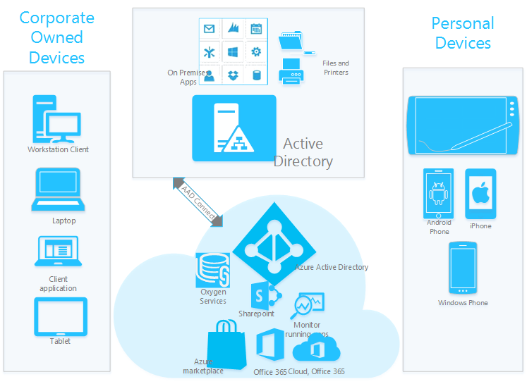

<properties
	pageTitle="Extending cloud capabilities to Windows 10 devices through Azure Active Directory Join| Microsoft Azure"
	description="Provides a detailed overview of how Windows 10 devices can utilize Azure AD Join to get registered on Azure Active Directory."
	services="active-directory"
	documentationCenter=""
	authors="femila"
	manager="swadhwa"
	editor=""
	tags="azure-classic-portal"/>

<tags
	ms.service="active-directory"
	ms.workload="identity"
	ms.tgt_pltfrm="na"
	ms.devlang="na"
	ms.topic="article"
	ms.date="06/23/2016"
	ms.author="femila"/>

# Extending cloud capabilities to Windows 10 devices through Azure Active Directory Join

## What is Azure Active Directory Join?
Azure Active Directory Join (Azure AD Join) is the functionality that registers a company-owned device in Azure Active Directory to enable centralized management of the device. It makes it possible for users such as employees and students to connect to the enterprise cloud through Azure Active Directory. This enables simplified Windows deployments and access to organizational apps and resources from any Windows device, both corporate-owned and personally-owned (BYOD).

Azure AD Join is intended for enterprises that are cloud-first/cloud-only--typically small- and medium-sized businesses that do not have an on-premises Windows Server Active Directory infrastructure. That said, Azure AD Join can and will also be used by large organizations on devices that are incapable of doing a traditional domain join (mobile devices, for example), or for users who primarily need to access Office 365 or other Azure AD SaaS apps.

Although the traditional domain join still offers the best on-premises experience on devices that are capable of domain joining, Azure AD Join is suitable for devices that cannot domain join. Azure AD Join is also suitable for managing users in the cloud. It does so by using mobile device management capabilities instead of by using traditional domain management tools like Group Policy and System Center Configuration Manager (SCCM).

## Why should enterprises adopt Azure AD Join?

* **Businesses that are largely in the cloud**: If you have moved or are moving to a model in which you are reducing your on-premises footprint and want to operate more in the cloud, Azure AD Join could benefit you. Maybe you have created Azure AD accounts manually or through synchronizing your on-premises Active Directory. Either way, you have an account in Azure AD, and you can use it to sign in to Windows 10. Your users can join their computers to Azure AD through either the out-of-box experience (OOBE) or through the Settings menu. After joining, users will enjoy single sign-on (SSO) access to cloud resources like Office 365, either in their browsers or in Office applications.

* **Educational institutions**: One of the scenarios we hear about often is that educational institutions have two user types: faculty and students. Faculty members are considered longer-term members of the organization, so creating on-premises accounts for them is desirable. But students are shorter-term members of the organization and thus can be managed in Azure AD. This means that directory scale can be pushed to the cloud instead of stored on-premises. It also means that students can sign in to Windows with their Azure AD accounts and get access to Office 365 resources, either in their browsers or in Office applications.

* **Retail businesses**: Another scenario we’ve heard about from customers is their desire to manage seasonal workers more easily.  Again, accounts for longer-term, full-time employees are usually created as on-premises accounts on domain-joined machines. But seasonal workers are shorter-term members of the org, so it's desirable to manage them where user licenses can be more easily moved around. Creating these user accounts in the cloud with Office 365 licenses allows the users to get the benefits of signing in to Windows and Office applications with an Azure AD account. Meanwhile, you maintain more flexibility with their licenses after they leave.
* **Other businesses**: Even though you maintain users in your on-premises Active Directory, you could still benefit from having users be Azure-AD-joined. That's because Azure AD offers a simplified joining experience, efficient device management, automatic mobile device management enrollment, and single sign-on capability for Azure AD and on-premises resources.  

## What capabilities does Azure AD Join offer?
With Azure AD Join, you get the following:

* **Self-provisioning of corporate-owned devices**: With Windows 10, users can configure a brand new, shrink-wrapped device in the out-of-box experience, without IT involvement.

* **Support for modern form factors**: Azure AD Join works on devices that don’t have the traditional domain join capabilities.  

* **Support for existing organizational accounts**: Users no longer need to create and maintain a a personal Microsoft account to get the best experience on company-issued devices, as they did with Windows 8. They can use their existing work accounts in Azure AD instead. For many organizations, this basically means that users can set up and sign in to Windows with the same credentials that they use to access Office 365.

* **Automatic mobile device management  enrollment**: Devices can be automatically enrolled in mobile device management when connected to Azure AD. This process works with Microsoft Intune and partner mobile device management solutions. When device management is done with Intune, IT administrators can monitor/manage Azure AD-joined devices alongside domain-joined devices in the SCCM management console.

* **Single sign-on to company resources**: Users enjoy single sign-on from the Windows desktop to apps and resources in the cloud, such as Office 365 and thousands of business applications that rely on Azure AD for authentication through [Azure AD Connect](active-directory-azureadjoin-deployment-aadjoindirect.md). Corporate-owned devices that are joined to Azure AD also enjoy SSO to on-premises resources when the device is on a corporate network, and from anywhere when these resources are exposed via the [Azure AD Application Proxy](https://msdn.microsoft.com/library/azure/Dn768219.aspx).

* **OS State Roaming**: Accessibility settings, websites, Wi-Fi passwords, and other settings are synchronized across corporate-owned devices without requiring a personal Microsoft account.

* **Enterprise-ready Windows Store**: The Windows Store supports app acquisition and licensing with Azure AD accounts. Organizations can volume-license apps and make them available to the users in their organization.

## How do different devices work with Azure AD Join?

| Corporate device (joined to on-premises domain)                                                                                                                                                                                         | Corporate device  (joined to the cloud)                                                                                                                                                                                                                                                                                                                                                                                                                                                                                                                     | Personal device                                                                                                         |
|-----------------------------------------------------------------------------------------------------------------------------------------------------------------------------------------------------------------------------------------|-------------------------------------------------------------------------------------------------------------------------------------------------------------------------------------------------------------------------------------------------------------------------------------------------------------------------------------------------------------------------------------------------------------------------------------------------------------------------------------------------------------------------------------------------------------|------------------------------------------------------------------------------------------------------------------------|
| Users can sign into Windows with work credentials (as they do today).                                                                                                                                                                        | Users can sign in to Windows with work credentials that are managed in Azure AD. This is relevant for corporate devices in three cases: 1)The organization doesn’t have Active Directory on premises (for example, a small business). 2)The organization doesn’t create all user accounts in Active Directory (for example, accounts for students, consultants, or seasonal workers are not created in Active Directory). 3)The organization has corporate devices that can’t be joined to an (on-premises) domain, like phones or tablets running a Mobile SKU (for example, a secondary device taken to a factory/retail floor). Azure AD Join supports joining of corporate devices for both managed and federated organizations. | Users sign in to Windows with their personal Microsoft account credentials (no change).                                                |
| Users have access to roaming settings and the enterprise Windows Store. These services work with work accounts and don't require a personal Microsoft account. This requires organizations to connect their on-premises Active Directory to Azure AD.                                        | Users can do self-service setup. They can go through the first-run experience (FRX) via their work account as an alternative to having IT provision the devices, although both methods are supported.                                                                                                                                                                                                                                                                                                                                                                             | Users can easily add a work account that’s managed in Active Directory or Azure AD.                                                      |
| Users have SSO ability from the desktop to work apps, websites, and resources--including both on-premises resources and cloud apps that use Azure AD for authentication.                                                                                                            | Devices are automatically registered in the enterprise directory (Azure AD) and automatically enrolled in mobile device management. (Azure AD Premium feature).                                                                                                                                                                                                                                                                                                                                                                                                                                                  | Users have SSO ability across apps and to websites/resources with this work account.                                              |
| Users can add their personal Microsoft accounts to access their personal pictures and files without impacting enterprise data. (Roaming settings continue to work with their work accounts.) The Microsoft account enables SSO and no longer drives the roaming of settings.  | Users can do a self-service password reset (SSPR) on winlogon, meaning they can reset a forgotten password. (Azure AD Premium feature).                                                                                                                                                                                                                                                                                                                                                                                                                                   | Users have access to the enterprise Windows Store so that they can acquire and use line-of-business apps on their personal devices. |                                                               |

## Additional information
* [Windows 10 for the enterprise: Ways to use devices for work](active-directory-azureadjoin-windows10-devices-overview.md)
* [Extending cloud capabilities to Windows 10 devices through Azure Active Directory Join](active-directory-azureadjoin-user-upgrade.md)
* [Authenticating identities without passwords through Microsoft Passport](active-directory-azureadjoin-passport.md)
* [Learn about usage scenarios for Azure AD Join](active-directory-azureadjoin-deployment-aadjoindirect.md)
* [Connect domain-joined devices to Azure AD for Windows 10 experiences](active-directory-azureadjoin-devices-group-policy.md)
* [Set up Azure AD Join](active-directory-azureadjoin-setup.md)
