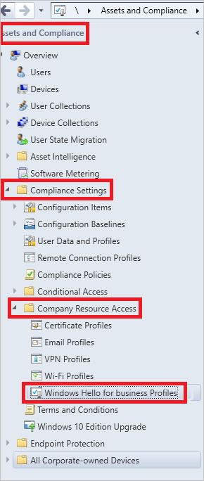
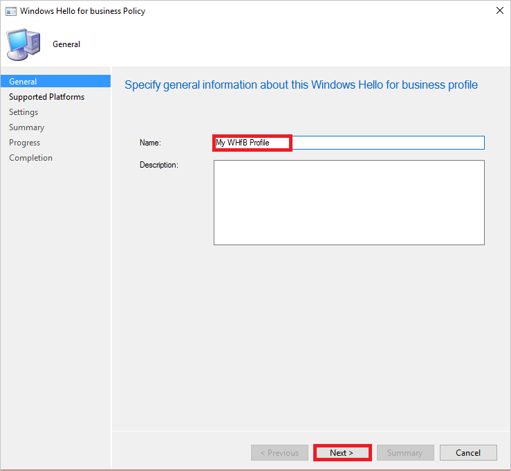
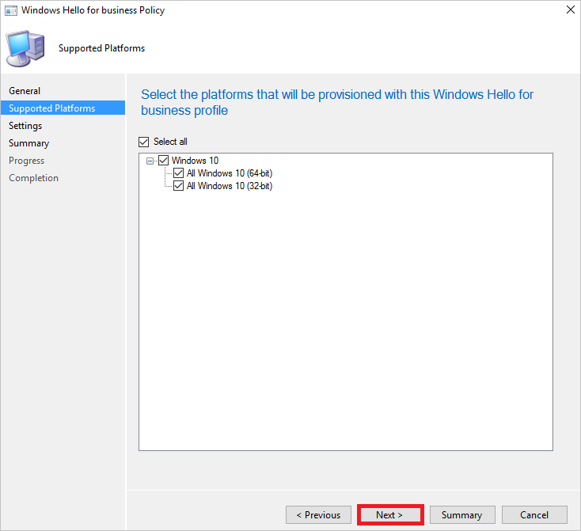
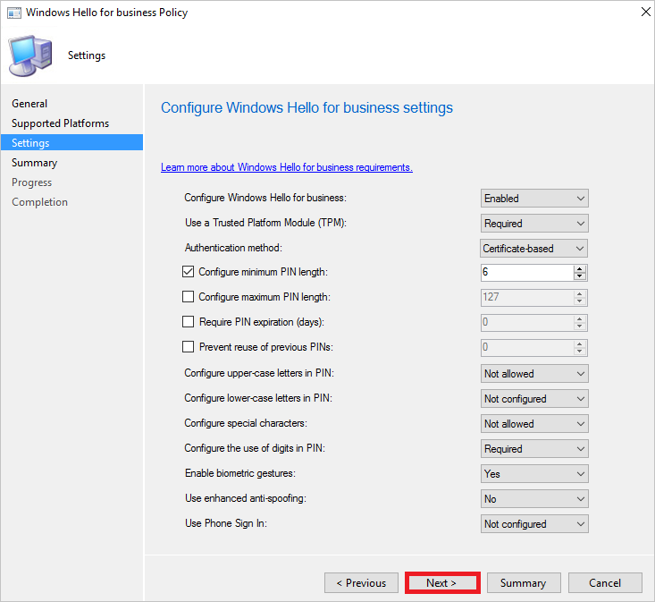

# Enable Microsoft Windows Hello for Business in your organization
After [connecting Windows 10 domain-joined devices with Azure Active Directory](active-directory-azureadjoin-devices-group-policy.md), do the following to enable Microsoft Windows Hello for Business in your organization:

1. Deploy System Center Configuration Manager  
2. Configure policy settings
3. Configure the certificate profile  

## Deploy System Center Configuration Manager
To deploy user certificates based on Windows Hello for Business keys, you need the following:

* **System Center Configuration Manager Current Branch** - You need to install version 1606 or better. For more information, see the [Documentation for System Center Configuration Manager](https://technet.microsoft.com/library/mt346023.aspx) and [System Center Configuration Manager Team Blog](http://blogs.technet.com/b/configmgrteam/archive/2015/09/23/now-available-update-for-system-center-config-manager-tp3.aspx).
* **Public key infrastructure (PKI)** - To enable Microsoft Windows Hello for Business by using user certificates, you must have a PKI in place. If you don’t have one, or you don’t want to use it for user certificates, you can deploy a new domain controller that has Windows Server 2016 build 10551 (or better) installed. Follow the steps to [install a replica domain controller in an existing domain](https://technet.microsoft.com/library/jj574134.aspx) or to [install a new Active Directory forest, if you're creating a new environment](https://technet.microsoft.com/library/jj574166). (The ISOs are available for download on [Signiant Media Exchange](https://datatransfer.microsoft.com/signiant_media_exchange/spring/main?sdkAccessible=true).)

## Configure policy settings
To configure the Microsoft Windows Hello for Business policy settings, you have two options:

* Group Policy in Active Directory 
* The System Center Configuration Manager 

Using Group Policy in Active Directory is the recommended method to configure Microsoft Windows Hello for Business policy settings. 

Using System Center Configuration Manager is the preferred method when you also use it to deploy certificates. 
This scenario:

* Ensures compatibility with the newer deployment scenarios
* Requires on the client side Windows 10 Version 1607 or better.

### Configure Microsoft Windows Hello for Business via group policy in Active Directory
**Steps**:

1. Open Server Manager, and navigate to **Tools** > **Group Policy Management**.
2. From Group Policy Management, navigate to the domain node that corresponds to the domain in which you want to enable Azure AD Join.
3. Right-click **Group Policy Objects**, and select **New**. Give your Group Policy Object a name, for example, Enable Windows Hello for Business. Click **OK**.
4. Right-click your new Group Policy Object, and then select **Edit**.
5. Navigate to **Computer Configuration** > **Policies** > **Administrative Templates** > **Windows Components** > **Windows Hello for Business**.
6. Right-click **Enable Windows Hello for Business**, and then select **Edit**.
7. Select the **Enabled** option button, and then click **Apply**. Click **OK**.
8. You can now link the Group Policy Object to a location of your choice. To enable this policy for all of the domain-joined Windows 10 devices in your organization, link the Group Policy to the domain. For example:
   * A specific organizational unit (OU) in Active Directory where Windows 10 domain-joined computers will be located
   * A specific security group that contains Windows 10 domain-joined computers that will be automatically registered with Azure AD

### Configure Windows Hello for Business using System Center Configuration Manager
**Steps**:

1. Open the **System Center Configuration Manager**, and then navigate to **Assets & Compliance > Compliance Settings > Company Resource Access > Windows Hello for Business Profiles**.
   
    
2. In the toolbar on the top, click **Create Windows Hello for business Profile**.
   
    
3. On the **General** dialog, perform the following steps:
   
    
   
    a. In the **Name** textbox, type a name for your profile, for example, **My WHfB Profile**.
   
    b. Click **Next**.
4. On the **Supported Platforms** dialog, select the platforms that will be provisioned with this Windows Hello for business profile, and then click **Next**.
   
    
5. On the **Settings** dialog, perform the following steps:
   
    
   
    a. As **Configure Windows Hello for Business**, select **Enabled**.
   
    b. As **Use a Trusted Platform Module (TPM)**, select **Required**. 
   
    c. As **Authentication method**, select **Certificate-based**.
   
    d. Click **Next**.
6. On the **Summary** dialog, click **Next**.
7. On the **Completion** dialog, click **Close**.
8. In the toolbar on the top, click **Deploy**.
   
    

## Configure the certificate profile
If you are using certificate-based authentication for on-premises authentication, you need to configure and deploy a certificate profile. This task requires you to set up an NDES server and Certificate Registration Point site role in the System Center Configuration Manager. For more details, see the [Prerequisites for Certificate Profiles in Configuration Manager](https://technet.microsoft.com/library/dn261205.aspx).

1. Open the **System Center Configuration Manager**, and then navigate to **Assets & Compliance > Compliance Settings > Company Resource Access > Certificate Profiles**.
2. Select a template that has Smart Card sign-in extended key usage (EKU).

On the **SCEP Enrollment** page of the certificate profile, you need to choose **Install to Passport for Work otherwise fail** as the **Key Storage Provider**.

## Next steps
* [Windows 10 for the enterprise: Ways to use devices for work](active-directory-azureadjoin-windows10-devices-overview.md)
* [Extending cloud capabilities to Windows 10 devices through Azure Active Directory Join](active-directory-azureadjoin-user-upgrade.md)
* [Authenticating identities without passwords through Microsoft Passport](active-directory-azureadjoin-passport.md)
* [Learn about usage scenarios for Azure AD Join](active-directory-azureadjoin-deployment-aadjoindirect.md)
* [Connect domain-joined devices to Azure AD for Windows 10 experiences](active-directory-azureadjoin-devices-group-policy.md)
* [Set up Azure AD Join](active-directory-azureadjoin-setup.md)

