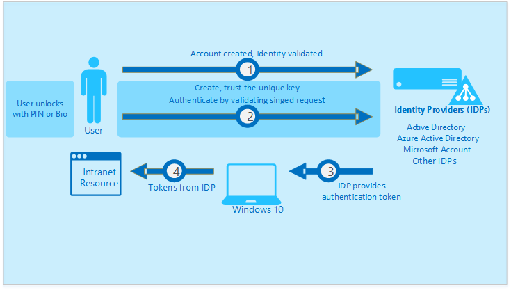

<properties
	pageTitle="Authenticating identities without passwords through Microsoft Passport | Microsoft Azure"
	description="Provides an overview of Microsoft Passport and additional information on deploying Microsoft Passport."
	services="active-directory"
	documentationCenter=""
	authors="femila"
	manager="swadhwa"
	editor=""
	tags="azure-classic-portal"/>

<tags
	ms.service="active-directory"
	ms.workload="identity"
	ms.tgt_pltfrm="na"
	ms.devlang="na"
	ms.topic="article"
	ms.date="06/23/2016"
	ms.author="femila"/>

# Authenticating identities without passwords through Microsoft Passport

The current methods of authentication with passwords alone are not sufficient to keep users safe. Users reuse and forget passwords. Passwords are breachable, phishable, prone to cracks, and guessable. They also get difficult to remember and prone to attacks like “[pass the hash](https://technet.microsoft.com/dn785092.aspx)”.

## About Microsoft Passport
Microsoft Passport is a private/public key or certificate-based authentication approach for organizations and consumers that goes beyond passwords. This form of authentication relies on  key pair credentials that can replace passwords and are resistant to breaches, thefts, and phishing.

 Microsoft Passport lets a user authenticate to a Microsoft account, a Windows Server Active Directory account, a Microsoft Azure Active Directory (Azure AD) account, or a non-Microsoft service that supports Fast IDentity Online (FIDO) authentication. After an initial two-step verification during Microsoft Passport enrollment, Microsoft Passport is set up on the user's device, and the user sets a gesture, which can be Windows Hello or a PIN. The user provides the gesture to verify their identity. Windows then uses Microsoft Passport to authenticate the user and help them to access protected resources and services.

The private key is made available solely through a “user gesture” like a PIN, biometrics, or a remote device like a smart card that the user uses to sign in to the device. This information is linked to a certificate or an asymmetrical key pair. The private key is hardware attested if the device has a Trusted Platform Module (TPM) chip. The private key never leaves the device.

The public key is registered with Azure Active Directory and Windows Server Active Directory (for on-premises). Identity Providers (IDPs) validate the user by mapping the public key of the user to the private key, and provide sign-in information through One Time Password (OTP), PhoneFactor, or a different notification mechanism.

## Why enterprises should adopt Microsoft Passport

By enabling Microsoft Passport, enterprises can make their resources even more secure by:

* Setting up Microsoft Passport with a hardware-preferred option. This means that keys will be generated on TPM 1.2 or TPM 2.0 when available. When TPM is not available, software will generate the key.

* Defining the complexity and length of the PIN, and whether Hello usage is enabled in your organization.

* Configuring Microsoft Passport to support smart card-like scenarios by using certificate-based trust.

## How Microsoft Passport works
1. Keys are generated on the hardware by TPM or software. Many devices have a built-in TPM chip that secures the hardware by integrating cryptographic keys into devices. TPM 1.2 or TPM 2.0 generates keys or certificates that are created from the generated keys.

2. The TPM attests these hardware-bound keys.

3. A single unlock gesture unlocks the device. This gesture allows access to multiple resources if the device is domain-joined or Azure AD-joined.

## How the Microsoft Passport lifecycle works

The preceding diagram illustrates the private/public key pair and the validation by the identity provider. Each of these steps is explained in detail here:

1. The user proves their identity through multiple built-in proofing methods (gestures, physical smart cards, multi-factor authentication) and sends this information to an Identity Provider (IDP) like Azure Active Directory or on-premises Active Directory.

2. The device then creates the key, attests the key, takes the public portion of this key, attaches it with station statements, signs in, and sends it to the IDP to register the key.

4. As soon as the IDP registers the public portion of the key, the IDP challenges the device to sign with the private portion of the key.

5. The IDP then validates and issues the authentication token that lets the user and the device access the protected resources. IDPs can write cross-platform apps or use browser support (via JavaScript/Webcrypto APIs) to create and use Microsoft Passport credentials for their users.

## The deployment requirements for Microsoft Passport
### At the enterprise level

* The enterprise has an Azure subscription.

### At the user level

* The user's computer runs Windows 10 Professional or Enterprise.

For detailed deployment instructions, see [Enable Microsoft Passport for work in the organization](active-directory-azureadjoin-passport-deployment.md).

## Additional information

* [Windows 10 for the enterprise: Ways to use devices for work](active-directory-azureadjoin-windows10-devices-overview.md)
* [Extending cloud capabilities to Windows 10 devices through Azure Active Directory Join](active-directory-azureadjoin-user-upgrade.md)
* [Learn about usage scenarios for Azure AD Join](active-directory-azureadjoin-deployment-aadjoindirect.md)
* [Connect domain-joined devices to Azure AD for Windows 10 experiences](active-directory-azureadjoin-devices-group-policy.md)
* [Set up Azure AD Join](active-directory-azureadjoin-setup.md)
