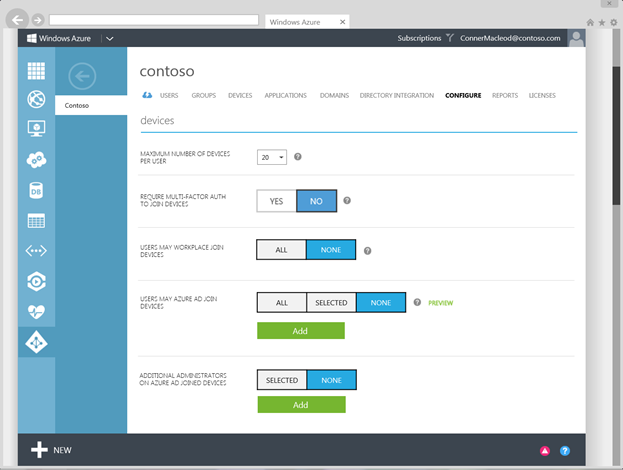

<properties
	pageTitle="Setting up Azure AD Join for your users| Microsoft Azure"
	description="Explains how administrators can set up Azure AD Join for on-premises directory and device registration."
	services="active-directory"
	documentationCenter=""
	authors="femila"
	manager="swadhwa"
	editor=""
	tags="azure-classic-portal"/>

<tags
	ms.service="active-directory"
	ms.workload="identity"
	ms.tgt_pltfrm="na"
	ms.devlang="na"
	ms.topic="get-started-article"
	ms.date="06/23/2016"
	ms.author="femila"/>

# Setting up Azure AD Join in your organization

Before you set up Azure Active Directory Join (Azure AD Join), you need to either sync up your on-premises directory of users to the cloud or manually create managed accounts in Azure AD.

Detailed instructions for syncing your on-premises users to Azure AD is covered in [Integrating your on-premises identities with Azure Active Directory](active-directory-aadconnect.md).

To manually create and manage users in Azure AD, refer to [User management in Azure AD](https://msdn.microsoft.com/library/azure/hh967609.aspx).

## Set up device registration
1. Log on to the Azure portal as an administrator.
2. On the left pane, select **Active Directory**.
3. On the **Directory** tab, select your directory.
4. Select the **Configure** tab.
5. Go to the **Devices** section.
6. On the **devices** tab, set the following:  
   * **MAXIMUM NUMBER OF DEVICES PER USER**: Select the maximum number of devices that a user can have in Azure AD.  If a user reaches this quota, they will not be able to add additional devices until one or more of their existing devices are removed.
   * **REQUIRE MULTI-FACTOR AUTH TO JOIN DEVICES**: Set whether users are required to provide a second authentication factor to join their device to Azure AD. For more information on Azure Multi-Factor Authentication, see [Getting started with Azure Multi-Factor Authentication in the cloud](..\multi-factor-authentication\multi-factor-authentication-get-started-cloud.md).
   * **USERS MAY AZURE AD JOIN DEVICES**: Select the users and groups that are allowed to join devices to Azure AD.
   * **ADDITIONAL ADMINISTRATORS ON AZURE AD JOINED DEVICES**: With Azure AD Premium or the Enterprise Mobility Suite (EMS), you can choose which users are granted local administrator rights to the device. Global administrators and device owners are granted local administrator rights by default.

 

After you set up Azure AD Join for your users, they can connect to Azure AD through their corporate or personal devices.

Following are the three scenarios you can use to enable your users to set up Azure AD Join:

- Users join a company-owned device directly to Azure AD.
- Users domain-join a company-owned device to the on-premises Active Directory and then extend the device to Azure AD.
- Users add work or school accounts to Windows on a personal device

## Additional information
* [Windows 10 for the enterprise: Ways to use devices for work](active-directory-azureadjoin-windows10-devices-overview.md)
* [Extending cloud capabilities to Windows 10 devices through Azure Active Directory Join](active-directory-azureadjoin-user-upgrade.md)
* [Learn about usage scenarios for Azure AD Join](active-directory-azureadjoin-deployment-aadjoindirect.md)
* [Connect domain-joined devices to Azure AD for Windows 10 experiences](active-directory-azureadjoin-devices-group-policy.md)
* [Set up Azure AD Join](active-directory-azureadjoin-setup.md)
