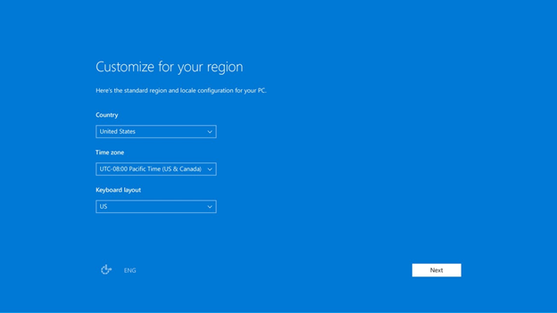
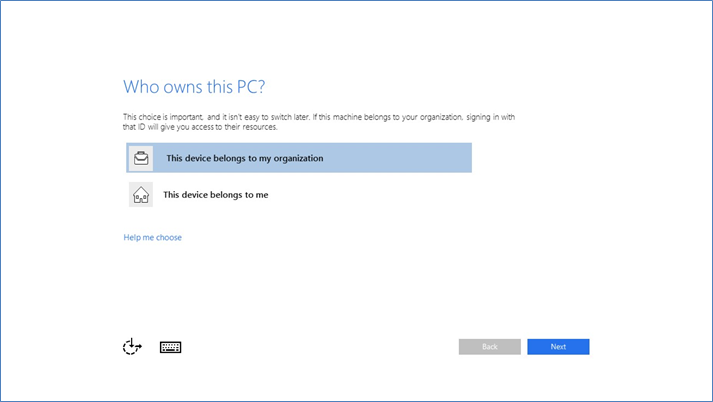

<properties
	pageTitle="Set up a new device with Azure AD during Setup| Microsoft Azure"
	description="A topic that explains how users can set up Azure AD Join during their first run experience."
	services="active-directory"
	documentationCenter=""
	authors="femila"
	manager="swadhwa"
	editor=""
	tags="azure-classic-portal"/>

<tags
	ms.service="active-directory"
	ms.workload="identity"
	ms.tgt_pltfrm="na"
	ms.devlang="na"
	ms.topic="article"
	ms.date="06/23/2016"
	ms.author="femila"/>

# Set up a new device with Azure AD during Setup

In Windows 10, users can join their devices to Azure Active Directory (Azure AD) in the first-run experience (FRX). This allows organizations to distribute shrink-wrapped devices to their employees or students, or let them choose their own devices (CYOD).
If either Windows 10 Professional or Windows 10 Enterprise editions is installed on a device, the experience defaults to the setup process for company-owned devices.

## To join a device to Azure AD

1. When you turn on your new device and start the setup process, you should see the  **Getting Ready** message. Follow the prompts to set up your device.
2. Start by customizing your region and language. Then accept the Microsoft Software License Terms.

3. Select the network you want to use for connecting to the Internet.
4. Select whether you're using a personal device or a company-owned device. If it's company-owned, click **This device belongs to my organization**. This starts the Azure AD Join experience. Following is a screen that you'll see if you're using Windows 10 Professional.

5.	Enter the credentials that were provided to you by your organization.

6.	After you have entered your user name, a matching tenant is located in Azure AD. If you are in a federated domain, you will be redirected to your on-premises Secure Token Service (STS) server--for example, Active Directory Federation Services (AD FS).
7. If you are a user in a non-federated domain, enter your credentials directly on the Azure AD-hosted page. If company branding was configured, you will also see your organization’s logo and support text.
8.	You're prompted for a multi-factor authentication challenge. This challenge is configurable by an IT administrator.
9.	Azure AD checks whether this user/device requires enrollment in mobile device management.
10.	Windows registers the device in the organization’s directory in Azure AD and enrolls it in mobile device management, if appropriate.
11.	If you are a managed user, Windows takes you to the desktop through the automatic sign-in process.
12.	If you are a federated user, you are directed to the Windows sign-in screen to enter your credentials.

> [AZURE.NOTE] Joining an on-premises Windows Server Active Directory domain in the Windows out-of-box experience is not supported. Therefore, if you plan to join a computer to a domain, you should select the link **Set up Windows with a local account** instead. You can then join the domain from the settings on your computer as you’ve done before.

## Additional information
* [Windows 10 for the enterprise: Ways to use devices for work](active-directory-azureadjoin-windows10-devices-overview.md)
* [Extending cloud capabilities to Windows 10 devices through Azure Active Directory Join](active-directory-azureadjoin-user-upgrade.md)
* [Authenticating identities without passwords through Microsoft Passport](active-directory-azureadjoin-passport.md)
* [Learn about usage scenarios for Azure AD Join](active-directory-azureadjoin-deployment-aadjoindirect.md)
* [Connect domain-joined devices to Azure AD for Windows 10 experiences](active-directory-azureadjoin-devices-group-policy.md)
* [Set up Azure AD Join](active-directory-azureadjoin-setup.md)
