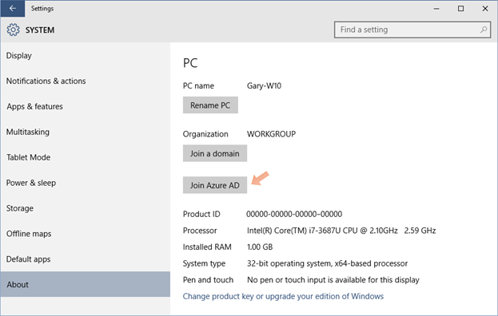
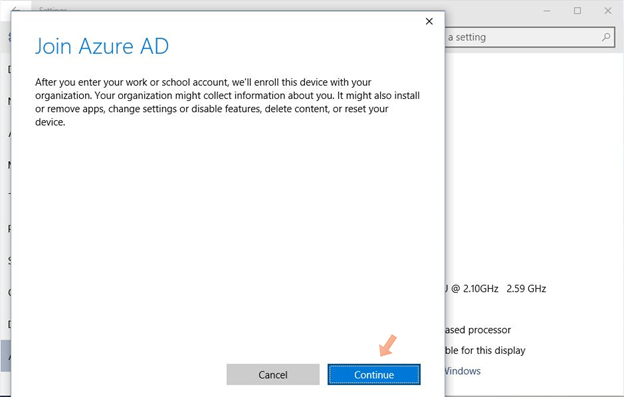
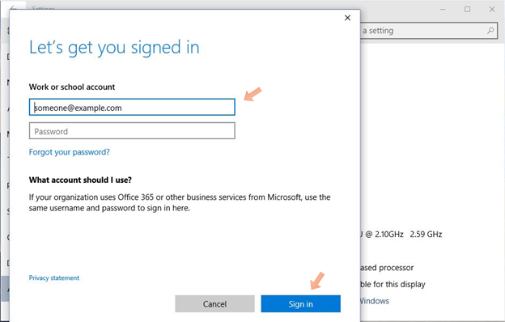

<properties
	pageTitle="Set up a Windows 10 device with Azure AD from Settings| Microsoft Azure"
	description="Explains how users can join to Azure AD through the Settings menu."
	services="active-directory"
	documentationCenter=""
	authors="femila"
	manager="swadhwa"
	editor=""
	tags="azure-classic-portal"/>

<tags
	ms.service="active-directory"
	ms.workload="identity"
	ms.tgt_pltfrm="na"
	ms.devlang="na"
	ms.topic="article"
	ms.date="06/23/2016"
	ms.author="femila"/>

# Set up a Windows 10 device with Azure AD from Settings
If you are already using Windows 7 or Windows 8, and your computer or device has been upgraded to Windows 10, you can join to Azure Active Directory (Azure AD) through the Settings menu.

## To join to Azure AD from the Settings menu

1. From the **Start** menu, click the **Settings** charm.
2. From **Settings**, select 	**System**->**About**->**Join Azure AD**.

 

3. Click **Continue** in the Azure AD Join message window.

 

4. Provide your sign-in credentials. This sign-in experience will include all the steps that are required to complete authentication. If you are part of a federated tenant, your administrator will provide you with the federation experience that's hosted by your organization.

 

5. If your organization has configured Azure Multi-Factor Authentication for joining to Azure AD, provide the second factor before proceeding.
6. Click **Accept** on the **Allow this device to be managed** screen.
7. You should see the message "Your device is now joined to your organization in Azure AD".

## Additional information
* [Learn about usage scenarios for Azure AD Join](active-directory-azureadjoin-deployment-aadjoindirect.md)
* [Connect domain-joined devices to Azure AD for Windows 10 experiences](active-directory-azureadjoin-devices-group-policy.md)
* [Set up Azure AD Join](active-directory-azureadjoin-setup.md)
* [Authenticating identities without passwords through Microsoft Passport](active-directory-azureadjoin-passport.md)
