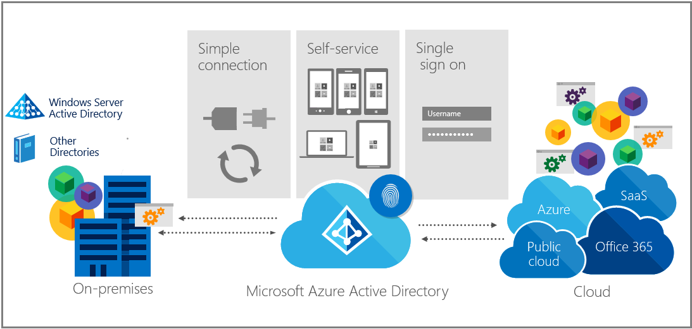

<properties
	pageTitle="Windows 10 for the enterprise: Ways to use devices for work | Microsoft Azure"
	description="Overview of deploying Windows 10 devices for enterprises, and how to integrate with Azure Active Directory for the Windows cloud. Contrasts the different ways a device can be provisioned and used in an enterprise through the Azure portal."
    keywords="windows cloud, Windows on Azure Active Directory, Windows 10 devices on Azure, Azure Windows devices"
	services="active-directory"
	documentationCenter=""
	authors="femila"
	manager="swadhwa"
	editor=""
	tags="azure-classic-portal"/>

<tags
	ms.service="active-directory"
	ms.workload="identity"
	ms.tgt_pltfrm="na"
	ms.devlang="na"
	ms.topic="article"
	ms.date="06/23/2016"

	ms.author="femila"/>

# Windows 10 for the enterprise: Ways to use devices for work

Windows 10 gives you the ability to leverage Azure Active Directory (Azure AD). You can connect Windows 10 devices to Azure AD so that users can sign in to Windows by using Azure AD accounts or by adding their Azure IDs to gain access to business apps and resources.

## Integrating Windows 10 devices with Azure Active Directory--a content map

The following topics provide insights into different capabilities of Windows 10 devices in your organization.

|              | Topics                                                                                                                                                                                                    |
|--------------------------------|-------------------------------------------------------------------------------------------------------------------------------------------------------------------------------------------------------------------------------------------------------------------------------------------------------------|
| Getting started                  | [Using Windows 10 devices in your workplace](active-directory-azureadjoin-windows10-devices.md)     [Extending cloud capabilities to Windows 10 devices through Azure Active Directory Join](active-directory-azureadjoin-overview.md)     [Authenticating identities without passwords through Microsoft Passport](active-directory-azureadjoin-passport.md)                              |
| Deployment     | [Usage scenarios and deployment considerations for Azure AD Join](active-directory-azureadjoin-deployment-aadjoindirect.md)    [Connecting domain-joined devices to Azure AD, for Windows 10 experiences](active-directory-azureadjoin-devices-group-policy.md)  [Enabling Microsoft Passport for work in the organization](active-directory-azureadjoin-passport-deployment.md)   [Enabling Enterprise State Roaming for Windows 10](active-directory-windows-enterprise-state-roaming-overview.md)   |
| User tasks    | [Setting up a new Windows 10 device with Azure AD during setup](active-directory-azureadjoin-user-frx.md)    [Setting up a Windows 10 device with Azure AD from the settings menu](active-directory-azureadjoin-user-upgrade.md)    [Joining a personal Windows 10 device to your organization](active-directory-azureadjoin-personal-device.md) |
