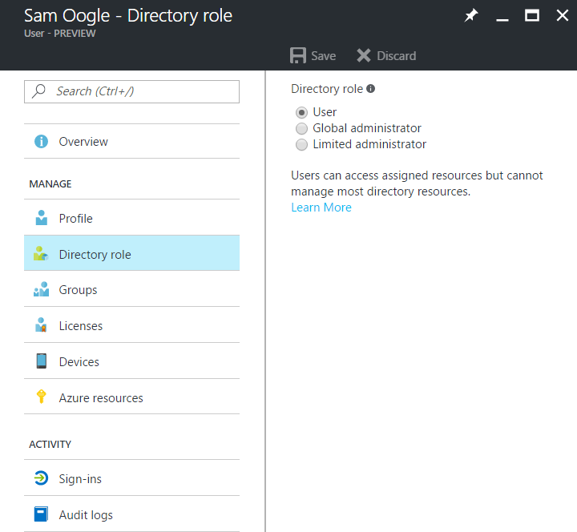
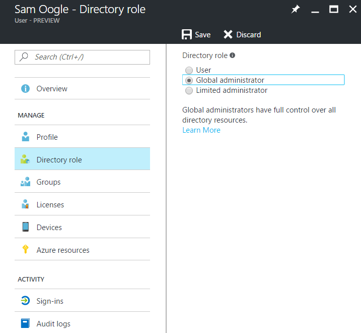
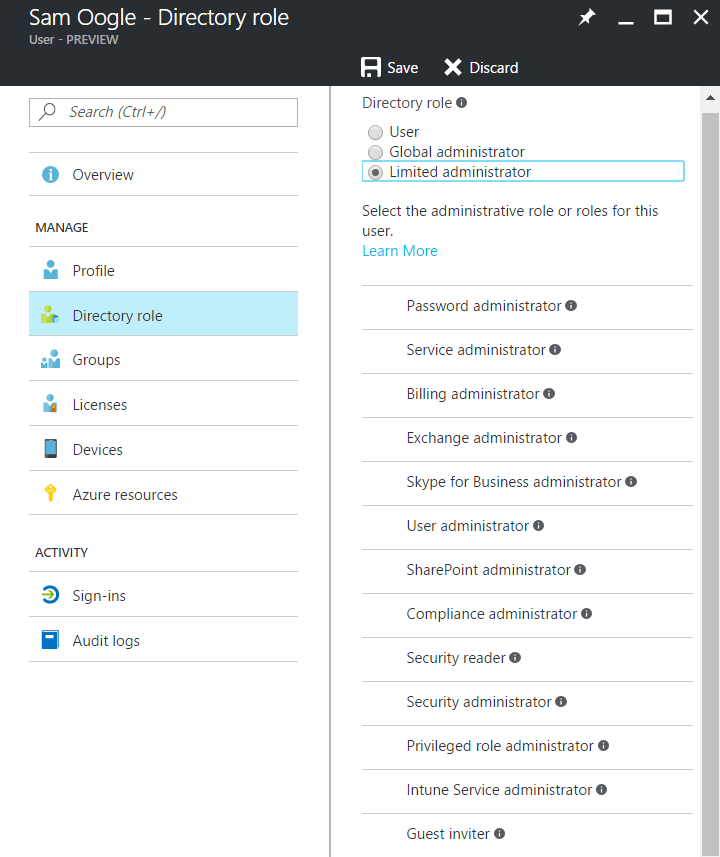

---

title: Add an Azure Active Directory B2B collaboration user to a role | Microsoft Docs
description: Add a guest user to a role in Azure Active Directory
services: active-directory
documentationcenter: ''
author: sasubram
manager: femila
editor: ''
tags: ''

ms.assetid:
ms.service: active-directory
ms.devlang: NA
ms.topic: article
ms.tgt_pltfrm: NA
ms.workload: identity
ms.date: 03/15/2017
ms.author: sasubram

ms.custom: H1Hack27Feb2017                          

---

# Grant permissions to users from partner organizations in your Azure Active Directory tenant

Azure Active Directory (Azure AD) B2B collaboration users are added as guest users to the directory, and guest permissions in the directory are restricted by default. Your business may need some guest users to fill higher-privilege roles in your organization. To support defining higher-privilege roles, guest users can be added to any roles you desire, based on your organization's needs.

## Default role

## Global Administrator Role

## Limited Administrator Role

## Next steps

Browse our other articles on Azure AD B2B collaboration:

* [What is Azure AD B2B collaboration?](active-directory-b2b-what-is-azure-ad-b2b.md)
* [B2B collaboration user properties](active-directory-b2b-user-properties.md)
* [Delegate B2bB collaboration invitations](active-directory-b2b-delegate-invitations.md)
* [Dynamic groups and B2B collaboration](active-directory-b2b-dynamic-groups.md)
* [B2B collaboration code and PowerShell samples](active-directory-b2b-code-samples.md)
* [Configure SaaS apps for B2B collaboration](active-directory-b2b-configure-saas-apps.md)
* [B2B collaboration user tokens](active-directory-b2b-user-token.md)
* [B2B collaboration user claims mapping](active-directory-b2b-claims-mapping.md)
* [Office 365 external sharing](active-directory-b2b-o365-external-user.md)
* [B2B collaboration current limitations](active-directory-b2b-current-limitations.md)
