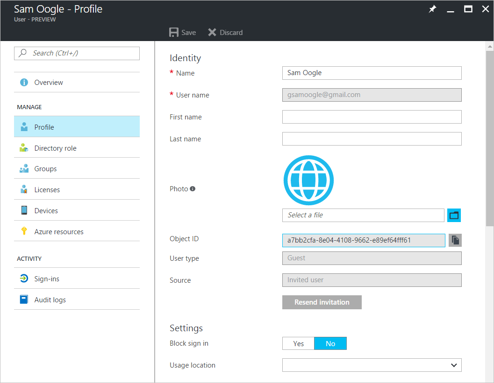

---

title: How do Azure Active Directory admins add B2B collaboration users? | Microsoft Docs
description: An admin can add guest users to your Azure AD from a partner organization using Azure Active Directory B2B collaboration.
services: active-directory
documentationcenter: ''
author: sasubram
manager: femila
editor: ''
tags: ''

ms.assetid:
ms.service: active-directory
ms.devlang: NA
ms.topic: article
ms.tgt_pltfrm: NA
ms.workload: identity
ms.date: 03/15/2017
ms.author: sasubram

---

# How do Azure Active Directory admins add B2B collaboration users?

Global Admins and limited admins can use the [Azure portal](https://portal.azure.com) to invite B2B collaboration users to the directory, to any group or to any application.

## Admins adding guest users to the directory
Add B2B collaboration users to the directory as an Azure AD administrator, as shown in the following video:

>[!VIDEO https://channel9.msdn.com/Blogs/Azure/Admin-adding-guests-for-B2B-collaboration-to-Azure-AD-tenant/Player]

## Admins adding guest users to a group
Add B2B collaboration users to a group as an Azure AD administrator, as shown in the following video:

>[!VIDEO https://channel9.msdn.com/Blogs/Azure/admin-adding-guests-to-a-group/Player]

## Admins adding guest users to an application

Add B2B collaboration users to an application as an Azure AD administrator, as shown in the following video:

>[!VIDEO https://channel9.msdn.com/Blogs/Azure/admin-assign-b2b-to-apps/Player]

## Admins resending invitations to guest users
You can go to a B2B collaboration user's profile page and resend invitations to any not-yet-redeemed guest users:

> ![NOTE]
> If you resend invitations, the invitation is sent from the signed-in user to individual users even if the original invitation was sent to a specific app or group.

## Related articles

Browse our other articles on Azure AD B2B collaboration:

* [What is Azure AD B2B collaboration?](active-directory-b2b-what-is-azure-ad-b2b.md)
* [How do information workers add B2B collaboration users?](active-directory-b2b-iw-add-users.md)
* [The elements of the B2B collaboration invitation email](active-directory-b2b-invitation-email.md)
* [B2B collaboration invitation redemption](active-directory-b2b-redemption-experience.md)
* [Azure AD B2B collaboration licensing](active-directory-b2b-licensing.md)
* [Troubleshooting Azure Active Directory B2B collaboration](active-directory-b2b-troubleshooting.md)
* [Azure Active Directory B2B collaboration frequently asked questions (FAQ)](active-directory-b2b-faq.md)
* [Multi-factor authentication for B2B collaboration users](active-directory-b2b-mfa-instructions.md)
* [Azure Active Directory B2B collaboration API and customization](active-directory-b2b-api.md)
* [Add B2B collaboration users without an invitation](active-directory-b2b-add-user-without-invite.md)
* [Article Index for Application Management in Azure Active Directory](active-directory-apps-index.md)
