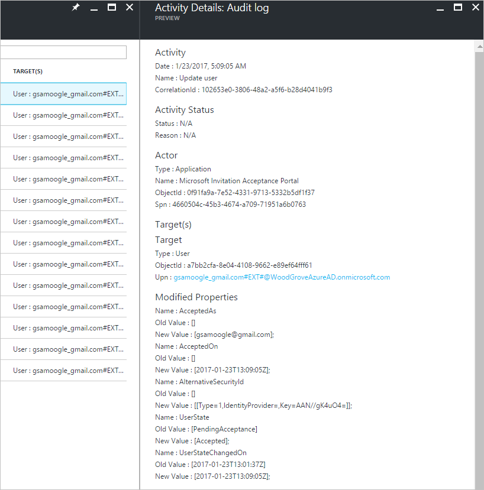

# Auditing and reporting a B2B collaboration user
With guest users, in this preview you have auditing capabilities on par with member users. Here's an example below of the invitation and redemption history of the just invited Sam Oogle:

You can dive into each of these events to get the details. For example, let's look at the acceptance details.

You can also export these logs from Azure AD and use the reporting tool of your choice in order to get customized reports.
