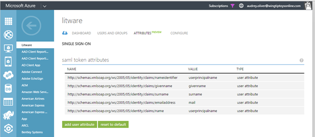

# B2B collaboration user claims mapping in Azure Active Directory

Azure Active Directory (Azure AD) supports customizing the claims issued in the SAML token for B2B collaboration users. When a user authenticates to the application, Azure AD issues a SAML token to the app that contains information (or claims) about the user that uniquely identifies them. By default, this includes the user's user name, email address, first name, and last name. You can view or edit the claims sent in the SAML token to the application under the Attributes tab.

There are two possible reasons why you might need to edit the claims issued in the SAML token.

1. The application has been written to require a different set of claim URIs or claim values

2. Your application requires the NameIdentifier claim to be something other than the user principal name stored in Azure Active Directory.

  

For information on how to add and edit claims, check out this article on claims customization, [Customizing claims issued in the SAML token for pre-integrated apps in Azure Active Directory](develop/active-directory-saml-claims-customization.md). For B2B collaboration users, mapping NameID and UPN cross-tenant are prevented for security reasons.

## Next steps

Browse our other articles on Azure AD B2B collaboration:

* [What is Azure AD B2B collaboration?](active-directory-b2b-what-is-azure-ad-b2b.md)
* [B2B collaboration user properties](active-directory-b2b-user-properties.md)
* [Adding a B2B collaboration user to a role](active-directory-b2b-add-guest-to-role.md)
* [Delegate B2bB collaboration invitations](active-directory-b2b-delegate-invitations.md)
* [Dynamic groups and B2B collaboration](active-directory-b2b-dynamic-groups.md)
* [B2B collaboration code and PowerShell samples](active-directory-b2b-code-samples.md)
* [Configure SaaS apps for B2B collaboration](active-directory-b2b-configure-saas-apps.md)
* [Office 365 external sharing](active-directory-b2b-o365-external-user.md)
* [B2B collaboration user tokens](active-directory-b2b-user-token.md)
* [B2B collaboration current limitations](active-directory-b2b-current-limitations.md)
