# Configure SaaS apps for B2B collaboration

Azure Active Directory (Azure AD) B2B collaboration works with most applications that integrate with Azure AD. In this section, we'll walk through instructions on how to configure some popular SAS apps for use with Azure AD B2B.
Before we look at application specific instructions, here are some rules of thumb:

* Remember that for most of the applications, user provision needs to happen manually (that is, users have to be created manually in the application as well).

* For apps that support automatic provisioning (like Dropbox), there will be separate invitations created from the applications. User must be sure to accept each invitation.

* In the User Attributes, always set User Identifier to user.mail (to mitigate any issues with mangled UPD in guest users)

##DropBox for Business

For users to be able to sign in using their organization account, Dropbox for Business must be manually configured to use Azure AD as a SAML identity provider. Dropbox for Business cannot prompt or otherwise allow users to sign in using Azure AD if it has not been configured to do so.

1. Add DropBox for Business application into Azure AD as shown in the screenshot.

  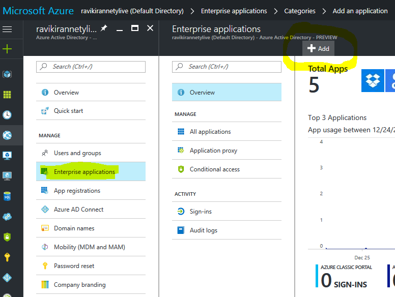

  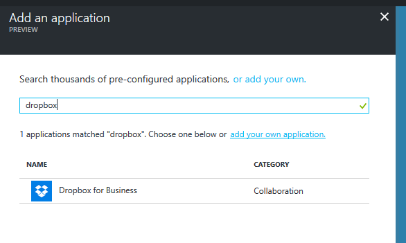

2. Configure the application.

  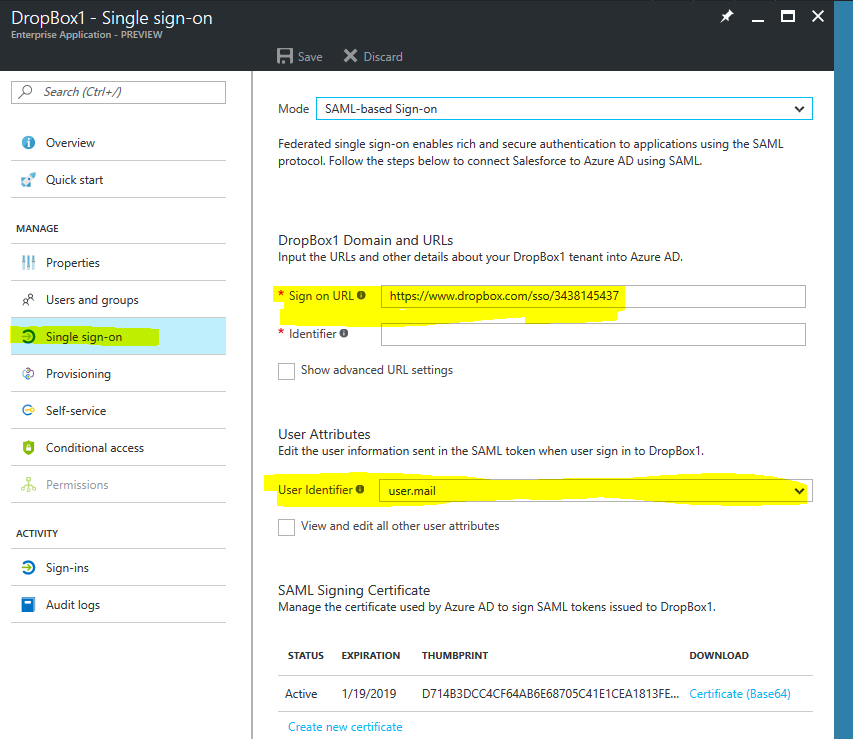

3. Select single sign-on configuration and change user identifier to user.mail (its UPN by default)

4. Download the certificate to use for DropBox configuration.

  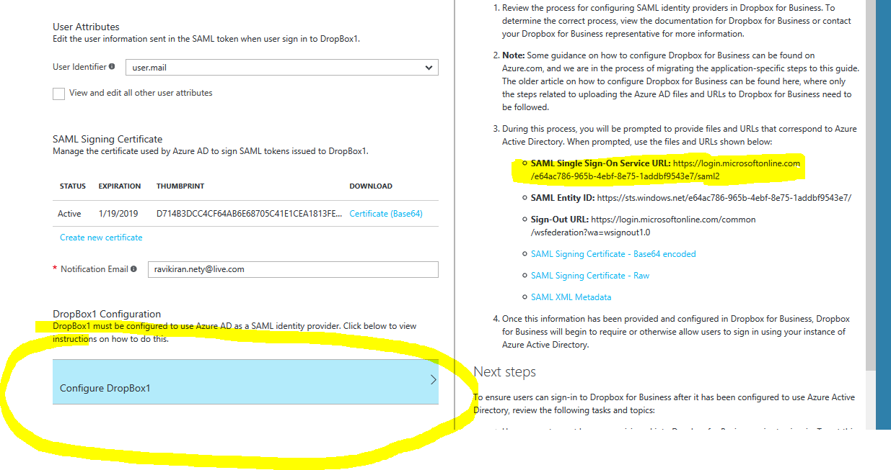

5. Use the Configure DropBox option (the process is explained in detail by screenshots below)

6. Get the SAML single sign on URL to be used in the configuration.

7. Get the sign-on URL from the DropBox configuration page.

  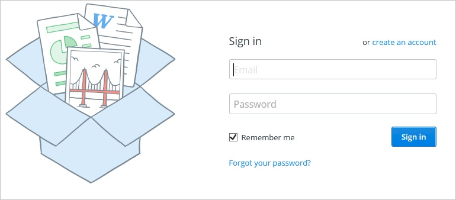

  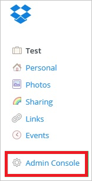

  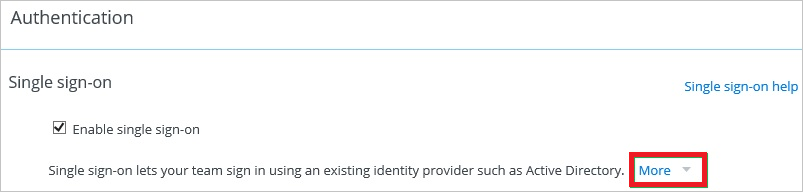

  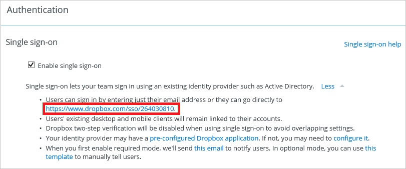

8. Upload certificate & paste SAML single sign on URL here.

  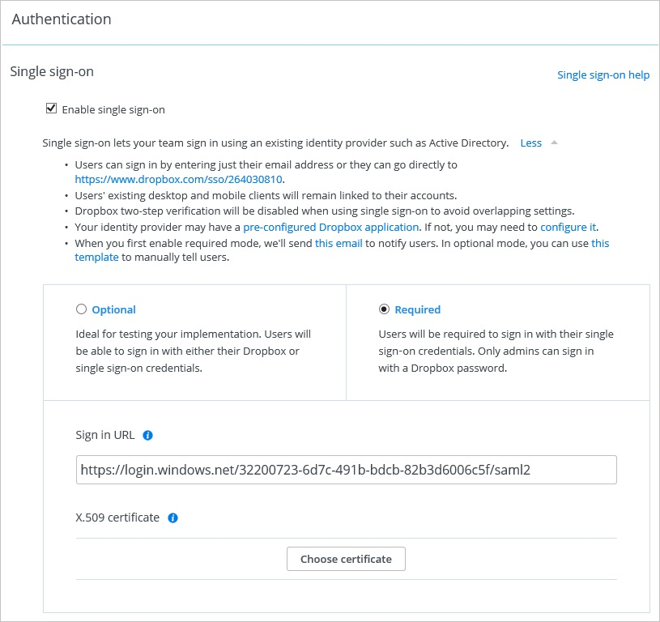

9. Configure automatic user provisioning in the Azure portal.

  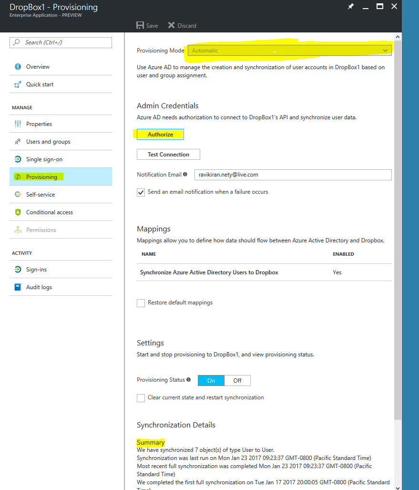

10. Once provisioned in the DropBox application, the guest/member user will get a separate invite from DropBox. The invitees must accept it by clicking the link, to use single sign-on into DropBox.

## Box
This section outlines how to enable users to authenticate a guest user to Box with their account in Azure AD using federation based on the SAML protocol. As part of this procedure, you are required to upload metadata to Box.com.

1. Add Box from the enterprise applications

2. Configure single sign-on

  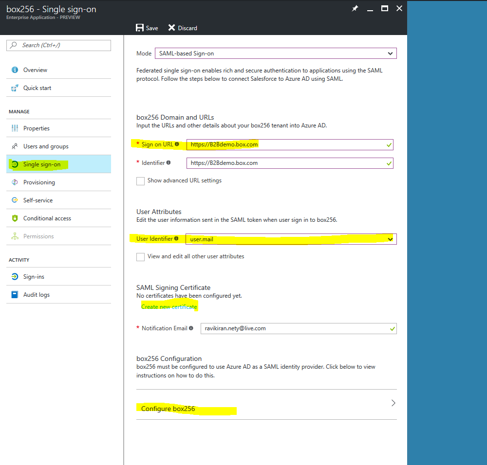

3. First, ensure that the Sign-on URL is set appropriately for Box in the Azure management portal. This is the URL of your Box.com tenant and should follow the format: https://.box.com.

4. The Identifier is not applicable for this application but still shows as mandatory field, just be aware of that fact.

5. User identifier to user.mail ( to make sure SSO for guest accounts)

6. Create new SAML certificate

7. To begin configuring your Box.com tenant to use Azure Active Directory as an identity provider, start by downloading the following metadata file, and saving it locally on your computer: Download metadata file ( make sure to make it active)

8. Forward that metadata file to Box support team. The support team configures single sign-on for you.

9. Set up for Azure AD automatic user provisioning.

  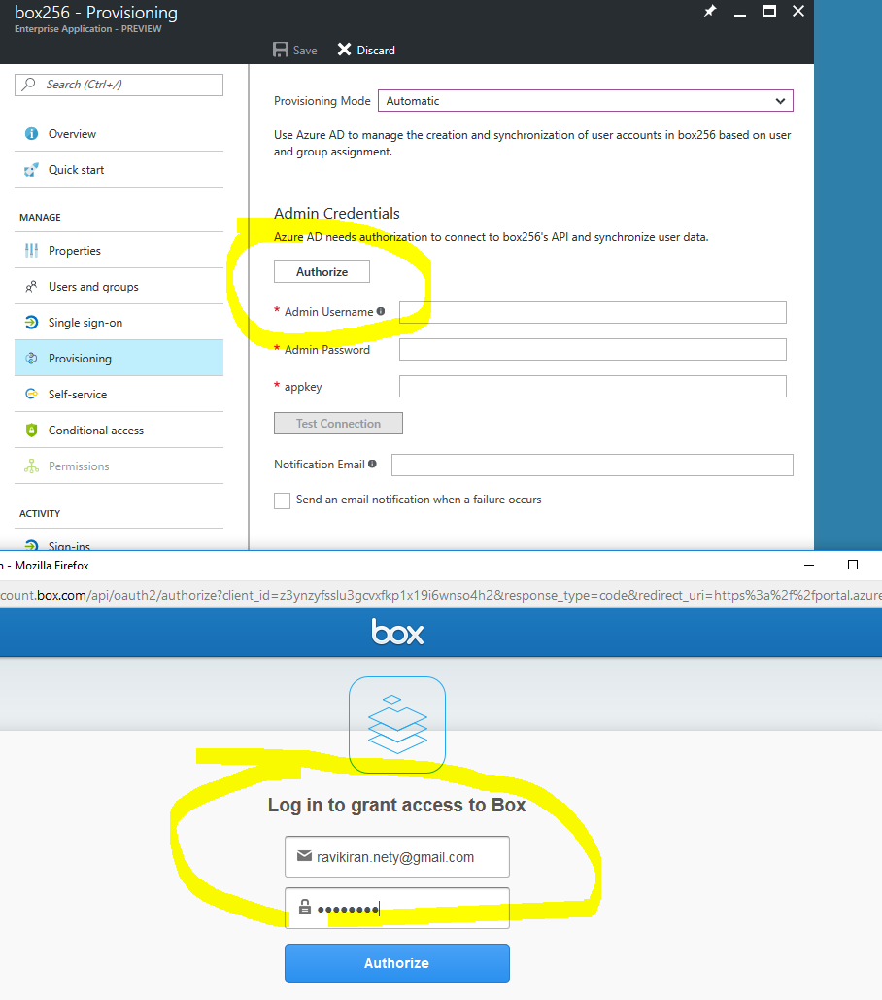

Invitees must also redeem their invitation from the Box application.

## Next steps

Browse our other articles on Azure AD B2B collaboration:

* [What is Azure AD B2B collaboration?](active-directory-b2b-what-is-azure-ad-b2b.md)
* [B2B collaboration user properties](active-directory-b2b-user-properties.md)
* [Adding a B2B collaboration user to a role](active-directory-b2b-add-guest-to-role.md)
* [Delegate B2B collaboration invitations](active-directory-b2b-delegate-invitations.md)
* [Dynamic groups and B2B collaboration](active-directory-b2b-dynamic-groups.md)
* [B2B collaboration code and PowerShell samples](active-directory-b2b-code-samples.md)
* [B2B collaboration user tokens](active-directory-b2b-user-token.md)
* [B2B collaboration user claims mapping](active-directory-b2b-claims-mapping.md)
* [Office 365 external sharing](active-directory-b2b-o365-external-user.md)
* [B2B collaboration current limitations](active-directory-b2b-current-limitations.md)
