<properties
   pageTitle="Detailed walkthrough of using the Azure Active Directory B2B collaboration preview | Microsoft Azure"
   description="Azure Active Directory B2B collaboration supports your cross-company relationships by enabling business partners to selectively access your corporate applications"
   services="active-directory"
   documentationCenter=""
   authors="viv-liu"
   manager="cliffdi"
   editor=""
   tags=""/>

<tags
   ms.service="active-directory"
   ms.devlang="NA"
   ms.topic="get-started-article"
   ms.tgt_pltfrm="NA"
   ms.workload="identity"
   ms.date="05/09/2016"
   ms.author="viviali"/>

# Azure AD B2B collaboration preview: Detailed walkthrough

This walkthrough outlines how to use Azure AD B2B collaboration. As the IT administrator of Contoso, we want to share applications with employees from three partner companies. None of the partner companies need to have Azure AD.

- Alice from Simple Partner Org
- Bob, from Medium Partner Org, needs access to a set of apps
- Carol, from Complex Partner Org, needs access to a set of apps, and membership in groups at Contoso

After invitations are sent out to partner users, we can configure them in Azure AD to grant access to apps and membership to groups through the Azure portal. Let's start by adding Alice.

## Adding Alice to the Contoso directory
1. Create a .csv file with the headers as shown, populating only Alice's **Email**, **DisplayName**, and **InviteContactUsUrl**. **DisplayName** is the name that appears in the invite, and also the name that appears in the Contoso Azure AD directory. **InviteContactUsUrl** is a way for Alice to contact Contoso. In the following example, InviteContactUsUrl specifies the LinkedIn profile of Contoso. It is important to spell the labels in the first row of the .csv file exactly as specified in the [CSV file format reference](active-directory-b2b-references-csv-file-format.md).  
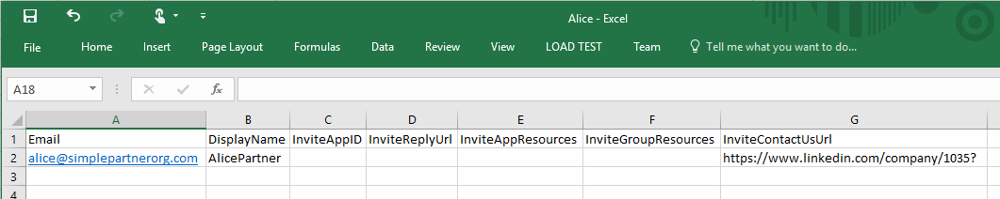

2. In the Azure portal, add a user into the Contoso directory (Active Directory > Contoso > Users > Add User). In the "Type of User" drop down, select "Users in partner companies". Upload the .csv file. Make sure that the .csv file is closed before uploading.  
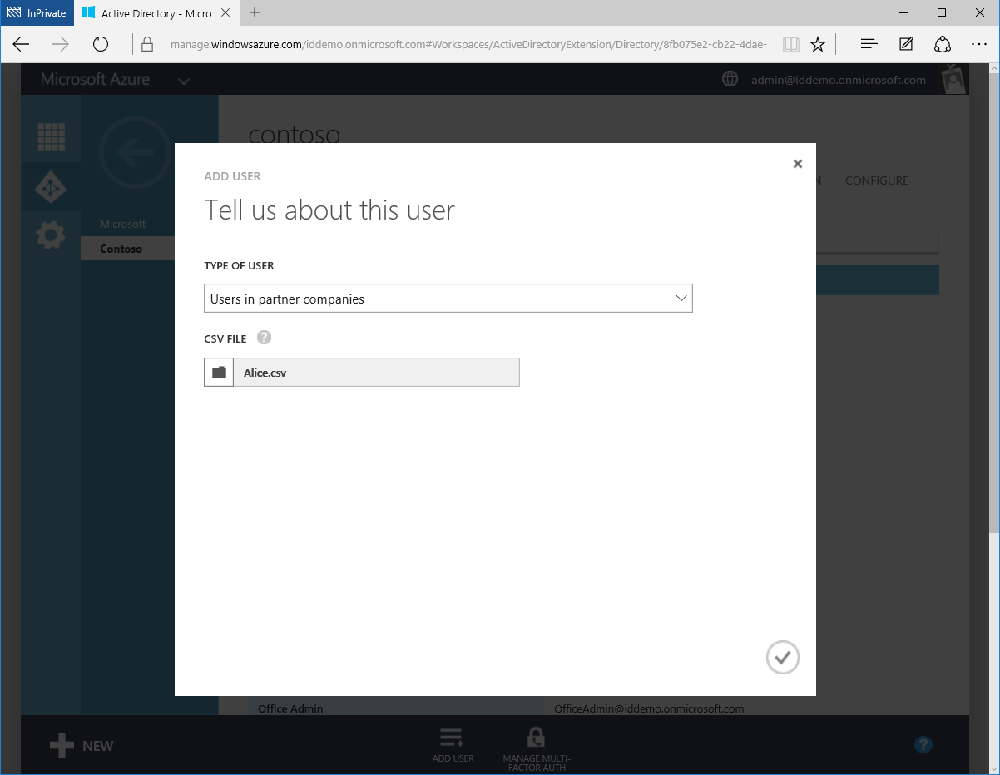

3. Alice is now represented as an External User in the Contoso Azure AD directory.  
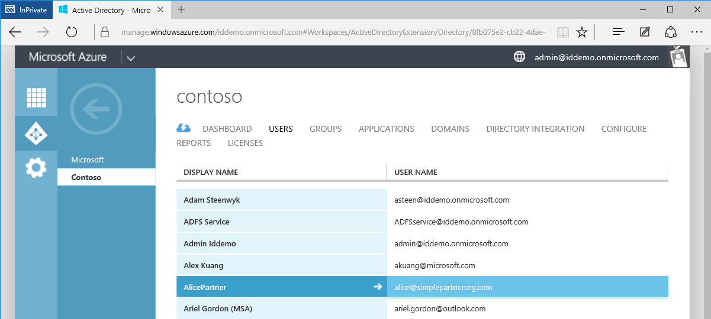

4. Alice receives the following email.  
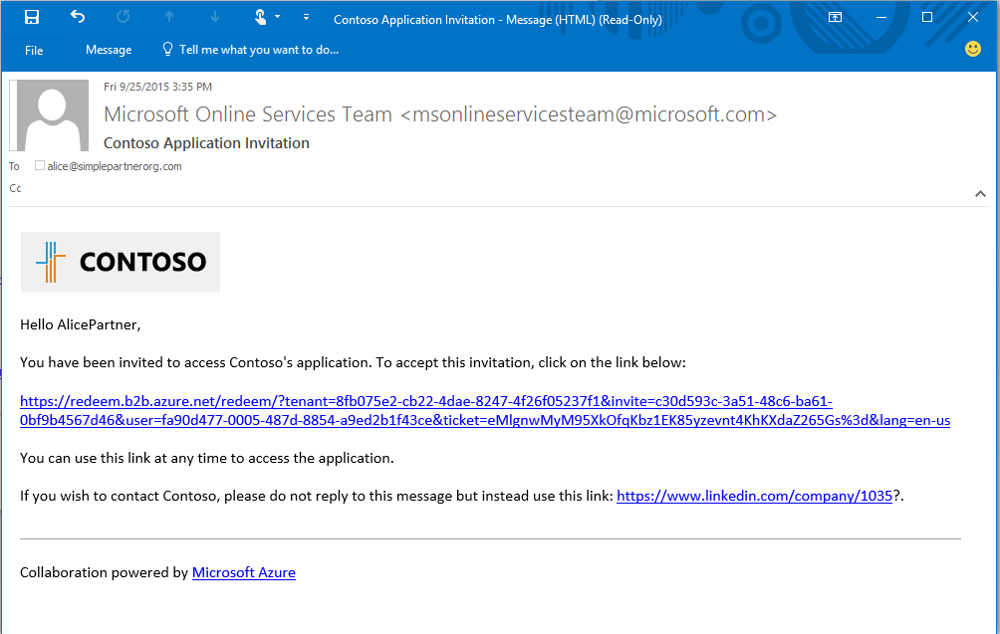

5. Alice clicks the link, and se is prompted to accept the invitation and to sign in using her work credentials. If Alice is not in the Azure AD directory, Alice is prompted to sign up.  
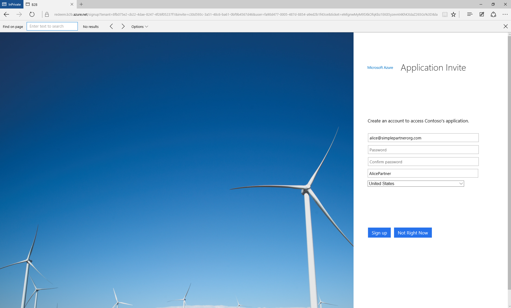

6. Alice is redirected to the App Access Panel, empty until she is granted access to apps.  
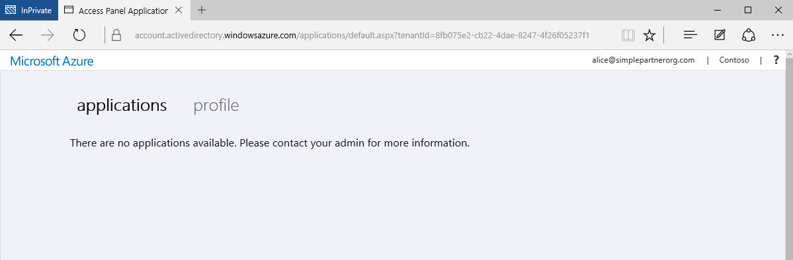

This procedure enables the simplest form of B2B collaboration. As a user in the Contoso Azure AD directory, Alice can be granted access to applications and groups through the Azure portal. Now let's add Bob, who needs access to the applications Moodle and Salesforce.

## Adding Bob to the Contoso directory and granting access to apps
1. Use Windows PowerShell with the Azure AD Module installed to find the application IDs of Moodle and Salesforce. The IDs can be retrieved using the cmdlet: `Get-MsolServicePrincipal | fl DisplayName, AppPrincipalId` This brings up a list of all available applications in Contoso and their AppPrincialIds.  
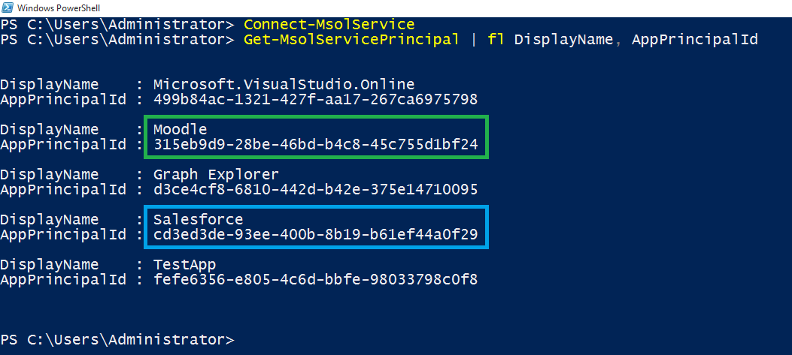

2. Create a .csv file containing Bob's Email and DisplayName, **InviteAppID**, **InviteAppResources**, and InviteContactUsUrl. Populate **InviteAppResources** with the AppPrincipalIds of Moodle and Salesforce found from PowerShell, separated by a space. Populate **InviteAppId** with the same AppPrincipalId of Moodle to brand the email and sign in pages with a Moodle logo.  
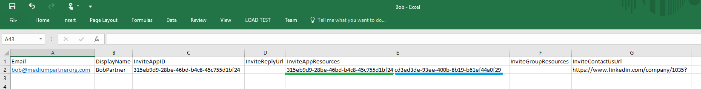

3. Upload the .csv file through the Azure Portal just as it was done for Alice. Bob is now an external user in the Contoso Azure AD directory.

4. Bob receives the following email.  
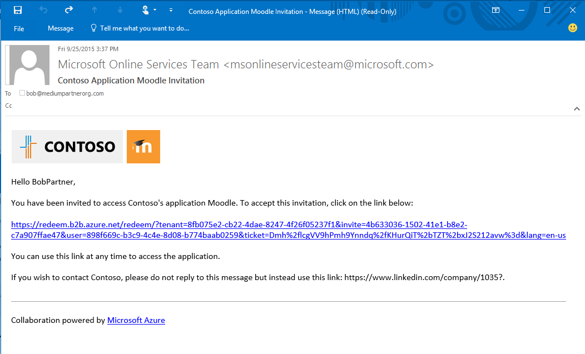

5. Bob clicks the link and is prompted to accept the invitation. After he is signed in, he is directed to the Access Panel and can already use Moodle and Salesforce.  
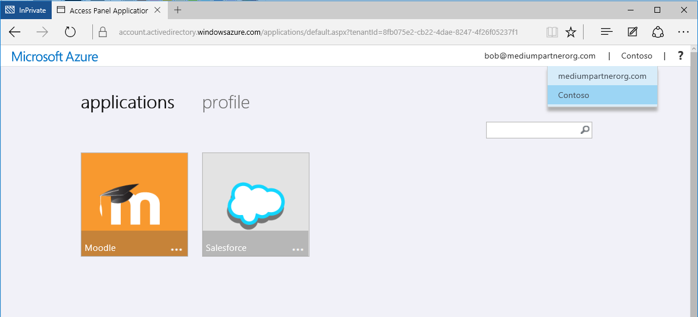

We will add Carol next, who needs access to applications as well as membership to groups in the Contoso directory.

## Adding Carol to the Contoso directory, granting access to apps, and giving group membership

1. Use Windows PowerShell with the Azure AD Module installed to find the application IDs and group IDs within Contoso.
 - Retrieve AppPrincipalId using cmdlet `Get-MsolServicePrincipal | fl DisplayName, AppPrincipalId`, same as for Bob
 - Retrieve ObjectId for groups using cmdlet `Get-MsolGroup | fl DisplayName, ObjectId`. This brings up a list of all groups in Contoso and their ObjectIds. Group IDs can also be retrieved as the Object ID in the Properties tab of the group in the Azure portal.  
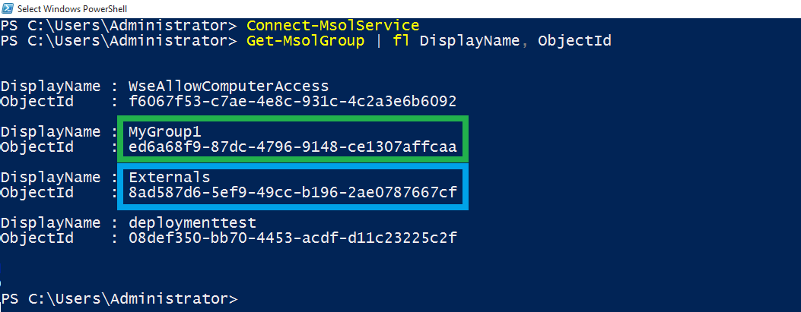

2. Create .csv file, populating Carol's Email, DisplayName, InviteAppID, InviteAppResources, **InviteGroupResources**, and InviteContactUsUrl. **InviteGroupResources** is populated by the ObjectIds of the groups MyGroup1 and Externals, separated by a space.  

3. Upload the .csv file through the Azure portal.

4. Carol is a user in the Contoso directory and is also a member of the groups MyGroup1 and Externals, as seen in the Azure portal.  
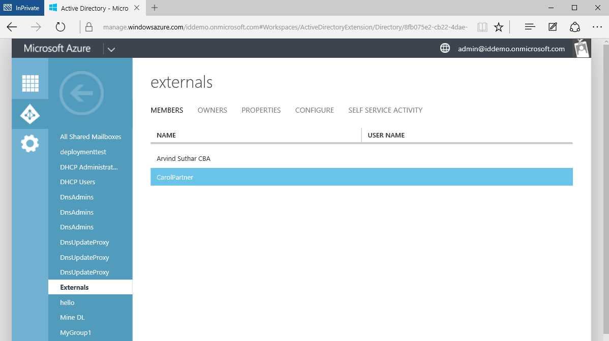

5. Carol receives an email containing a link to accept the invitation. After she signs in, she is redirected to the App Access Panel to have access to Moodle and Salesforce.  

That's all there is to adding users from partner businesses in Azure AD B2B collaboration. This walkthrough showed how to add users Alice, Bob, and Carol to the Contoso directory using three separate .csv files. This process can be made easier by condensing the separate .csv files into a single file.  
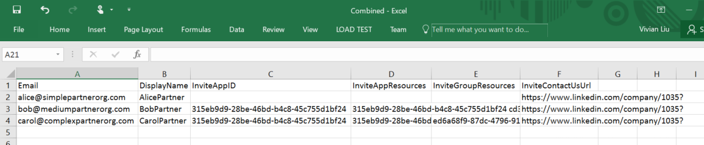

## Related articles
Browse our other articles on Azure AD B2B collaboration:

- [What is Azure AD B2B collaboration?](active-directory-b2b-what-is-azure-ad-b2b.md)
- [How it works](active-directory-b2b-how-it-works.md)
- [CSV file format reference](active-directory-b2b-references-csv-file-format.md)
- [External user token format](active-directory-b2b-references-external-user-token-format.md)
- [External user object attribute changes](active-directory-b2b-references-external-user-object-attribute-changes.md)
- [Current preview limitations](active-directory-b2b-current-preview-limitations.md)
- [Article Index for Application Management in Azure Active Directory](active-directory-apps-index.md)
