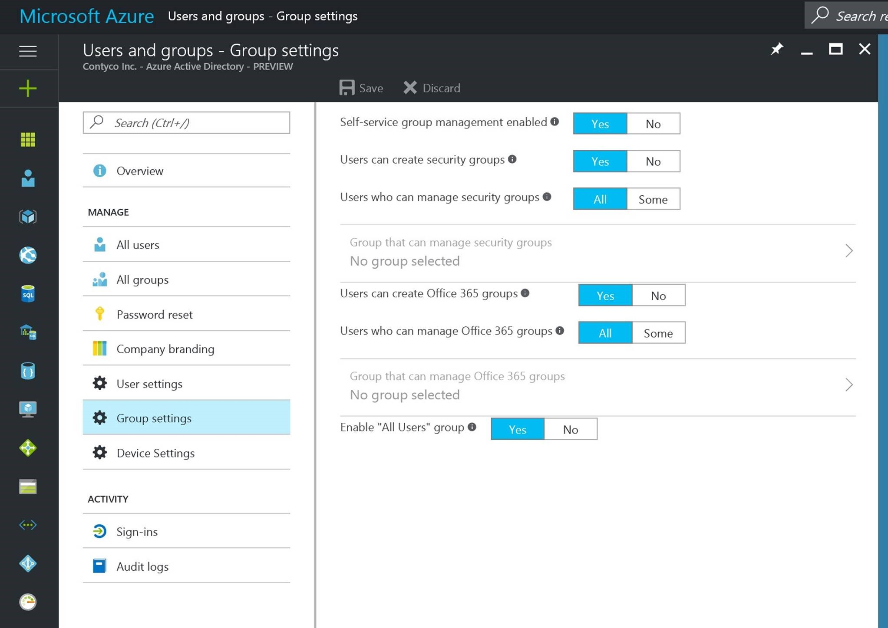
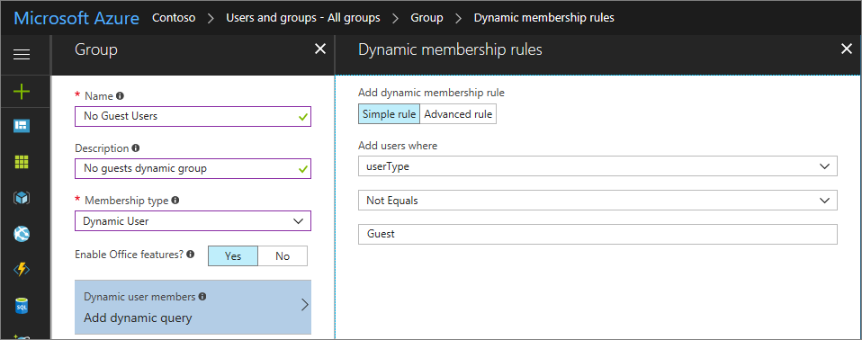

# Dynamic groups and Azure Active Directory B2B collaboration

## What are dynamic groups?
Dynamic configuration of security group membership for Azure Active Directory (Azure AD) is available in [the Azure portal](https://portal.azure.com). Administrators can set rules to populate groups that are created in Azure Active Directory based on user attributes (such as userType, department, or country). Members can be automatically added to or removed from a security group based on their attributes. These groups can provide access to applications or cloud resources (SharePoint sites, documents) and to assign licenses to members. Read more about dynamic groups in [Dedicated groups in Azure Active Directory](active-directory-accessmanagement-dedicated-groups.md).

The appropriate [Azure AD Premium P1 or P2 licensing](https://azure.microsoft.com/pricing/details/active-directory/) is required to create and use dynamic groups. Learn more in the article [Create attribute-based rules for dynamic group membership in Azure Active Directory](active-directory-groups-dynamic-membership-azure-portal.md).

## What are the built-in dynamic groups?
The **All users** dynamic group enables tenant admins to create a group containing all users in the tenant with a single click. By default, the **All users** group includes all users in the directory, including Members and Guests.
Within the new Azure Active Directory admin portal, you can choose to enable the **All users** group in the Group Settings view.

## Hardening the All users dynamic group
By default, the **All users** group contains your B2B collaboration (guest) users as well. You can further secure your **All users** group by using a rule to remove guest users. The following illustration shows the **All users** group modified to exclude guests.

You might also find it useful to create a new dynamic group that contains only guest users, so that you can apply policies (such as Azure AD Conditional Access policies) to them.
What such a group might look like:

## Next steps

Browse our other articles on Azure AD B2B collaboration:

* [What is Azure AD B2B collaboration?](active-directory-b2b-what-is-azure-ad-b2b.md)
* [B2B collaboration user properties](active-directory-b2b-user-properties.md)
* [Adding a B2B collaboration user to a role](active-directory-b2b-add-guest-to-role.md)
* [Delegate B2B collaboration invitations](active-directory-b2b-delegate-invitations.md)
* [B2B collaboration code and PowerShell samples](active-directory-b2b-code-samples.md)
* [Configure SaaS apps for B2B collaboration](active-directory-b2b-configure-saas-apps.md)
* [B2B collaboration user tokens](active-directory-b2b-user-token.md)
* [B2B collaboration user claims mapping](active-directory-b2b-claims-mapping.md)
* [Office 365 external sharing](active-directory-b2b-o365-external-user.md)
* [B2B collaboration current limitations](active-directory-b2b-current-limitations.md)
