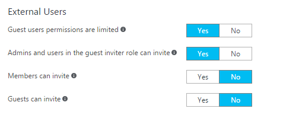
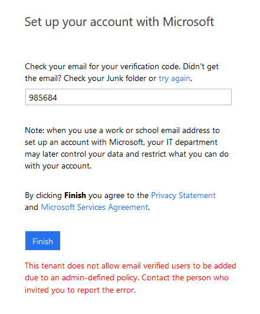

---
title: Troubleshooting Azure Active Directory B2B collaboration | Microsoft Docs
description: Remedies for common problems with Azure Active Directory B2B collaboration
services: active-directory
documentationcenter: ''
author: sasubram
manager: femila
editor: ''
tags: ''

ms.assetid:
ms.service: active-directory
ms.devlang: NA
ms.topic: article
ms.tgt_pltfrm: NA
ms.workload: identity
ms.date: 05/25/2017
ms.author: sasubram

---

# Troubleshooting Azure Active Directory B2B collaboration

Here are some remedies for common problems with Azure Active Directory (Azure AD) B2B collaboration.

## I’ve added an external user but do not see them in my Global Address Book or in the people picker

In cases where external users are not populated in the list, the object might take a few minutes to replicate.

## A B2B guest user is not showing up in SharePoint Online/OneDrive people picker 
 
The ability to search for existing guest users in the SharePoint Online (SPO) people picker is OFF by default to match legacy behavior.

You can enable this feature by using the setting 'ShowPeoplePickerSuggestionsForGuestUsers' at the tenant and site collection level. You can set the feature using the Set-SPOTenant and Set-SPOSite cmdlets, which allow members to search all existing guest users in the directory. Changes in the tenant scope do not affect already provisioned SPO sites.

## Invitations have been disabled for directory

If you are notified that you do not have permissions to invite users, verify that your user account is authorized to invite external users under User Settings:

If you have recently modified these settings or assigned the Guest Inviter role to a user, there might be a 15-60 minute delay before the changes take effect.

## The user that I invited is receiving an error during redemption

Common errors include:

### Invitee’s Admin has disallowed EmailVerified Users from being created in their tenant

When inviting users whose organization is using Azure Active Directory, but where the specific user’s account does not exist (for example, the user does not exist in Azure AD contoso.com). The administrator of contoso.com may have a policy in place preventing users from being created. The user must check with their admin to determine if external users are allowed. The external user’s admin may need to allow Email Verified users in their domain (see this [article](/powershell/module/msonline/set-msolcompanysettings?view=azureadps-1.0) on allowing Email Verified Users).

### External user does not exist already in a federated domain

If you are using federation authentication and the user does not already exist in Azure Active Directory, the user cannot be invited.

To resolve this issue, the external user’s admin must synchronize the user’s account to Azure Active Directory.

## How does ‘\#’, which is not normally a valid character, sync with Azure AD?

“\#” is a reserved character in UPNs for Azure AD B2B collaboration or external users, because the invited account user@contoso.com becomes user_contoso.com#EXT@fabrikam.onmicrosoft.com. Therefore, \# in UPNs coming from on-premises aren't allowed to sign in to the Azure portal. 

## I receive an error when adding external users to a synchronized group

External users can be added only to “assigned” or “Security” groups and not to groups that are mastered on-premises.

## My external user did not receive an email to redeem

The invitee should check with their ISP or spam filter to ensure that the following address is allowed: Invites@microsoft.com

## I notice that the custom message does not get included with invitation messages at times

To comply with privacy laws, our APIs do not include custom messages in the email invitation when:

- The inviter doesn’t have an email address in the inviting tenant
- When an appservice principal sends the invitation

If this scenario is important to you, you can suppress our API invitation email, and send it through the email mechanism of your choice. Consult your organization’s legal counsel to make sure any email you send this way also complies with privacy laws.

## Next steps

Browse our other articles on Azure AD B2B collaboration:

* [What is Azure AD B2B collaboration?](active-directory-b2b-what-is-azure-ad-b2b.md)
* [How do Azure Active Directory admins add B2B collaboration users?](active-directory-b2b-admin-add-users.md)
* [How do information workers add B2B collaboration users?](active-directory-b2b-iw-add-users.md)
* [The elements of the B2B collaboration invitation email](active-directory-b2b-invitation-email.md)
* [B2B collaboration invitation redemption](active-directory-b2b-redemption-experience.md)
* [Azure AD B2B collaboration licensing](active-directory-b2b-licensing.md)
* [Azure Active Directory B2B collaboration frequently asked questions (FAQ)](active-directory-b2b-faq.md)
* [Azure Active Directory B2B collaboration API and customization](active-directory-b2b-api.md)
* [Multi-factor authentication for B2B collaboration users](active-directory-b2b-mfa-instructions.md)
* [Add B2B collaboration users without an invitation](active-directory-b2b-add-user-without-invite.md)
* [Article Index for Application Management in Azure Active Directory](active-directory-apps-index.md)
