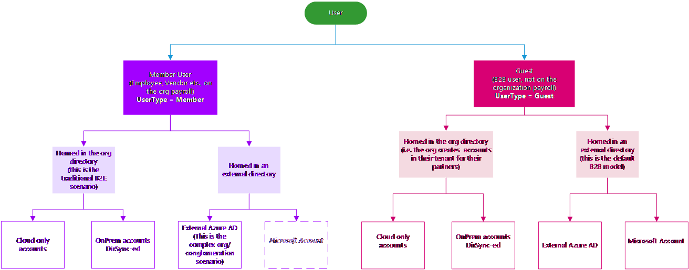
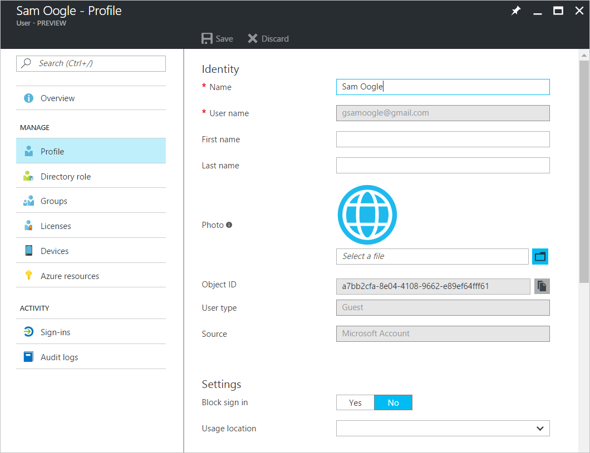
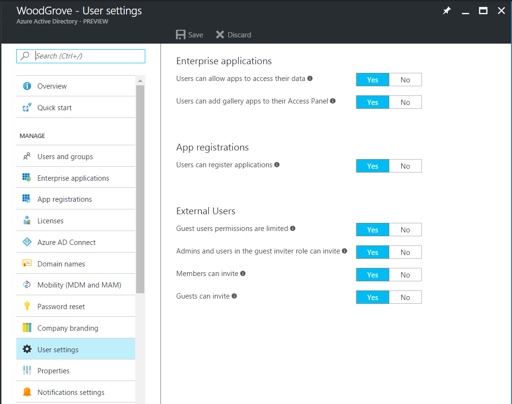

# Properties of an Azure Active Directory B2B collaboration user

An Azure Active Directory (Azure AD) business-to-business (B2B) collaboration user is a user with UserType = Guest. This guest user typically is from a partner organization and has limited privileges in the inviting directory, by default.

Depending on the inviting organization's needs, an Azure AD B2B collaboration user can be in one of the following account states:

- State 1: Homed in an external instance of Azure AD and represented as a guest user in the host organization. In this case, the B2B user signs in by using an Azure AD account that belongs to his home tenancy. If the external organization of the user doesn't use Azure AD at the time of invitation, the guest user in Azure AD is created when the user redeems his invitation and after Azure AD verifies his email address. This is also called a just-in-time (JIT) tenancy or a viral tenancy.

- State 2: Homed in a Microsoft account and represented as a guest user in the host organization. In this case, the guest user signs in with a Microsoft account. The invited user's social identity (google.com or similar), which is not a Microsoft account, is created as a Microsoft account during offer redemption.

- State 3: Homed in the host organization's on-premises Active Directory and synced with the host organization's Azure AD. During this release, you must use PowerShell to manually change the UserType of such users in the cloud.

- State 4: Homed in host organization's Azure AD with UserType = Guest and credentials that the host organization manages.

  

Now, let's see what an Azure AD B2B collaboration user in State 1 looks like in Azure AD.

### Before invitation redemption

### After invitation redemption

## Key properties of the Azure AD B2B collaboration user
### UserType
This property indicates the relationship of the user to the host tenancy. This can have two values:
- Member: This value indicates an employee of the host organization and a user in the organization's payroll. For example, this user expects to have access to internal-only sites. This user would not be considered an external collaborator.

- Guest: This value indicates a user who isn't considered internal to the company. This user could be an external collaborator, partner, customer, or similar user who isn't expected to get a CEO's internal memo, for example, or get company benefits.

  > [!NOTE]
  > The UserType has no relation to how the user signs in, the directory role of the user, and so on. This property simply indicates the user's relationship to the host organization and allows the organization to enforce policies that depend on this property.

### Source
This property indicates how the user signs in.

- Invited User: This user has been invited but has not yet redeemed an invitation.

- External Active Directory: This user is homed in an external organization and authenticates by using an Azure AD account that belongs to the other organization. This type of sign-in corresponds to State 1.

- Microsoft account: This user is homed in a Microsoft account and authenticates by using a Microsoft account. This type of sign-in corresponds to State 2.

- Windows Server Active Directory: This user is signed in from on-premises Active Directory that belongs to this organization. This type of sign-in corresponds to State 3.

- Azure Active Directory: This user authenticates by using an Azure AD account that belongs to this organization. This type of sign-in corresponds to State 4.
  > [!NOTE]
  > Source and UserType are independent properties. A value of Source does not imply a particular value for UserType.

## Can Azure AD B2B users be added as members instead of guests?
Typically, an Azure AD B2B user and guest user are synonymous. Therefore, an Azure AD B2B collaboration user is added as a user with UserType = Guest by default. However, in some cases, the partner organization is a member of a larger organization to which the host organization also belongs. If so, the host organization might want to treat users in the partner organization as members instead of guests. In this case, use the Azure AD B2B Invitation Manager APIs to add or invite a user from the partner organization to the host organization as a member.

## Filter for guest users in the directory

## Convert UserType
Currently, it is possible for users to convert UserType from Member to Guest and vice-versa by using PowerShell. However, the UserType property is supposed to represent the user's relationship to the organization. Therefore, the value of this property should change only if the relationship of the user to the organization changes. If the relationship of the user changes, should issues, like whether the user principal name (UPN) should change, be addressed? Should the user continue to have access to the same resources? Should a mailbox be assigned? Therefore, we do not recommend changing the UserType by using PowerShell as an atomic activity. In addition, in case this property becomes immutable by using PowerShell, we do not recommend taking a dependency on this value.

## Remove guest user limitations
There may be cases where you want to give your guest users higher privileges. In this situation, you can add a guest user to any role and even remove the default guest user restrictions in the directory to give a user the same privileges as members.

It is possible to turn off the default guest user limitations so that a guest user in the company directory is given the same directory permissions as a regular user, who is a member.

## Next steps

Browse our other articles on Azure AD B2B collaboration:

* [What is Azure AD B2B collaboration?](active-directory-b2b-what-is-azure-ad-b2b.md)
* [Adding a B2B collaboration user to a role](active-directory-b2b-add-guest-to-role.md)
* [Delegate B2B collaboration invitations](active-directory-b2b-delegate-invitations.md)
* [B2B collaboration user auditing and reporting](active-directory-b2b-auditing-and-reporting.md)
* [Dynamic groups and B2B collaboration](active-directory-b2b-dynamic-groups.md)
* [B2B collaboration code and PowerShell samples](active-directory-b2b-code-samples.md)
* [Configure SaaS apps for B2B collaboration](active-directory-b2b-configure-saas-apps.md)
* [B2B collaboration user tokens](active-directory-b2b-user-token.md)
* [B2B collaboration user claims mapping](active-directory-b2b-claims-mapping.md)
* [Office 365 external sharing](active-directory-b2b-o365-external-user.md)
* [B2B collaboration current limitations](active-directory-b2b-current-limitations.md)
