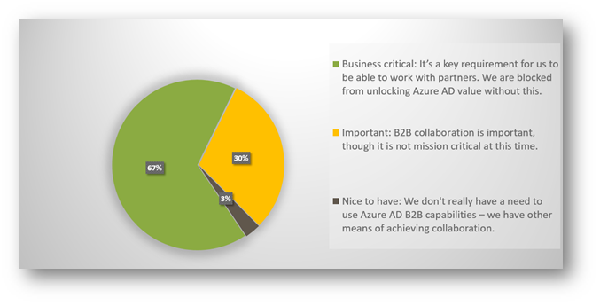
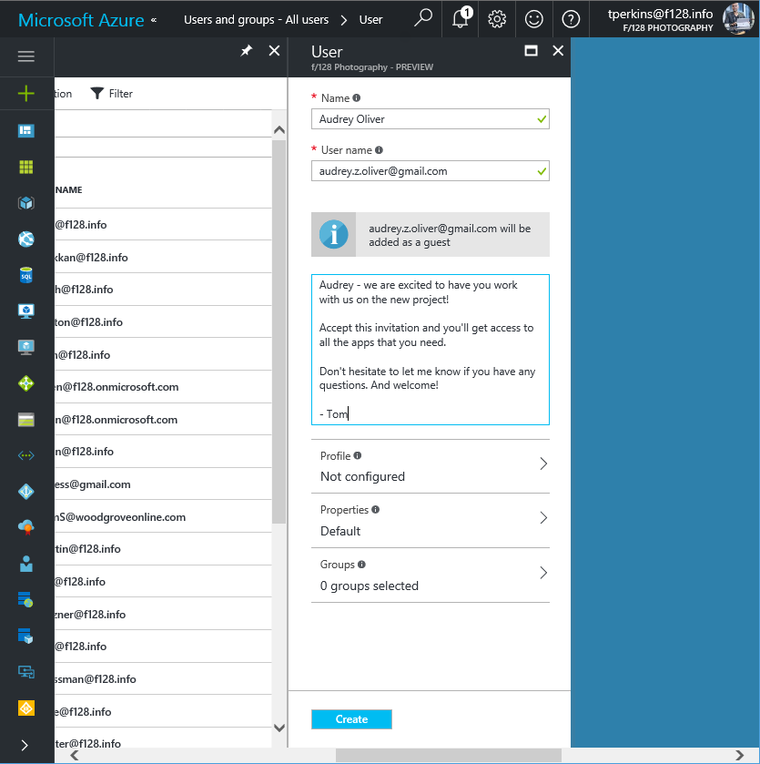
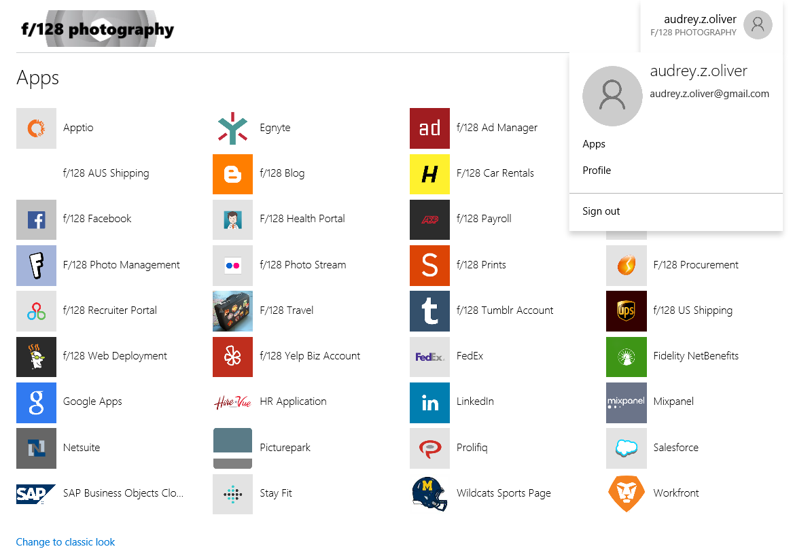
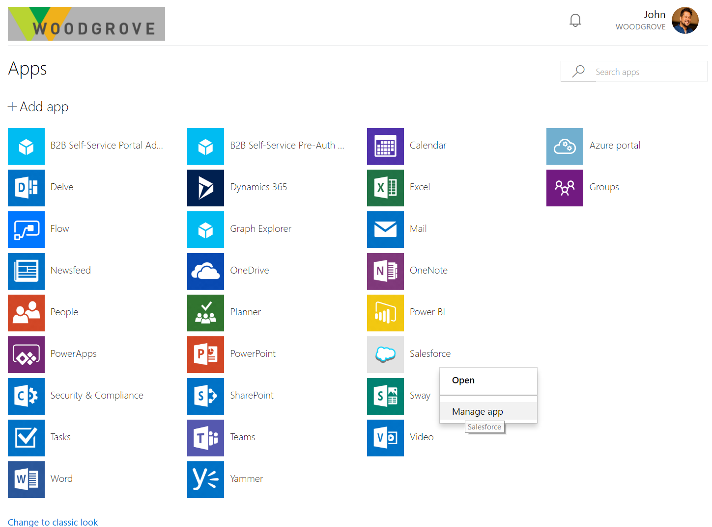
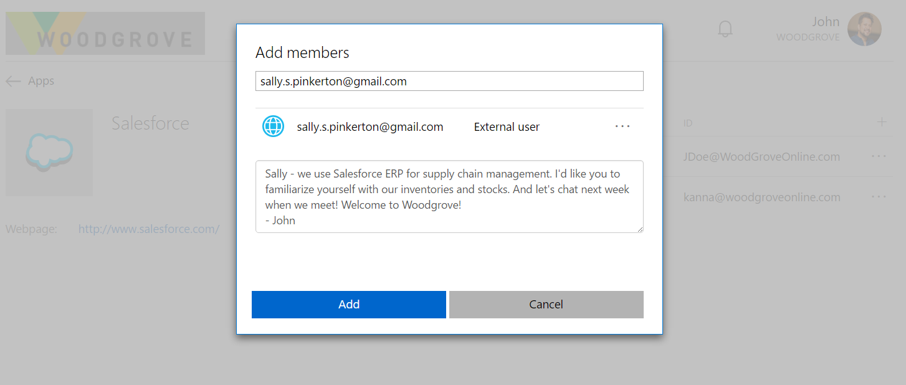
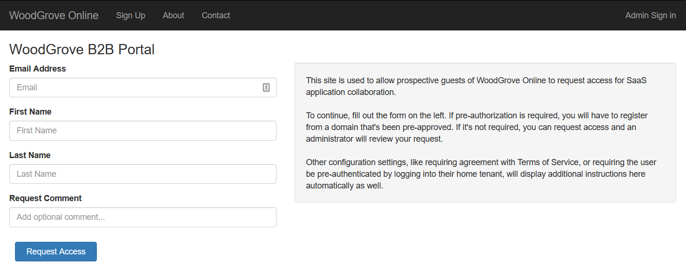

# What is Azure AD B2B collaboration?

<iframe width="560" height="315" src="https://www.youtube.com/embed/AhwrweCBdsc" frameborder="0" allowfullscreen></iframe>

Azure AD business-to-business (B2B) collaboration capabilities enable any organization using Azure AD to work safely and securely with users from any other organization, small or large. Those organizations can be with Azure AD or without, or even with an IT organization or without. 

Organizations using Azure AD can provide access to documents, resources, and applications to their partners, while maintaining complete control over their own corporate data. Developers can use the Azure AD business-to-business APIs to write applications that bring two organizations together in more securely. Also, it's pretty easy for end users to navigate.

97% of our customers have told us Azure AD B2B collaboration is very important to them.

As of early April 2017, we had about 3 million users already using Azure AD B2B collaboration capabilities. And more than 23% of Azure AD organizations that have more than 10 users are already benefiting from these capabilities.

## The key benefits of Azure AD B2B collaboration to your organization

### Work with any user from any partner

* Partners use their own credentials

* No requirement for partners to use Azure AD

* No external directories or complex set-up required

### Simple and secure collaboration

* Provide access to any corporate app or data, while applying sophisticated, Azure AD-powered authorization policies

* Easy for users

* Enterprise-grade security for apps and data

### No management overhead

* No external account or password management

* No sync or manual account lifecycle management

* No external administrative overhead

## You can easily add B2B collaboration users to your organization

Admins can add B2B collaboration (guest) users in the [Azure portal](https://portal.azure.com).

### Enable your collaborators to bring their own identity

B2B collaborators can sign in with an identity of their choice. If the user doesn’t have a Microsoft account or an Azure AD account – one is created for them seamlessly at the time for offer redemption.

### Delegate to application and group owners 
Application and group owners can add B2B users directly to any application that you care about, whether it is a Microsoft application or not. Admins can delegate permission to add B2B users to non-admins. Non-admins can use the [Azure AD Application Access Panel](https://myapps.microsoft.com) to add B2B collaboration users to applications or groups.

### Authorization policies protect your corporate content

Conditional access policies, such as multi-factor authentication, can be enforced:
- At the tenant level
- At the application level
- For specific users to protect corporate apps and data

### Use our APIs and sample code to easily build applications to onboard
Bring your external partners on board in ways customized to your organization’s needs.

Using the [B2B collaboration invitation APIs](https://developer.microsoft.com/graph/docs/api-reference/v1.0/resources/invitation), you can customize your onboarding experiences, including creating self-service sign-up portals. We provide sample code for a self-service portal [on Github](https://github.com/Azure/active-directory-dotnet-graphapi-b2bportal-web).

With Azure AD B2B collaboration, you can get the full power of Azure AD to protect your partner relationships in a way that end users find easy and intuitive. So go ahead, join the thousands of organizations that are already using Azure AD B2B for their external collaboration!

## Next steps

* Administrator experiences are found in the [Azure portal](https://portal.azure.com).

* Information worker experiences are available in the [Access Panel](https://myapps.microsoft.com).

* And, as always, connect with the product team for any feedback, discussions, and suggestions through our [Microsoft Tech Community](https://techcommunity.microsoft.com/t5/Azure-Active-Directory-B2B/bd-p/AzureAD_B2b).

Browse our other articles on Azure AD B2B collaboration:

* [How do Azure Active Directory admins add B2B collaboration users?](active-directory-b2b-admin-add-users.md)
* [How do information workers add B2B collaboration users?](active-directory-b2b-iw-add-users.md)
* [The elements of the B2B collaboration invitation email](active-directory-b2b-invitation-email.md)
* [B2B collaboration invitation redemption](active-directory-b2b-redemption-experience.md)
* [Azure AD B2B collaboration licensing](active-directory-b2b-licensing.md)
* [Troubleshooting Azure Active Directory B2B collaboration](active-directory-b2b-troubleshooting.md)
* [Azure Active Directory B2B collaboration frequently asked questions (FAQ)](active-directory-b2b-faq.md)
* [Azure Active Directory B2B collaboration API and customization](active-directory-b2b-api.md)
* [Multi-factor authentication for B2B collaboration users](active-directory-b2b-mfa-instructions.md)
* [Add B2B collaboration users without an invitation](active-directory-b2b-add-user-without-invite.md)
* [B2B collaboration user auditing and reporting](active-directory-b2b-auditing-and-reporting.md)
* [Article Index for Application Management in Azure Active Directory](active-directory-apps-index.md)
