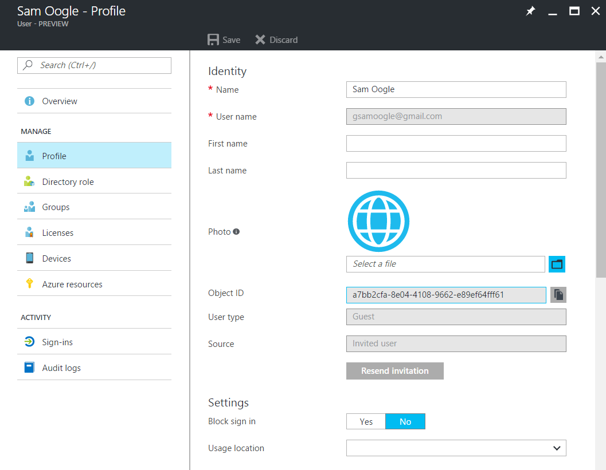
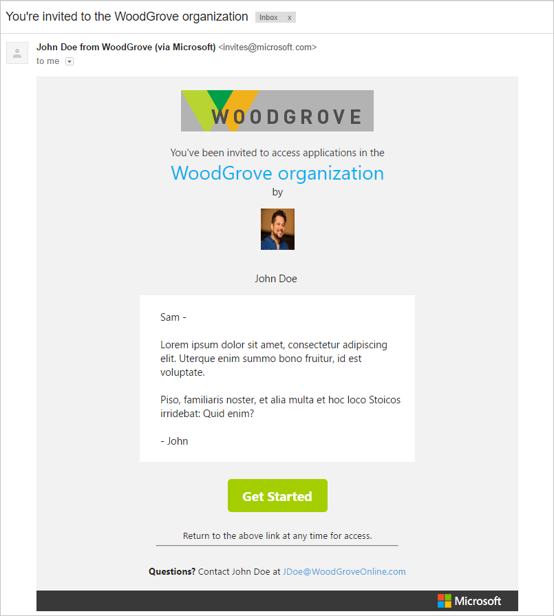
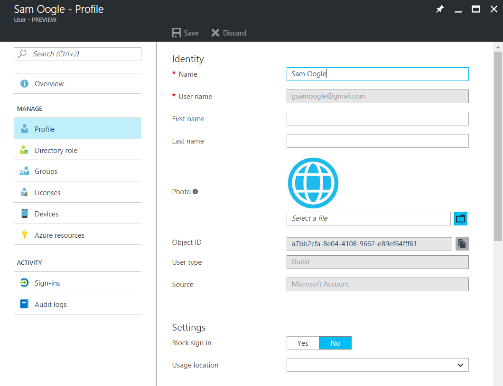
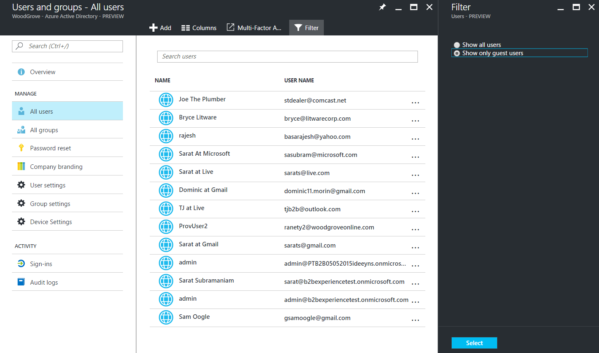

# About the Azure AD B2B collaboration preview
This article discusses the goals, features, and benefits of the refresh of the Azure Active Directory (Azure AD) B2B collaboration public preview.

Whether you're an IT pro or an information worker, you can take advantage of many Azure AD B2B collaboration capabilities. You can work closely with partners in other organizations everywhere, regardless of their size, industry, or compliance and governance requirements. And you can provide them access to documents, resources, and applications while you maintain complete control over your internal data.

If you're a developer, you can use the Azure AD B2B APIs to write applications that bring organizations together securely. For information-worker users, the process and navigation are straightforward.

## How B2B collaboration works

In the current preview release, IT pros and information workers establish relationships with partner organizations by adding their users one or a few at a time through the Azure portal or the invitation manager API.

Admins can use the new portal experiences in the Azure portal (https://portal.azure.com) and PowerShell to establish relationships.

Information workers can use the access-panel experiences in http://myapps.microsoft.com.

Developers can create applications by using the Azure AD B2B invitation manager API to add B2B collaboration users and customize the invitation and onboarding workflows.

B2B collaboration users are typically added through an invitation and redemption process. Here's how it works:

1. John Doe from WoodGrove wants to add Sam Oogle as a user with his Gmail address (gsamoogle@gmail.com).

2. John Doe goes to the WoodGrove portal (portal.azure.com) or access panel (myapps.microsoft.com), signs in, and then adds user Sam Oogle to the WoodGrove directory, or group or application.

3. John Doe specifies a custom invitation email to send to Sam Oogle.

4. When John Doe sends the invitation, user Sam Oogle is created in Azure AD for WoodGrove, as shown here:

  

5. After the user is created, Azure AD sends an invitation email to Sam Oogle:

  

6. In the invitation, Sam Oogle selects **Get Started**.  
The Azure portal opens.

7. Sam Oogle signs in to the Azure portal.

8. Azure AD updates the Sam Oogle user object in Azure AD with information from his token, as shown here:

  

9. Now that user Sam Oogle has redeemed the invitation, he can access WoodGrove resources. And like any other user in Azure AD, user Sam Oogle can be managed by the administrator. The user list is shown here:

  

## Public preview features
Based on user feedback, the B2B collaboration public preview refresh provides key features that include:

* For administrators: get user interface enhancements in the [Azure portal](https://portal.azure.com). For example, administrators can invite B2B users to the directory, or to any group or application.  

* For information workers: get B2B collaboration self-service invitation capabilities in the [access panel](https://myapps.microsoft.com). Information workers can invite B2B collaboration users to any self-service group or application that they manage.

* Allow invited users to have any email address. Whether it's an Office 365 or on-premises Microsoft Exchange address, an outlook.com address, or any social address (Gmail, Yahoo!, and so on), users can access the invited organization with the creation of an Azure AD or Microsoft account.

* Create professional, tenant-branded invitation email.

* Customize user orientation by using the invitation APIs.

* Set up multi-factor authentication for B2B collaboration users in the inviting organization.

* Delegate invitations to non-administrators.

* Provide PowerShell support for B2B collaboration.

* Provide auditing and reporting capabilities.

## Help us shape your features
 
We're constantly listening to your feedback on ways to improve B2B collaboration. We invite you join the discussion, share your user scenarios, best practices, and what you like about Azure AD B2B collaboration at the [Microsoft Tech Community](https://techcommunity.microsoft.com/t5/Azure-Active-Directory-B2B/bd-p/AzureAD_B2b)
 
We also invite you to submit your ideas and vote for future features at the [B2B Collaboration Ideas](https://techcommunity.microsoft.com/t5/Azure-Active-Directory-B2B-Ideas/idb-p/AzureAD_B2B_Ideas) site.

## Next steps

Browse our other articles on Azure AD B2B collaboration:

* [How do Azure Active Directory admins add B2B collaboration users?](active-directory-b2b-admin-add-users.md)
* [How do information workers add B2B collaboration users?](active-directory-b2b-iw-add-users.md)
* [The elements of the B2B collaboration invitation email](active-directory-b2b-invitation-email.md)
* [B2B collaboration invitation redemption](active-directory-b2b-redemption-experience.md)
* [Azure AD B2B collaboration licensing](active-directory-b2b-licensing.md)
* [Troubleshooting Azure Active Directory B2B collaboration](active-directory-b2b-troubleshooting.md)
* [Azure Active Directory B2B collaboration frequently asked questions (FAQ)](active-directory-b2b-faq.md)
* [Azure Active Directory B2B collaboration API and customization](active-directory-b2b-api.md)
* [Multi-factor authentication for B2B collaboration users](active-directory-b2b-mfa-instructions.md)
* [Add B2B collaboration users without an invitation](active-directory-b2b-add-user-without-invite.md)
* [B2B collaboration user auditing and reporting](active-directory-b2b-auditing-and-reporting.md)
* [Article Index for Application Management in Azure Active Directory](active-directory-apps-index.md)
