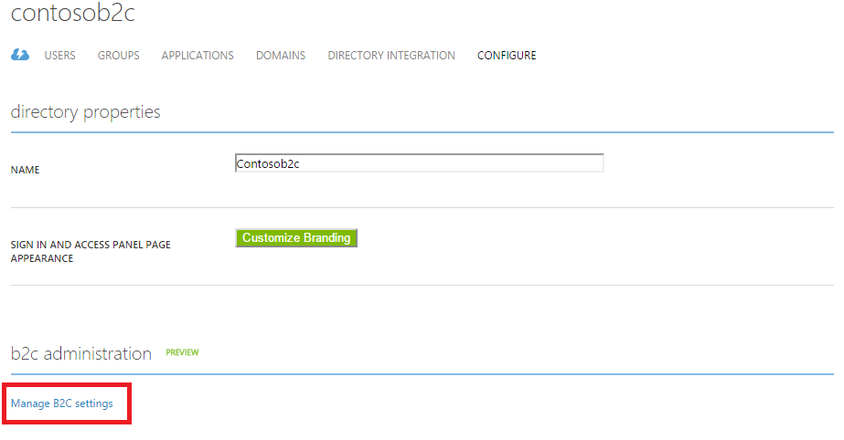

<properties
	pageTitle="Azure AD B2C preview | Microsoft Azure"
	description="A topic on how to create an Azure AD B2C directory"
	services="active-directory"
	documentationCenter=""
	authors="swkrish"
	manager="msmbaldwin"
	editor="curtand"/>

<tags
	ms.service="active-directory"
	ms.workload="identity"
	ms.tgt_pltfrm="na"
	ms.devlang="na"
	ms.topic="article"
	ms.date="08/03/2015"
	ms.author="swkrish"/>

# Azure AD B2C preview: How to create an Azure AD B2C directory

To start using Azure AD B2C, follow the 3 steps outlined below.

## Step 1: Sign up for an Azure subscription

If you already have an Azure subscription move on to the next step. If not, sign up for [an Azure subscription](sign-up-organization) and get access to Azure AD B2C.

> [AZURE.NOTE]
Azure AD B2C preview is currently free for use but limited (up to 50,000 users per directory). An Azure subscription is needed to access the [Azure Management Portal](http://manage.windowsazure.com/).

## Step 2: Create an Azure AD B2C directory

Use the following steps to create a new Azure AD B2C directory. Currently B2C features can't be turned on in your existing directories, if you have any.

1. Sign into the [Azure Management Portal](https://manage.windowsazure.com/) as the Subscription Administrator. This is the same work or school account or the same Microsoft Account that you used to sign up for Azure.
2. Click **New** > **App Services** > **Active Directory** > **Directory** > **Custom Create**.

    

3. Choose the **name**, **domain name** and **country or region** for your directory.
4. Check the option that says "**This is a B2C directory**".
5. Click the check mark to complete the action.

    

6. Your directory is now created and will appear in the Active Directory extension. You are also made a Global Administrator of the directory. You can add other Global Administrators as required.

    > [AZURE.IMPORTANT]
    It can take up to a minute for your Azure AD B2C directory to be created. Note that there is a known issue that some of you may experience: Create Azure AD B2C directory operation won't complete as expected. You will see an error message that says, "Could not complete the creation of the B2C directory 'contosob2c'. Please visit this [link](http://go.microsoft.com/fwlink/?LinkID=624192&clcid=0x409) for more guidance.". Delete the directory (even if created) and try again.

## Step 3: Navigate to the B2C features blade on the Azure Portal

1. Navigate to the Active Directory extension on the navigation bar on the left hand side.
2. Find your directory under the **Directory** tab and click on it.
3. Click on the **Configure** tab.
4. Click on the **Manage B2C settings** link in the **B2C administration** section.

    

4. The [Azure Portal](https://portal.azure.com/) with the B2C features blade will open in a new browser tab or window.
5. Pin this blade (see top right corner) to your Startboard for easy access.

    

    > [AZURE.NOTE]
    You can manage users & groups, self-service password reset configuration and company branding features of your directory on the [Azure Management Portal](https://manage.windowsazure.com/).
