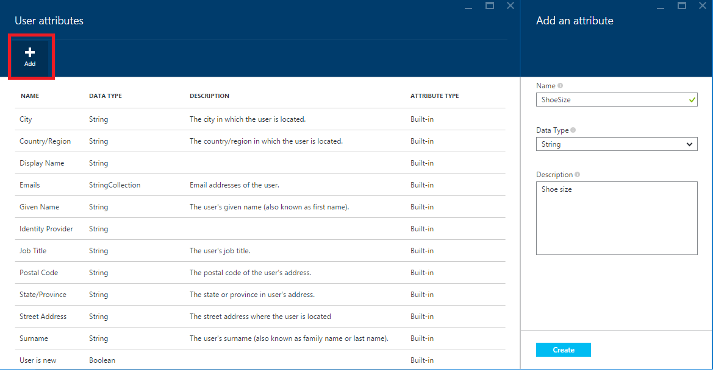

<properties
	pageTitle="Custom attributes - Azure Active Directory B2C"
	description="Custom attributes - Azure Active Directory B2C"
	services="active-directory"
	documentationCenter=""
	authors="swkrish"
	manager="msmbaldwin"
	editor="curtand"/>

<tags
	ms.service="active-directory"
	ms.workload="identity"
	ms.tgt_pltfrm="na"
	ms.devlang="na"
	ms.topic="article"
	ms.date="08/13/2015"
	ms.author="swkrish"/>

#  Azure AD B2C preview: Use custom attributes to collect information about your consumers

Your Azure AD B2C directory comes with a built-in set of properties; for e.g., Given Name, Surname, City, Postal Code, etc. However, every consumer-facing application has unique requirements on what information (attributes) they would like to gather from their consumers. Azure AD B2C allows you to extend your directory (specifically, extend the set of attributes stored on each consumer account). You can create custom attributes on the [Azure Portal](https://portal.azure.com/) and use it in your sign-up policies as shown below. You can also read & write these attributes using Azure AD Graph API as shown [here](active-directory-b2c-devquickstarts-graph-dotnet.md).

> [AZURE.NOTE]
Custom attributes use [Azure AD Graph API Directory Schema Extensions](https://msdn.microsoft.com/library/azure/dn720459.aspx) under the hood.

## How to create a custom attribute

1. Navigate to the B2C features blade on the [Azure Portal](htts://portal.azure.com/). Read [here](active-directory-b2c-app-registration.md#navigate-to-the-b2c-features-blade-on-the-azure-portal) on how to do this.
2. Click **User attributes**.
3. Click **+Add** at the top of the blade.
4. Provide a **Name** for the custom attribute (for e.g., "ShoeSize") and optionally, a **Description**. Click **Create**. You're done!

    > [AZURE.NOTE]
    Only the "String" **Data Type** is available currently. We will be adding more data types (DateTime, Integer, etc.) in the future.

    

The custom attribute is now available in the list of **User attributes** and for use in your sign-up policies.

## How to use a custom attribute in your sign-up policy

1. Navigate to the B2C features blade on the [Azure Portal](htts://portal.azure.com/). Read [here](active-directory-b2c-app-registration.md#navigate-to-the-b2c-features-blade-on-the-azure-portal) on how to do this.
2. Click **Sign-up policies**.
3. Open your sign-up policy (for e.g., "B2C_1_SiUp") by clicking on it. Click **Edit** at the top of the blade.
4. Click **Sign-up attributes** and select the custom attribute (for e.g., "ShoeSize"). Click **OK**.
5. Click **Application claims** and select the custom attribute. Click **OK**. 
6. Click **Save** at the top of the blade. You're done!

You can use the "Run now" feature on the policy to verify the consumer experience. You should now see "ShoeSize" in the list of attributes being collected during consumer sign-up and see it in the token sent back to your application.
