<properties
	pageTitle="Azure AD B2C preview | Microsoft Azure"
	description="A topic on the extensible policy framework of Azure AD B2C and on how to create various policy types"
	services="active-directory"
	documentationCenter=""
	authors="swkrish"
	manager="msmbaldwin"
	editor="curtand"/>

<tags
	ms.service="active-directory"
	ms.workload="identity"
	ms.tgt_pltfrm="na"
	ms.devlang="na"
	ms.topic="article"
	ms.date="08/31/2015"
	ms.author="swkrish"/>

# Azure AD B2C preview: Extensible policy framework

## The Basics

Azure AD B2C's extensible policy framework is the core strength of the service. Policies fully describe consumer identity experiences such as sign up, sign in or profile editing. For instance, a sign-up policy allows you to control the following behaviors:

- Which account types (social accounts such as Facebook & Google and / or local accounts such as email address / username & password) can consumers use to sign up for the application?
- What attributes do you want collected from the consumer during sign up? For e.g., First name, last name, shoe size, etc.
- Whether or not the consumer should complete multi-factor authentication?
- What is the look-and-feel of all sign-up pages?
- What information (as claims in a token) will your application receive when the policy run completes?

You can create multiple policies of different types in your directory and use them in your applications as needed. Policies can be re-used across applications. This allows developers to define & modify consumer identity experiences with minimal or no changes to their code. We will continue to add richer policy types to our service.

Policies are available for use via a simple developer interface. Your application triggers a policy using a standard HTTP authentication request (passing a policy parameter in the request) and receives a customized token as response. For e.g., the only difference between requests invoking a sign-up policy and a sign-in policy is the policy name used in the "p" query string parameter:

```

https://login.microsoftonline.com/contosob2c.onmicrosoft.com/oauth2/v2.0/authorize?
client_id=2d4d11a2-f814-46a7-890a-274a72a7309e      // Your registered Application ID
&redirect_uri=https%3A%2F%2Flocalhost%3A44321%2F    // Your registered Reply URL, url encoded
&response_mode=form_post                            // 'query', 'form_post' or 'fragment'
&response_type=id_token
&scope=openid
&nonce=dummy
&state=12345                                        // Any value provided by your application
&p=b2c_1_siup                                       // Your sign-up policy

```

```

https://login.microsoftonline.com/contosob2c.onmicrosoft.com/oauth2/v2.0/authorize?
client_id=2d4d11a2-f814-46a7-890a-274a72a7309e      // Your registered Application ID
&redirect_uri=https%3A%2F%2Flocalhost%3A44321%2F    // Your registered Reply URL, url encoded
&response_mode=form_post                            // 'query', 'form_post' or 'fragment'
&response_type=id_token
&scope=openid
&nonce=dummy
&state=12345                                        // Any value provided by your application
&p=b2c_1_siin                                       // Your sign-in policy

```

## How to create a sign-up policy

To enable sign up on your application, you will need to create a Sign-up policy. This policy describes the experiences that consumers will go through during sign up and the contents of tokens that the application will receive on successful sign ups.

1. [Navigate to the B2C features blade on the Azure Portal](active-directory-b2c-app-registration.md#navigate-to-the-b2c-features-blade-on-the-azure-portal).
2. Click **Sign-up policies**.
3. Click **+Add** at the top of the blade.
4. The **Name** determines the sign-up policy name used by your application. For e.g., enter "SiUp".

    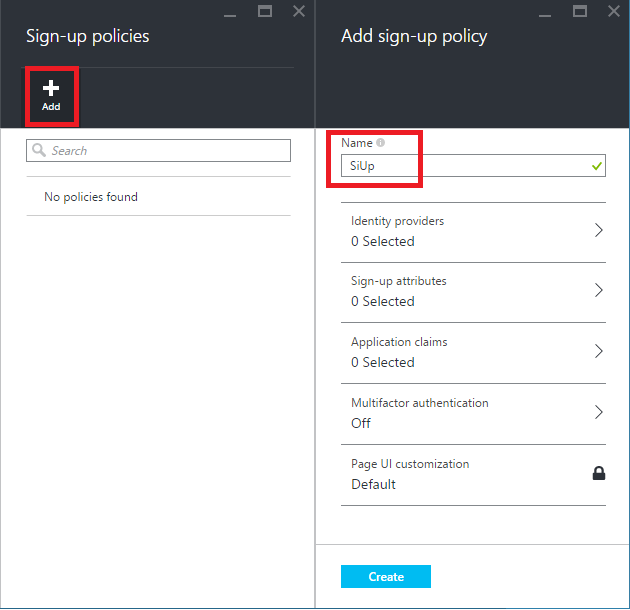

5. Click **Identity providers** and select "Email address". Optionally, you can also select social identity providers, if already configured. Click **OK**.

    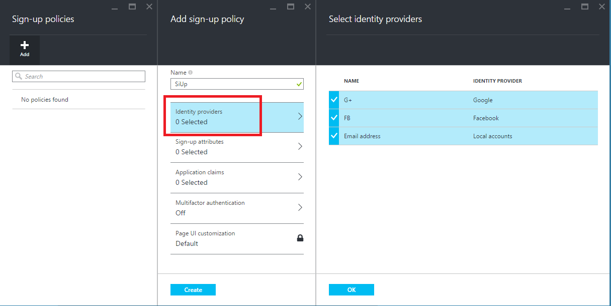

6. Click **Sign-up attributes**. Here you choose attributes that you want to collect from the consumer during sign up. For e.g., select "City", "Display Name" and "Postal Code". Click **OK**.

    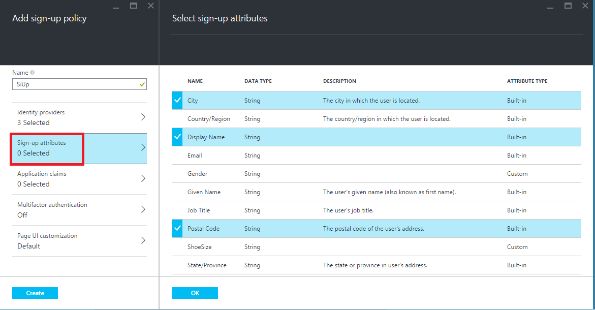

7. Click **Application claims**. Here you can choose the claims that you want returned in the tokens back to your application after a successful sign up experience. For e.g., select "Display Name", "Identity Provider", "Postal Code", "User is new" and "User's Object ID".

    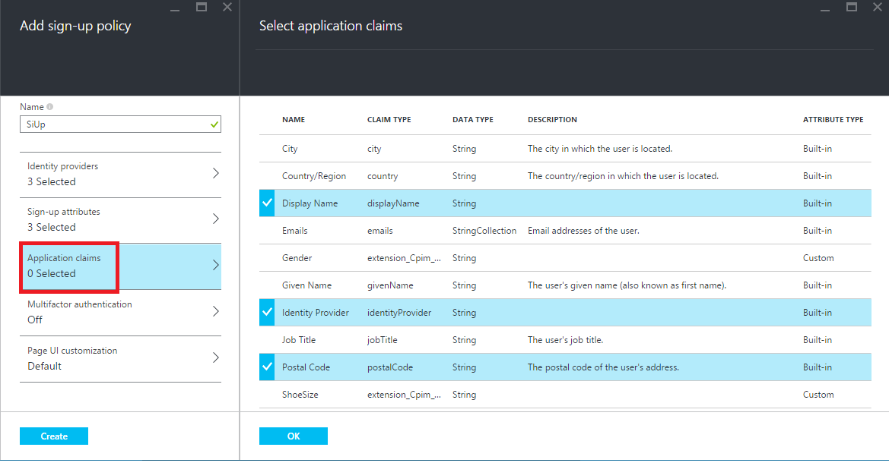

8. Click **Create**. Note that the policy just created appears as "**B2C_1_SiUp**" (the **B2C\_1\_** fragment is automatically pre-pending) in the **Sign-up policies** blade.

    

9. Open the policy by clicking on it.
10. Select "Contoso B2C app" in the **Applications** drop-down and `https://localhost:44321/` in the **Reply URL / Redirect URI** drop-down. Click the **Run now** button. A new browser tab opens up and you can run through the consumer experience of signing up for your application.

    > [AZURE.NOTE]
    It takes up to a minute for policy creation & updates to take effect.

    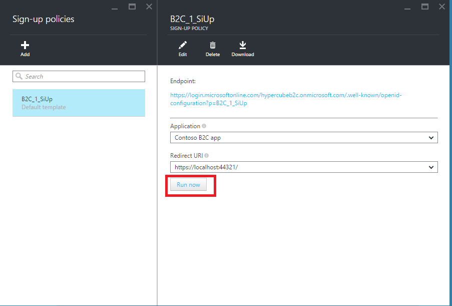

## How to create a sign-in policy

To enable sign in on your application, you will need to create a Sign-in policy. This policy describes the experiences that consumers will go through during sign in and the contents of tokens that the application will receive on successful sign ins.

1. [Navigate to the B2C features blade on the Azure Portal](active-directory-b2c-app-registration.md#navigate-to-the-b2c-features-blade-on-the-azure-portal).
2. Click **Sign-in policies**.
3. Click **+Add** at the top of the blade.
4. The **Name** determines the sign-in policy name used by your application. For e.g., enter "SiIn".

    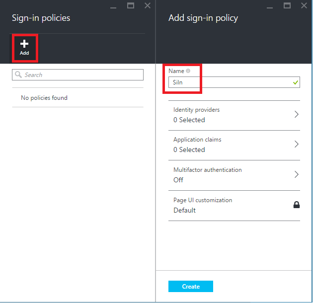

5. Click **Identity providers** and select "Email address". Optionally, you can also select social identity providers, if already configured. Click **OK**.

    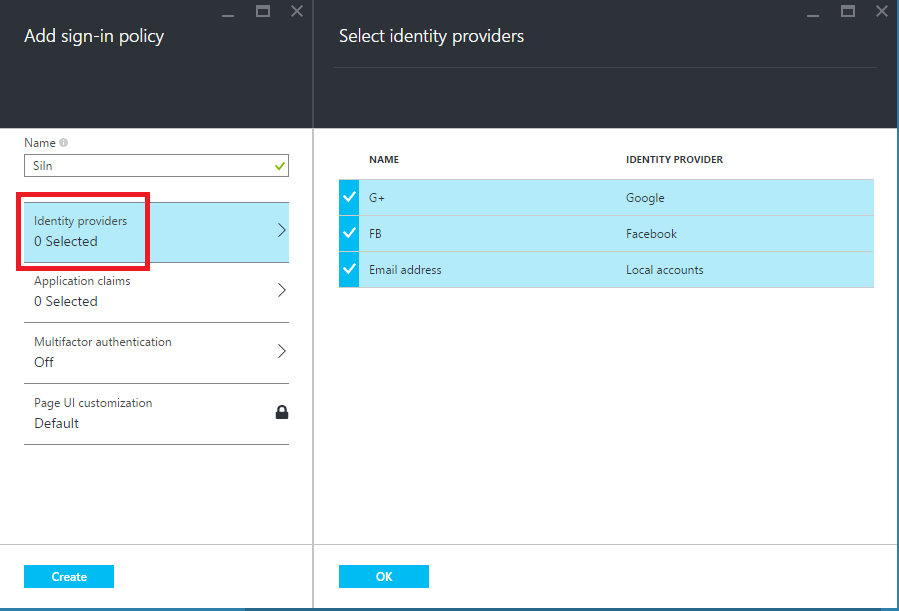
	
6. Click **Application claims**. Here you can choose the claims that you want returned in the tokens back to your application after a successful sign in experience. For e.g., select "Display Name", "Identity Provider", "Postal Code"  and "User's Object ID". Click **OK**.

    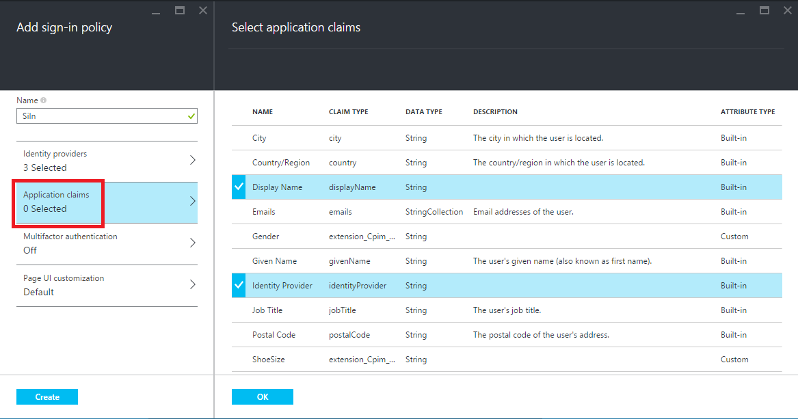
	
7. Click **Create**. Note that the policy just created appears as "**B2C_1_SiIn**" (the **B2C\_1\_** fragment is automatically added) in the **Sign-in policies** blade.

    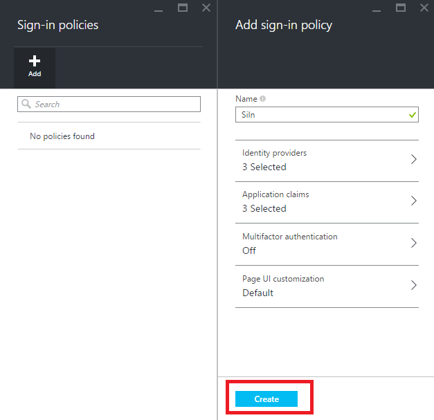

8. Open the policy by clicking on it.
9. Select "Contoso B2C app" in the **Applications** drop-down and `https://localhost:44321/` in the **Reply URL / Redirect URI** drop-down. Click the **Run now** button. A new browser tab opens up and you can run through the consumer experience of signing into your application.

    > [AZURE.NOTE]
    It takes up to a minute for policy creation & updates to take effect.

    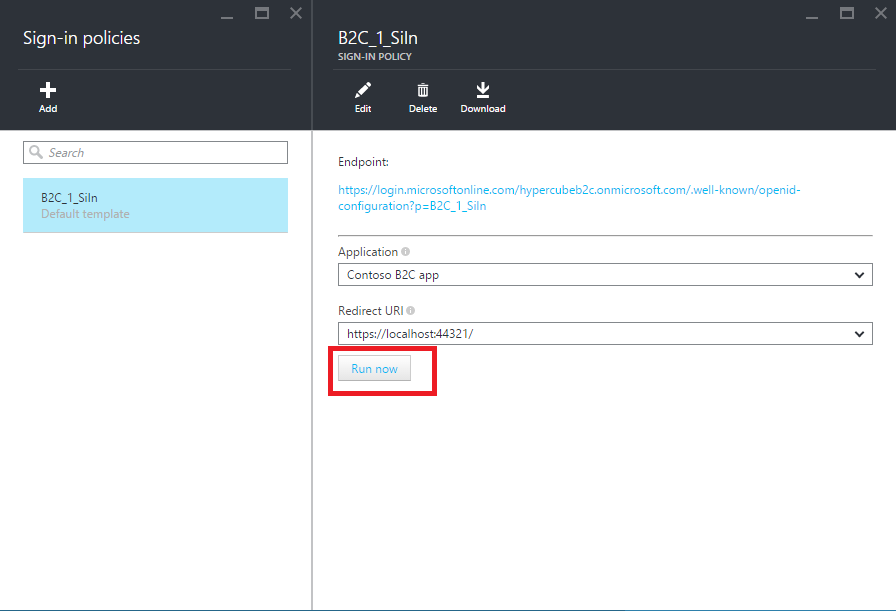

## How to create a profile editing policy

To enable profile editing on your application, you will need to create a Profile editing policy. This policy describes the experiences that consumers will go through during profile editing and the contents of tokens that the application will receive on successful completion.

1. [Navigate to the B2C features blade on the Azure Portal](active-directory-b2c-app-registration.md#navigate-to-the-b2c-features-blade-on-the-azure-portal).
2. Click **Profile editing policies**.
3. Click **+Add** at the top of the blade.
4. The **Name** determines the profile editing policy name used by your application. For e.g., enter "SiPe".

    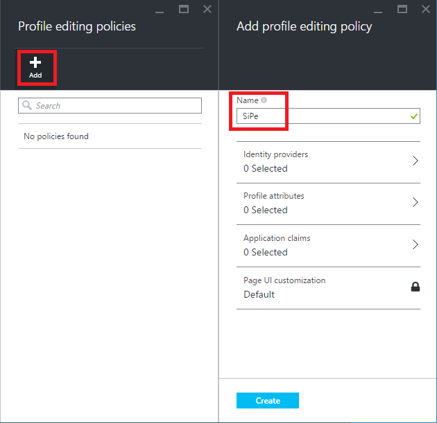

5. Click **Identity providers** and select "Email address". Optionally, you can also select social identity providers, if already configured. Click **OK**.

    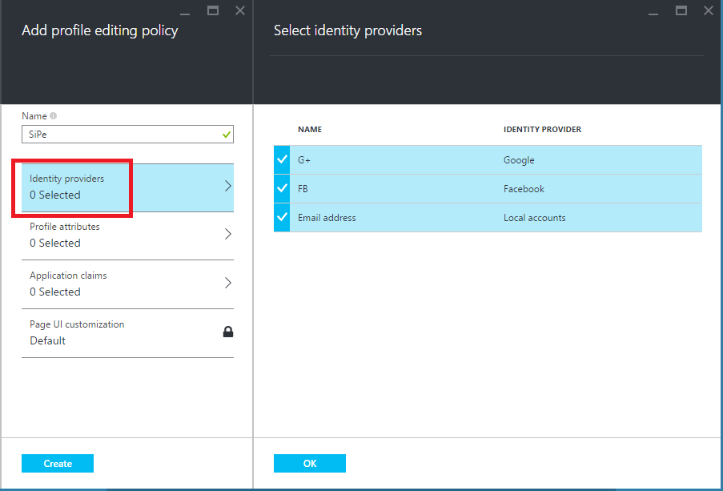

6. Click **Profile attributes**. Here you choose attributes that the consumer can view & edit. For e.g., select "City", "Display Name" and "Postal Code". Click **OK**.

    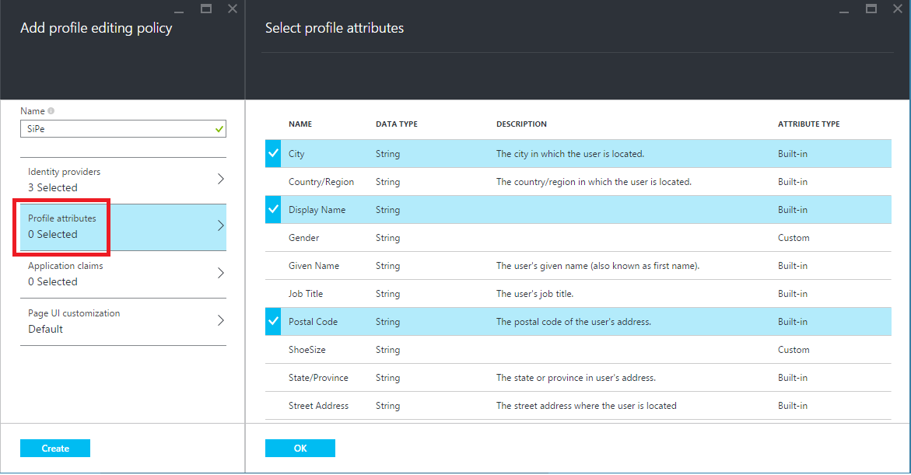

7. Click **Application claims**. Here you can choose the claims that you want returned in the tokens back to your application after a successful profile editing experience. For e.g., select "Display Name" and "Postal Code".

    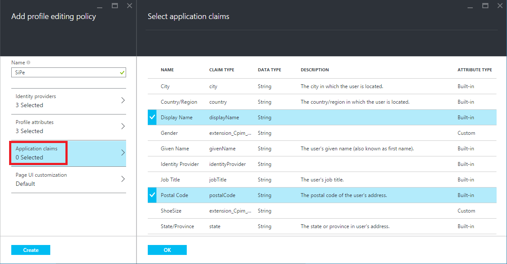

8. Click **Create**. Note that the policy just created appears as "**B2C_1_SiPe**" (the **B2C\_1\_** fragment is automatically pre-pending) in the **Profile editing policies** blade.

    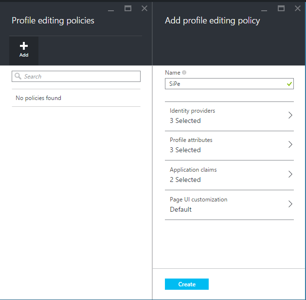

9. Open the policy by clicking on it.
10. Select "Contoso B2C app" in the **Applications** drop-down and `https://localhost:44321/` in the **Reply URL / Redirect URI** drop-down. Click the **Run now** button. A new browser tab opens up and you can run through the profile editing consumer experience in your application.

    > [AZURE.NOTE]
    It takes up to a minute for policy creation & updates to take effect.

    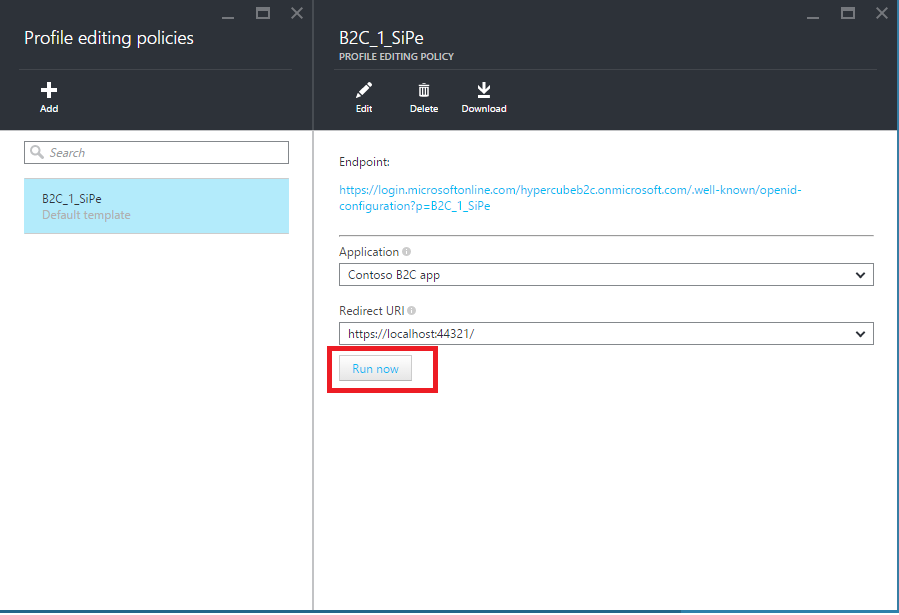
