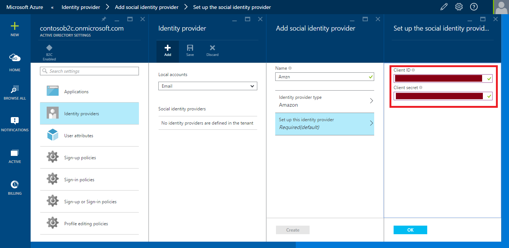

<properties
	pageTitle="Azure AD B2C preview | Microsoft Azure"
	description="Provide sign up and sign in to consumers with LinkedIn accounts in your applications secured by Azure AD B2C"
	services="active-directory"
	documentationCenter=""
	authors="swkrish"
	manager="msmbaldwin"
	editor="curtand"/>

<tags
	ms.service="active-directory"
	ms.workload="identity"
	ms.tgt_pltfrm="na"
	ms.devlang="na"
	ms.topic="article"
	ms.date="08/12/2015"
	ms.author="swkrish"/>

# Azure AD B2C preview: Provide sign up and sign in to consumers with Amazon accounts in your applications

## Create an Amazon application

To use Amazon as an identity provider in Azure AD B2C, you will first need to create an Amazon application and supply it with the right parameters. You will need an Amazon account to do this; if you don’t have one, you can get it at [http://www.amazon.com/](http://www.amazon.com/).

1. Go to the [Amazon Developers Center](https://login.amazon.com/) and sign in with your Amazon account credentials.
2. If you have not already done so, click **Sign Up**, follow the developer registration steps and accept the policy.
3. Click **Register new application**.

    

4. Provide application information (**Name**, **Description** and **Privacy Notice URL**) and click **Save**.

    

5. In the **Web Settings** section, copy the values of **Client ID** and **Client secret** (you will need to click the **Show Secret** button to see this). You will need both of them to configure Amazon as an identity provider in your directory.

    > [AZURE.NOTE]
    **Client secret** is an important security credential.

6. Click **Edit** in the **Web Settings** section.
7. Enter [https://login.microsoftonline.com](https://login.microsoftonline.com) in the **Allowed JavaScript origins** field and [https://login.microsoftonline.com/te/{directory}/oauth2/authresp](https://login.microsoftonline.com/te/{directory}/oauth2/authresp) in the **Allowed Return URLs** field, where **{directory}** is to be replaced with your directory's name (for e.g., contoso.onmicrosoft.com). Click **Save**.

    > [AZURE.NOTE]
    The **{directory}** value is case-sensitive.

    

## Configure Amazon as an identity provider in your directory

1. [Navigate to the B2C features blade on the Azure Portal](active-directory-b2c-app-registration.md#navigate-to-the-b2c-features-blade-on-the-azure-portal).
2. On the B2C features blade, click **Social identity providers**.
3. Click **+Add** at the top of the blade.
4. Provide a friendly **Name** for the identity provider configuration. For e.g., enter "Amzn".
5. Click **Identity provider type**, select **Amazon** and click **OK**.

    

6. Click **Set up this identity provider** and enter the **Client ID** and **Client secret** of the Amazon application that you created earlier.

    

7. Click **OK** and then **Create** to save your Amazon configuration.
