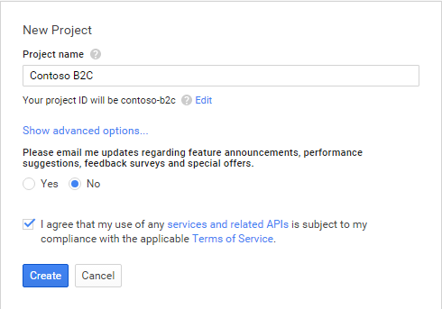
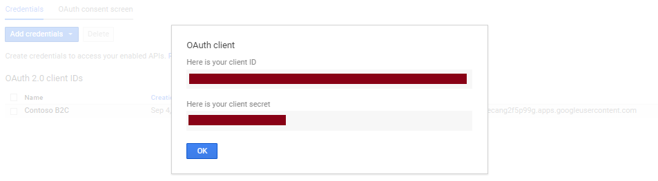
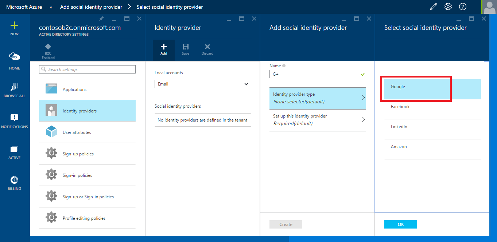
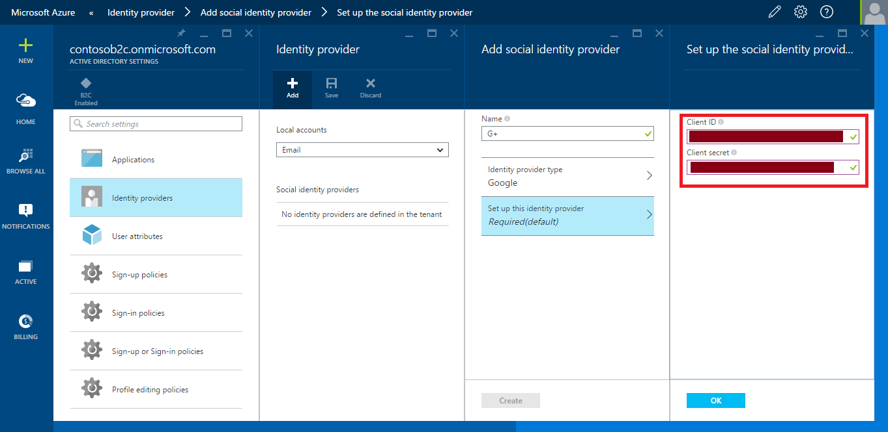

<properties
	pageTitle="Google+ configuration - Azure Active Directory B2C"
	description="Azure Active Directory B2C - Provide sign up and sign in to consumers with Google+ accounts in your applications"
	services="active-directory"
	documentationCenter=""
	authors="swkrish"
	manager="msmbaldwin"
	editor="curtand"/>

<tags
	ms.service="active-directory"
	ms.workload="identity"
	ms.tgt_pltfrm="na"
	ms.devlang="na"
	ms.topic="article"
	ms.date="08/10/2015"
	ms.author="swkrish"/>

# Azure AD B2C preview: Provide sign up and sign in to consumers with Google+ accounts in your applications

## Create a Google+ application

To use Google+ as an identity provider in Azure AD B2C, you will first need to create a Google+ application and supply it with the right parameters. You will need a Google+ account to do this; if you don’t have one, you can get it at [https://accounts.google.com/SignUp](https://accounts.google.com/SignUp).

1. Go to the [Google Developers Console](https://console.developers.google.com/) and sign in with your Google+ account credentials.
2. Click **Create Project**, enter a **Project name**, agree to the Terms of Service and then click **Create**.

    

    

3. Click **APIs & Auth** and then **Credentials** in the left hand navigation.
4. Click the **OAuth consent screen** tab at the top.

    

5. Select or specify a valid **Email address**, provide a **Product name** and click **Save**.

    

6. Under **Application type**, select **Web application**.
7. Provide a **Name** for your application, enter [https://login.microsoftonline.com](https://login.microsoftonline.com) in the **Authorized redirect URIs** field and [https://login.microsoftonline.com/te/{directory}/oauth2/authresp](https://login.microsoftonline.com/te/{directory}/oauth2/authresp) in the **Authorized redirect URIs** field, where **{directory}** is to be replaced with your directory's name (for e.g., contosob2c.onmicrosoft.com). Click **Create**.

    > [AZURE.NOTE]
    The **{directory}** value is case-sensitive.

    

8. Copy the values of **Client ID** and **Client secret**. You will need both of them to configure Google+ as an identity provider in your directory.

    > [AZURE.NOTE]
    **Client secret** is an important security credential.

    

## Configure Google+ as an identity provider in your directory

1. Navigate to the B2C features blade on the [Azure Portal](htts://portal.azure.com/). Read [here](active-directory-b2c-app-registration.md#navigate-to-the-b2c-features-blade-on-the-azure-portal) on how to do this.
2. On the B2C features blade, click **Social identity providers**.
3. Click **+Add** at the top of the blade.
4. Provide a friendly **Name** for the identity provider configuration. For e.g., enter "G+".
5. Click **Identity provider type**, select **Google** and click **OK**.

    

6. Click **Set up this identity provider** and enter the **Client ID** and **Client secret** of the Google+ application that you created earlier.

    

7. Click **OK** and then **Create** to save your Google+ configuration.
