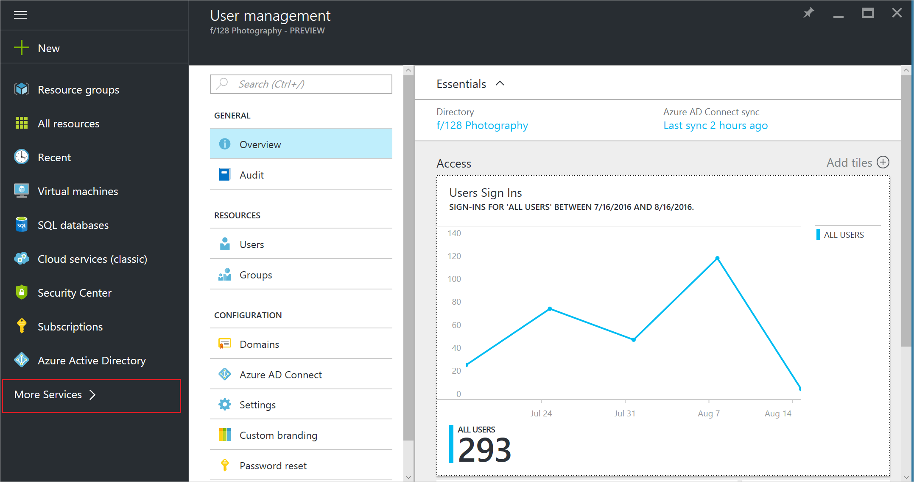
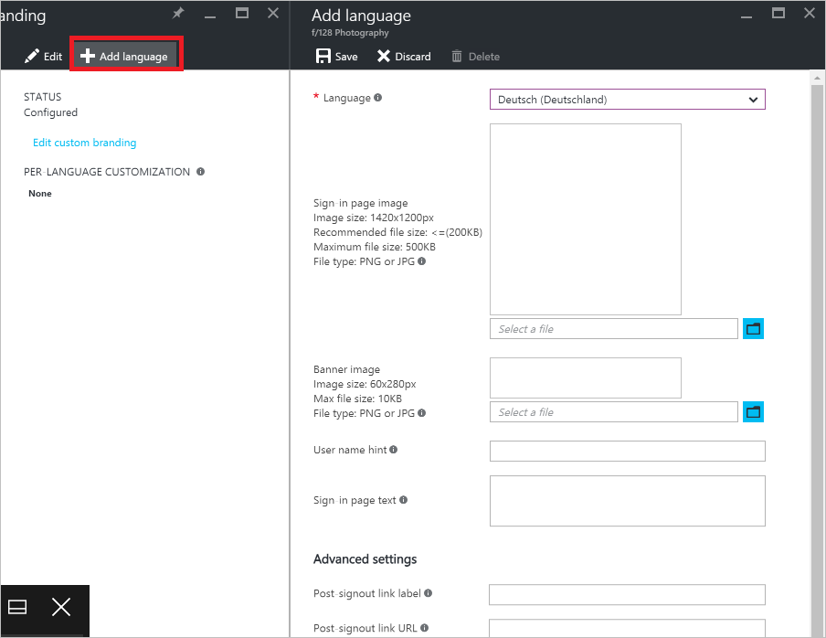

# Add language-specific company branding to your sign-in page in the Azure Active Directory preview
To avoid confusion, many companies want to apply a consistent look and feel across all the websites and services they manage. Azure Active Directory preview provides this capability by allowing you to customize the appearance of the sign-in page with your company logo and custom color schemes. [What's in the preview?](active-directory-preview-explainer.md) The sign-in page is the page that appears when you sign in to Office 365 or other web-based applications that are using Azure AD as your identity provider. You interact with this page to enter your credentials.

## Customizing the sign-in page for another language
You can add language-specific elements to your custom sign-in page only if you have already created a custom sign-in page as described in [Add company branding to your sign-in page](active-directory-branding-custom-signon-azure-portal.md). You can configure one sign-in page per directory with a default set of customizable elements. After you’ve configured the default set of page elements, you can configure more versions for different locales. You can also mix and match various elements. For example, you could:

* Create a default **Sign-in page image** that works for all cultures, then create specific versions for English and French. When you set your browsers to one of these two languages, the language-specific image appears, while the default illustration appears for all other languages.
* Configure different logos for your organization (for example, Japanese or Hebrew versions).

We recommend that you keep the number of language variations low, for maintenance and performance reasons.

**To add company branding to your directory:**

1. Sign in to the [Azure portal](https://portal.azure.com) with an account that's a global admin for the directory.
2. Select **More services**, enter **Users and groups** in the text box, and then select **Enter**.

   
3. On the **Users and groups** blade, select **Company branding**.
4. On the **Users and groups - Company branding** blade, select the **Add language** command.

    
5. Modify the elements you want to customize. All elements are optional.
6. Click **Save**.

It can take up to an hour for any changes you made to the sign-in page branding to appear.

## Next steps
[Add company branding to your sign-in page](active-directory-branding-custom-signon-azure-portal.md)
