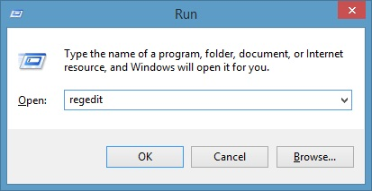
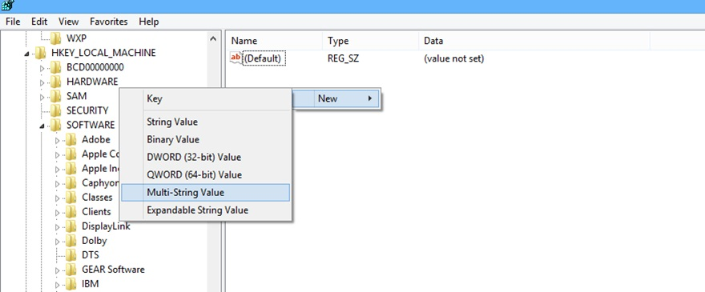
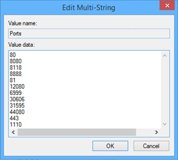

<properties 
	pageTitle="Cloud App Discovery Registry Settings for Proxy Services | Microsoft Azure" 
	description="The objective of this topic is to provide you with the steps you need to perform to set the required port on the computers running the Cloud App Discovery agent." 
	services="active-directory" 
	documentationCenter="" 
	authors="markusvi" 
	manager="femila"/>

<tags 
	ms.service="active-directory" 
	ms.workload="identity" 
	ms.tgt_pltfrm="na" 
	ms.devlang="na" 
	ms.topic="article" 
	ms.date="07/13/2016" 
	ms.author="markusvi"/>

# Cloud App Discovery Registry Settings for Proxy Services

By default, the Cloud App Discovery agent is configured to use only the ports 80 or 443. 
If you are planning on installing Cloud App Discovery in an environment with a proxy server that is using a custom port (neither 80 nor 443), you need to configure your agents to use this port. 
The configuration is based on a registry key.

The objective of this topic is to provide you with the steps you need to perform to set the required port on the computers running the Cloud App Discovery agent.

**To modify the port used by the computer running the Cloud App Discovery agent, perform the following steps:**

1. Start the registry editor.   

2. Navigate to or create the following registry key:   **HKLM_LOCAL_MACHINE\Software\Microsoft\Cloud App Discovery\Endpoint** 

3. Create a new **multi-string** value called **Ports**. 

4. To open the **Edit Multi-String** dialog, double-click the Ports value.

5. In the Value data textbox, type the following values and add all custom ports that are used by your organization:   
**80**  
**8080**  
**8118**  
**8888**  
**81**  
**12080**  
**6999**  
**30606**  
**31595**  
**4080**  
**443**  
**1110**   

6. Click **OK** to close the **Edit Multi-String** dialog.

**Additional Resources**

* [How can I discover unsanctioned cloud apps that are used within my organization](active-directory-cloudappdiscovery-whatis.md) 

