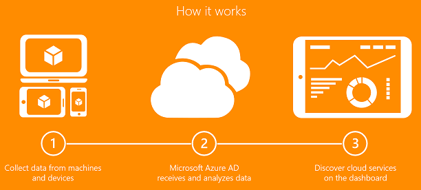

<properties
	pageTitle="Finding unmanaged cloud applications with Cloud App Discovery | Microsoft Azure"
	description="Provides information about finding and managing applications with Cloud App Discovery, what are the benefits and how it works."
	services="active-directory"
	keywords="cloud app discovery, managing applications"
	documentationCenter=""
	authors="markusvi"
	manager="femila"
	editor=""/>

<tags
	ms.service="active-directory"
	ms.workload="identity"
	ms.tgt_pltfrm="na"
	ms.devlang="na"
	ms.topic="article"
	ms.date="07/19/2016"
	ms.author="markvi"/>

# Finding unmanaged cloud applications with Cloud App Discovery

## Overview
In modern enterprises, IT departments are often not aware of all the cloud applications that members of their organization use to do their work. It is easy to see why administrators would have concerns about unauthorized access to corporate data, possible data leakage and other security risks. This lack of awareness can make creating a plan for dealing with these security risks seem daunting.

Cloud App Discovery is a feature of Azure Active Directory (AD) Premium that enables you to discover cloud applications being used by the people in your organization.

**With Cloud App Discovery, you can:**

- Find the cloud applications being used and measure that usage by number of users, volume of traffic or number of web requests to the application.
- Identify the users that are using an application.
- Export data for offline analysis.
- Bring these applications under IT control and enable single sign on for user management.

## How it works
1. Application usage agents are installed on user's computers.
2. The application usage information captured by the agents is sent over a secure, encrypted channel to the cloud app discovery service.
3. The Cloud App Discovery service evaluates the data and generates reports.

To get started with Cloud App Discovery, see [Getting Started With Cloud App Discovery](http://social.technet.microsoft.com/wiki/contents/articles/30962.getting-started-with-cloud-app-discovery.aspx)

## Related articles
- [Cloud App Discovery Security and Privacy Considerations](active-directory-cloudappdiscovery-security-and-privacy-considerations.md)  
- [Cloud App Discovery Group Policy Deployment Guide](http://social.technet.microsoft.com/wiki/contents/articles/30965.cloud-app-discovery-group-policy-deployment-guide.aspx)
- [Cloud App Discovery System Center Deployment Guide](http://social.technet.microsoft.com/wiki/contents/articles/30968.cloud-app-discovery-system-center-deployment-guide.aspx)
- [Cloud App Discovery Registry Settings for Proxy Servers with Custom Ports](active-directory-cloudappdiscovery-registry-settings-for-proxy-services.md)
- [Cloud App Discovery Agent Changelog ](http://social.technet.microsoft.com/wiki/contents/articles/24616.cloud-app-discovery-agent-changelog.aspx)
- [Cloud App Discovery Frequently Asked Questions](http://social.technet.microsoft.com/wiki/contents/articles/24037.cloud-app-discovery-frequently-asked-questions.aspx)
- [Article Index for Application Management in Azure Active Directory](active-directory-apps-index.md)
