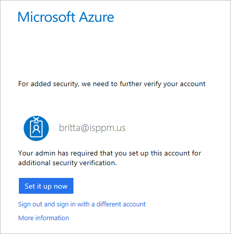
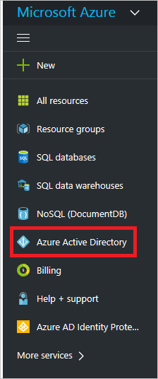
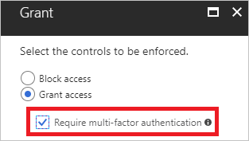
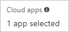

# Quickstart: Configure per cloud app MFA with Azure Active Directory conditional access 

To simplify the sign-in experience of your users, you might want to allow them to sign-in to your cloud apps using a user name and a password. However, many environments have at least a few apps for which it is advisable to require a stronger form of account verification, such as multi-factor authentication. This might be, for example true, for access to your organization's email system or your HR apps.  

This quickstart shows how you can require multi-factor authentication only for a set of selected cloud apps in your environment using an [Azure AD conditional access policy](active-directory-conditional-access-azure-portal.md).

To complete the scenario in this quickstart, you:

> [!div class="checklist"]
> * Create your conditional access policy
> * Evaluate your conditional access policy
> * Test your conditional access policy  

## Scenario description

The scenario in this article uses the Azure portal as placeholder for a cloud app that requires multi-factor authentication for a specific user. Britta Simon is a user in your organization. When she signs in to your Azure portal, you want her to further verify her account with multi-factor authentication.

## Before you begin 

To complete the scenario in this quickstart, you need:

- **Access to an Azure AD Premium edition** - Azure AD conditional access is an Azure AD Premium capability. If you don't have access to an Azure AD Premium edition, you can [sign-up for a trial](https://azure.microsoft.com/trial/get-started-active-directory/).

- **A test account called Britta Simon** - If you don't know how to create a test account, read [these instructions](https://docs.microsoft.com/azure/active-directory/add-users-azure-active-directory).

## Create your conditional access policy 

This section shows you how to create the required conditional access policy.  
In your policy, you set:

|Setting |Value|
|---     | --- |
|Users and groups | Britta Simon |
|Cloud apps | Microsoft Azure Management |
|Grant | Require multi-factor authentication |
 

**To configure your conditional access policy:**

1. Sign in to your [Azure portal](https://portal.azure.com) as global administrator.

2. In the Azure portal, on the left navbar, click **Azure Active Directory**. 

    

3. On the **Azure Active Directory** page, in the **Manage** section, click **Conditional access**.

    
 
4. On the **Conditional Access** page, in the toolbar on the top, click **Add**.

    

5. On the **New** page, in the **Name** textbox, type **Require MFA for Britta**.

    

6. In the **Assignment** section, click **Users and groups**.

    

7. On the **Users and groups** page, perform the following steps:

    

    a. Click **Select users and groups**.

    b. Click **Select**.

    c. On the **Select** page, select your test user, and then click **Select**.

    d. On the **Users and groups** page, click **Done**.

8. Click **Cloud apps**.

    

9. On the **Cloud apps** page, perform the following steps:

    

    a. Click **Select apps**.

    b. Click **Select**.

    c. On the **Select** page, select **Microsoft Azure Management**, and then click **Select**.

    d. On the **Cloud apps** page, click **Done**.

10. In the **Access controls** section, click **Grant**.

    

11. On the **Grant** page, perform the following steps:

    

    a. Select **Grant access**.

    a. Select **Require multi-factor authentication**.

    b. Click **Select**.

12. In the **Enable policy** section, click **On**.

    

13. Click **Create**.

## Evaluate your conditional access policy

To understand the impact of your conditional access policies on your environment, you can use the [conditional access what if policy tool](active-directory-conditional-access-whatif.md). Using this tool, you can evaluate a simulated sign-in of a user.

When you configure the tool with **Britta Simon** as user and **Microsoft Azure Management** as cloud app, the tool shows **Require MFA for Britta** under **Policies that will apply**.

**To evaluate your conditional access policy:**

1. On the [Conditional access - Policies](https://portal.azure.com/#blade/Microsoft_AAD_IAM/ConditionalAccessBlade/Policies) page, in the menu on the top, click **What If**.  
 
    

2. Click **Users**, select **Britta Simon**, and then click **Select**.

    

2. To select a cloud app, perform the following steps:

    

    a. Click **Cloud apps**.

    b. On the **Cloud apps page**, click **Select apps**.

    c. Click **Select**.

    d. On the **Select** page, select Microsoft Azure Management**, and then click **Select**.

    e. On the cloud apps page, click **Done**.

3. Click **What If**.

## Test your conditional access policy

To test your policy, try to sign-in to your [Azure portal](https://portal.azure.com) using your **Britta Simon** test account. You should see a dialog that requires you to set your account up for additional security verification.

## Next steps

If you would like to learn more about conditional access, see [Azure Active Directory conditional access](active-directory-conditional-access-azure-portal.md).

