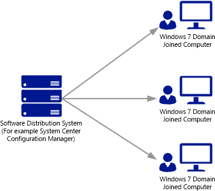
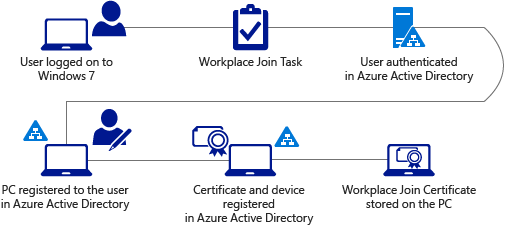

<properties
	pageTitle="# Configure automatic device registration for Windows 7 domain joined devices| Microsoft Azure"
	description="Steps to configure your Windows 7 domain joined devices to automatically register with Azure AD. and steps to deploy the device registration software package to your Windows 7 domain joined devices using a software distribution system such as System Center Configuration Manager."
	services="active-directory"
	documentationCenter=""
	authors="femila"
	manager="swadhwa
	editor=""/>

<tags
	ms.service="active-directory"
	ms.workload="identity"
	ms.tgt_pltfrm="na"
	ms.devlang="na"
	ms.topic="article"
	ms.date="06/23/2016"
	ms.author="femila"/>

# Configure automatic device registration for Windows 7 domain joined devices

As an IT admin, you can configure your Windows 7 domain joined devices to automatically register with Azure AD. To do so, you must deploy the device registration software package to your Windows 7 domain joined devices using a software distribution system such as System Center Configuration Manager. Be sure to read through and complete the prerequisites listed in Automatic Device Registration with Azure Active Directory for Windows Domain-Joined Devices.

##Installing the device registration software package on Windows 7 domain joined devices

Device registration for Windows 7 is available as a [downloadable MSI package](https://connect.microsoft.com/site1164). The package must be installed on Windows 7 machines that are joined to an Active Directory Domain. You should deploy the package using a software distribution system such as System Center Configuration Manager. The MSI package supports the standard silent install options using the /quiet parameter.
The software package is available for download at the [Microsoft Connect website](https://connect.microsoft.com/site1164). Here you can select and then download Workplace Join for Windows 7.

## Workplace Join with Azure Active Directory
Device registration for Windows 7 domain joined devices does not require or include a user interface. Once installed on the machine, any domain user that logs into the machine will be automatically and silently registered with a device object in Azure AD. There will be one device object in Azure AD for every registered user of the physical device.

The installer creates a Scheduled Task on the system that runs in the user’s context and is triggered on user sign-in. The task silently registers the user and device with Azure AD after the user signs-in is complete.
The Scheduled Task can be found in the Task Scheduler Library under **Microsoft** > **Workplace Join**.
The task will run and register any and all Active Directory users that sign-in to the machine.
The following illustration lists the step-by-step process for automatic device registration.

1. A user (information worker) logs on to a Windows 7 client computer using Active Directory domain credentials.
1. The Workplace Join scheduled task is executed.
1. The user is silently authenticated with AD FS using Windows Integrated Authentication.
1. The Windows 7 PC is registered to the user in Azure AD.
1. A device object and certificate is created in Azure AD. The object represents the user@device.
1. The Workplace Join certificate is stored on the machine.

## Unregistering your Windows 7 domain joined devices

You may choose unregister your domain joined Windows 7 devices by doing the following:
Uninstall the Workplace Join software package from your Windows 7 domain joined devices using a software distribution system such as System Center Configuration Manager.

Then, open a command prompt on the Windows 7 machine and execute the following command to unregister the device:

    %ProgramFiles%\Microsoft Workplace Join\AutoWorkplace.exe /leave

>[AZURE.NOTE]
>This command must be run in the context of each domain user that has signed into the machine.
Event Viewer and Errors for Windows 7 domain joined devices.

The Windows Event Log on the Windows 7 machine will display messages related to Workplace Join. You can find messages for both successful and unsuccessful Workplace Join events. The Event Log can be found in the Event Viewer under Applications and Services Logs> Microsoft-Workplace Join.

## Additional topics

- [Azure Active Directory Device Registration overview](active-directory-conditional-access-device-registration-overview.md)
- [Automatic device registration with Azure Active Directory for Windows Domain-Joined Devices](active-directory-conditional-access-automatic-device-registration.md)
- [Configure automatic device registration for Windows 8.1 domain joined devices](active-directory-conditional-access-automatic-device-registration-windows-8-1.md)
- [Automatic device registration with Azure Active Directory for Windows 10 domain-joined devices](active-directory-azureadjoin-devices-group-policy.md)
