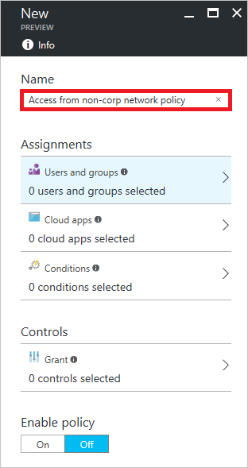
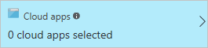
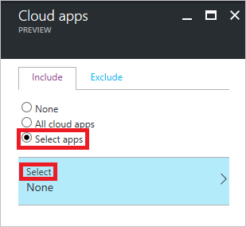
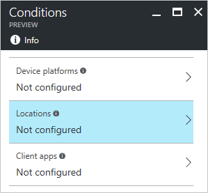
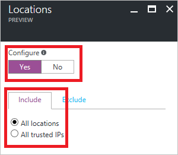
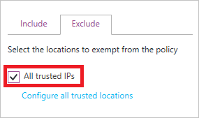
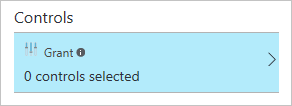
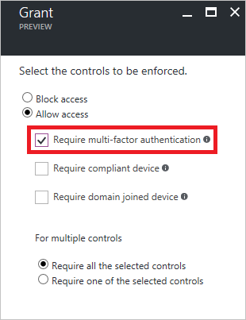

# Get started with conditional access in Azure Active Directory

Conditional access is a capability of Azure Active Directory that enables you to define conditions under which authorized users can access your apps. 

This topic provides you with instructions for testing a conditional access based on a location condition in your environment.  

## Scenario description

One common requirement in many organizations is to only require multi-factor authentication for access to apps that is not performed from the corporate intranet. With Azure Active Directory, you can easily accomplish this goal by configuring a location-based conditional access policy. This topic provides you with detailed instructions for configuring a related policy. The policy leverages [Trusted IPs](../multi-factor-authentication/multi-factor-authentication-whats-next.md#trusted-ips) to distinguish between access attempts made from the corporate's intranet and all other locations.

## Prerequisites

The scenario outlined in this topic assumes that you are familiar with the concepts outlined in [Azure Active Directory conditional access](active-directory-conditional-access-azure-portal.md).

To test this scenario, you need to:

- Create a test user 

- Assign an Azure AD Premium license to the test user

- Configure a managed app and assign your test user to it

- Configure trusted IPs

If you need more details about Trusted IPs, see [Trusted IPs](../multi-factor-authentication/multi-factor-authentication-whats-next.md#trusted-ips).

## Policy configuration steps

**To configure your conditional access policy, do:**

1. In the Azure portal, on the left navbar, click **Azure Active Directory**. 

    

2. On the **Azure Active Directory** blade, in the **Manage** section, click **Conditional access**.

    
 
3. On the **Conditional Access** blade, to open the **New** blade, in the toolbar on the top, click **Add**.

    

4. On the **New** blade, in the **Name** textbox, type a name for your policy.

    

5. In the **Assignment** section, click **Users and groups**.

    

6. On the **Users and groups** blade, perform the following steps:

    

    a. Click **Select users and groups**.

    b. Click **Select**.

    c. On the **Select** blade, select your test user, and then click **Select**.

    d. On the **Users and groups** blade, click **Done**.

7. On the **New** blade, to open the **Cloud apps** blade, in the **Assignment** section, click **Cloud apps**.

    

8. On the **Cloud apps** blade, perform the following steps:

    

    a. Click **Select apps**.

    b. Click **Select**.

    c. On the **Select** blade, select your cloud app, and then click **Select**.

    d. On the **Cloud apps** blade, click **Done**.

9. On the **New** blade, to open the **Conditions** blade, in the **Assignment** section, click **Conditions**.

    

10. On the **Conditions** blade, to open the **Locations** blade, click **Locations**.

    

11. On the **Locations** blade, perform the following steps:

    

    a. Under **Configure**, click **Yes**.

    b. Under **Include**, click **All locations**.

    c. Click **Exclude**, and then click **All trusted IPs**.

    

    d. Click **Done**.

12. On the **Conditions** blade, click **Done**.

13. On the **New** blade, to open the **Grant** blade, in the **Controls** section, click **Grant**.

    

14. On the **Grant** blade, perform the following steps:

    

    a. Select **Require multi-factor authentication**.

    b. Click **Select**.

15. On the **New** blade, under **Enable policy**, click **On**.

    

16. On the **New** blade, click **Create**.

## Testing the policy

To test your policy, you should access your app from a device that: 

1. Has an IP address that is within your configured Trusted IPs 

1. Has an IP address that is not within your configured Trusted IPs

Multi-factor authentication should only be required during a connection attempt that was made from a device that is not within your configured Trusted IPs. 

## Next steps

If you would like to learn more about conditional access, see [Azure Active Directory conditional access](active-directory-conditional-access-azure-portal.md).

