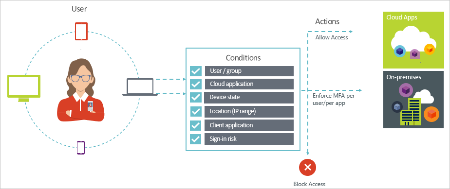

# Conditional access in Azure Active Directory

Security is a top concern for organizations using the cloud. A key aspect of cloud security is identity and access when it comes to managing your cloud resources. In a mobile-first, cloud-first world, users can access your organization's resources using a variety of devices and apps from anywhere. As a result of this, just focusing on who can access a resource is not sufficient anymore. In order to master the balance between security and productivity, IT professionals also need to factor how a resource is being accessed into an access control decision. With Azure AD conditional access, you can address this requirement. Conditional access is a capability of Azure Active Directory that enables you to enforce controls on the access to apps in your environment based on specific conditions from a central location. 

This article provides you with a conceptual overview of conditional access in Azure AD.

## Common scenarios

In a mobile-first, cloud-first world, Azure Active Directory enables single sign-on to devices, apps, and services from anywhere. With the proliferation of devices (including BYOD), work off corporate networks, and third party SaaS apps, IT professionals are faced with two opposing goals:

- Empower users to be productive wherever and whenever
- Protect the corporate assets at any time

By using conditional access policies, you can apply the right access controls under the required conditions. Azure AD conditional access provides you with added security when needed and stays out of your user’s way when it isn’t. 

Following are some common access concerns that conditional access can help you with:

- **[Sign-in risk](active-directory-conditional-access-conditions.md#sign-in-risk)**: Azure AD Identity Protection detects sign-in risks. How do you restrict access if a detected sign-in risk indicates a bad actor? What if you would like to get a stronger evidence that a sign-in was  performed by the legitimate user or your doubts are strong enough to even block specific users from accessing an app?

- **[Network location](active-directory-conditional-access-locations.md)**: Azure AD is accessible from anywhere. What if an access attempt is performed from a network location that is not under the control of your IT department? Using a username and password combination might be good enough as proof of identity for access attempts to your resources from your corporate network. What if you demand a stronger proof of identity for access attempts that are initiated from other unexpected countries or regions of the world? What if you even want to block access attempts from certain locations?  

- **[Device management](active-directory-conditional-access-conditions.md#device-platforms)**: In Azure AD, users can access cloud apps from a broad range of devices including mobile and also personal devices. What if you demand that access attempt should only be performed user using devices that are managed by your IT department? What if you even want to block certain device types form access in cloud apps in your environment? 

- **[Client application](active-directory-conditional-access-conditions.md#client-apps)**: Today, you can access many cloud apps using different app types such as web-based apps, mobile apps, or desktop apps. What if an access attempt is performed using a client app type that causes known issues? What if you require a device that is managed by your IT department for certain app types? 

These questions and the related answers represent common access scenarios for Azure AD conditional access. 
Conditional access is a capability of Azure Active Directory that enables you to handle access scenarios using a policy-based approach.

## Conditional access policies

A conditional access policy is definition of an access scenario using the following pattern:

**Then do this** defines the response of your policy. It is important to note that the objective of a conditional access policy is not to grant access to a cloud app. In Azure AD, granting access to cloud apps is subject of user assignments. With a conditional access policy, you control how authorized users (users that have been granted access to a cloud app) can access cloud apps under specific conditions. In your response, you enforce additional requirements such as multi-factor authentication, a managed device, and others. In the context of Azure AD conditional access, the requirements your policy enforces are called access controls. In the most restrictive form, your policy can block access. For more information, see [Access controls in Azure Active Directory conditional access](active-directory-conditional-access-controls.md).
     

**When this happens** defines the reason for triggering your policy. This reason is characterized by a group of conditions that have been satisfied. In Azure AD conditional access, the two assignment conditions play a special role:

- **[Users](active-directory-conditional-access-conditions.md#users-and-groups)**: The users performing an access attempt (**Who**). 

- **[Cloud apps](active-directory-conditional-access-conditions.md#cloud-apps)**: The targets of an access attempt (**What**).    

These two conditions are mandatory in a conditional access policy. In addition to the two mandatory conditions, you can also include additional conditions that describe how the access attempt is performed. Common examples are using mobile devices or locations that are outside your corporate network. For more information, see [Conditions in Azure Active Directory conditional access](active-directory-conditional-access-conditions.md).   

The combination of conditions with your access controls represents a conditional access policy. 

With Azure AD conditional access, you can control how authorized users can access your cloud apps. The objective of a conditional access policy is to enforce additional access controls on an access attempt to a cloud app that is driven by how an access attempt is performed.

One benefit of using a policy-based approach to protect access to your cloud apps is that you can start drafting the policy requirements for your environment using the structure outlined in this article without worrying about the technical implementation. 

## What you need to know

### General requirements for using conditional access

You can use Azure AD conditional access to protect cloud apps when an authentication attempt comes from:

- A web browser

- A client app that uses modern authentication

- Exchange ActiveSync

For more information, see [client apps](active-directory-conditional-access-conditions.md#client-apps).

Some [cloud apps](active-directory-conditional-access-conditions.md#cloud-apps) also support legacy authentication protocols. This applies, for example, to SharePoint Online and Exchange Online. When a client app can use a legacy authentication protocol to access a cloud app, Azure AD cannot enforce a conditional access policy on this access attempt. To prevent a client app from bypassing the enforcement of policies, you should check whether it is possible to only enable modern authentication on the affected cloud apps.

Examples for client apps conditional access does not apply to are:

- Office 2010 and earlier

- Office 2013 when modern authentication is not enabled

For more information, see [Set up SharePoint Online and Exchange Online for Azure Active Directory conditional access](active-directory-conditional-access-no-modern-authentication.md).

### License requirements for using conditional access

Using conditional access requires a Azure AD Premium license. To find the right license for your requirements, see [Comparing generally available features of the Free, Basic, and Premium editions](https://www.microsoft.com/en-us/cloud-platform/azure-active-directory-features).

## Next steps

- If you want to know more about:
    - Conditions, see [Conditions in Azure Active Directory conditional access](active-directory-conditional-access-conditions.md).

    - Access controls, see [Access controls in Azure Active Directory conditional access](active-directory-conditional-access-controls.md).

- If you want to get some experience with configuring conditional access policies, see [Get started with conditional access in Azure Active Directory](active-directory-conditional-access-azure-portal-get-started.md).

- If you are ready to configure conditional access policies for your environment, see the [best practices for conditional access in Azure Active Directory](active-directory-conditional-access-best-practices.md). 
